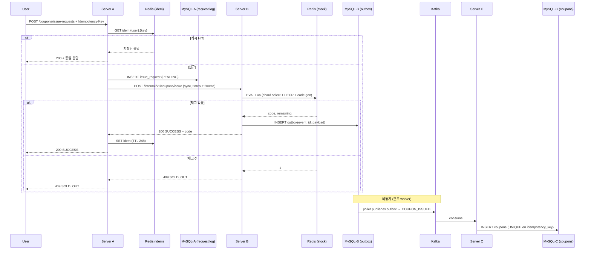

# System Design — A → B → C 분산 흐름 (promotion)

본 스킬은 CLAUDE.md §4 (시스템 아키텍처) / §5 (서비스별 책임) / §6 (ADR) 의 결정을 코드로 옮길 때의 기준을 제공한다. **CLAUDE.md 에서 이미 결정된 내용은 본 스킬보다 우선** 한다.

> 본 과제 흐름:
> ```
> User → Server A (RDBMS) → Server B (Redis + RDBMS Outbox) →(Kafka)→ Server C (RDBMS)
>        진입/검증/멱등성   재고/쿠폰코드/Outbox             영구저장/redeem
> ```

---

## 1. 노드별 책임 (CLAUDE.md §5 요약)

| 노드 | 권장 역할 | 저장소 | 절대 하지 말 것 |
|---|---|---|---|
| Server A | 진입, 인증, Rate Limit, Idempotency 1차, 요청 로그 | MySQL (요청 로그) + Redis (Idempotency 캐시) | 재고 직접 다루기, B 호출에 timeout/CB 없음, 트랜잭션 길게 |
| Server B | 재고 차감, 쿠폰 코드 발급, Outbox 적재 | Redis (재고/코드) + MySQL (Outbox) | RDBMS row lock 으로 재고, Redis GET-then-SET, C 동기 호출 |
| Server C | Kafka consumer → 영구 저장, redeem | MySQL (쿠폰 마스터, redemption) | UNIQUE 없이 consume, consumer 안에서 동기 외부 호출 |

핵심: **A↔B 동기 (timeout 200ms + Circuit Breaker), B→C 비동기 (Outbox + Kafka)** (ADR-001).

---

## 2. 발급(Issue) 흐름 — 정상 케이스

```
1. POST /api/v1/coupons/issue-requests   Header: Idempotency-Key: <uuid>
2. Server A:
     a. 인증 (user_id 헤더 또는 JWT)
     b. Rate Limit 검사 (Bucket4j + Redis) — 초과 시 429
     c. Idempotency 검사 (Redis cache) — 같은 키 → 저장된 응답 반환
     d. issue_request 로그 INSERT (batch / async, MySQL)
     e. Server B 호출 (sync, timeout 200ms, Resilience4j CB)
3. Server B:
     a. Redis Lua: shard 선택 → DECR → 코드 생성 → outbox INSERT (RDBMS)
     b. Server A 에 결과 응답
4. Server A: 사용자에게 응답 (200 SUCCESS or 409 SOLD_OUT)
5. Server B (별도 thread): outbox poller → Kafka publish (FOR UPDATE SKIP LOCKED)
6. Server C: Kafka consumer → MySQL INSERT (UNIQUE on idempotency_key)
```

타임라인:
- 1~4 = 사용자가 인지하는 응답 시간 (목표 p95 < 300ms)
- 5~6 = 사용자에게 보이지 않는 비동기 영구화

---

## 3. Idempotency-Key 설계 (ADR-004)

### 3.1 헤더와 검증

```
Header: Idempotency-Key: 550e8400-e29b-41d4-a716-446655440000  (UUIDv4)
```

- 클라이언트가 생성, 서버는 검증.
- `(idempotency_key, user_id)` 가 유일.
- A 의 1차 검사는 Redis 캐시 (TTL 24h). C 의 최종 보장은 MySQL UNIQUE constraint.

### 3.2 Server A 의 1차 검사

```
1. 헤더 추출 (없으면 400)
2. Redis GET "idem:{user_id}:{key}"
   ├─ HIT  → 저장된 응답 그대로 반환 (200 또는 409)
   └─ MISS → B 호출
3. B 응답 받은 후 Redis SET (TTL 24h) "idem:{user_id}:{key}" → response JSON
```

대용량 요청에는 `request_hash` (SHA-256 of body) 도 같이 저장해 같은 키로 다른 body 가 오면 409 Conflict.

### 3.3 Server C 의 최종 보장

```sql
CREATE TABLE coupons (
    id BIGINT PRIMARY KEY AUTO_INCREMENT,
    code VARCHAR(40) NOT NULL,
    user_id VARCHAR(64) NOT NULL,
    event_id VARCHAR(64) NOT NULL,
    idempotency_key VARCHAR(64) NOT NULL,
    issued_at DATETIME(6) NOT NULL,
    used_at DATETIME(6) NULL,
    version BIGINT NOT NULL DEFAULT 0,         -- 낙관락 (ADR-007)
    UNIQUE KEY uq_coupon_code (code),
    UNIQUE KEY uq_coupon_idem (idempotency_key),
    INDEX idx_coupon_user (user_id)
) ENGINE=InnoDB;
```

- Kafka 메시지가 중복 도착해도 UNIQUE 위반 → consumer 가 catch 후 ack (이미 처리됨).
- INSERT IGNORE 또는 `INSERT ... ON DUPLICATE KEY UPDATE id=id` 로 표현 가능.

---

## 4. Outbox 패턴 (ADR-002)

### 4.1 왜 Outbox 인가

- B 가 Redis 차감 + Kafka publish 를 같은 트랜잭션으로 보장하려면 분산 트랜잭션 → 1 vCPU 환경에선 비현실.
- B 가 Redis 차감 + Outbox INSERT (MySQL 트랜잭션) → poller 가 나중에 Kafka publish.
- at-least-once 자연 구현. 중복은 C 의 UNIQUE 가 흡수.

### 4.2 Outbox 테이블 (Server B 의 보조 RDBMS)

```sql
CREATE TABLE coupon_outbox (
    event_id CHAR(36) PRIMARY KEY,             -- Kafka 메시지 키
    event_type VARCHAR(64) NOT NULL,           -- COUPON_ISSUED
    payload JSON NOT NULL,                      -- {code, userId, eventId, idempotencyKey, issuedAt}
    created_at DATETIME(6) NOT NULL,
    published_at DATETIME(6) NULL,              -- NULL = unpublished
    INDEX idx_outbox_unpublished (published_at, created_at)
) ENGINE=InnoDB;
```

### 4.3 Poller (Server B 안의 별도 worker)

```sql
-- 다중 worker / 다중 인스턴스 안전
SELECT * FROM coupon_outbox
WHERE published_at IS NULL
ORDER BY created_at
LIMIT 100
FOR UPDATE SKIP LOCKED;
```

```
loop every 50~200ms:
  rows = 위 쿼리
  for r in rows:
    kafka.send(r.event_type, key=r.event_id, value=r.payload)   // 실패 시 다음 루프
    UPDATE coupon_outbox SET published_at = NOW() WHERE event_id = r.event_id;
  commit;
```

> **5일 일정에서 CDC (Debezium) 는 과도**. 단순 polling 으로 충분. README 에 "프로덕션 진화 방향으로 CDC" 한 줄 명시.

---

## 5. Choreography Saga (ADR-002)

### 5.1 정상 흐름

```
A: issue_request INSERT (PENDING)
   └→ B 호출 (sync)
B: Redis DECR + outbox INSERT (commit)
   └→ A 응답 (사용자에게 즉시 결과)

[비동기]
B-poller: outbox → Kafka(COUPON_ISSUED)
C: consume → coupons INSERT (UNIQUE 보호)
   └→ Kafka(COUPON_PERSISTED) [선택적]
A: consume → issue_request 를 COMPLETED 갱신 [선택적, 5일 시간 부족 시 생략]
```

### 5.2 보상 흐름

| 실패 지점 | 처리 |
|---|---|
| A 에서 B 호출 실패 (timeout / CB OPEN) | A 가 503 응답. issue_request 는 FAILED. 재고 미차감 → 보상 불필요. |
| B 가 Redis 차감 후 Outbox INSERT 실패 | 트랜잭션 롤백 → Redis INCR 보상 (Lua 안에서 같이 수행 또는 catch). |
| Kafka publish 영구 실패 (>N 회) | Outbox row 를 `FAILED` 로 마킹 → DLQ 또는 운영 알림 → B 에서 재고 복구 이벤트 발행. |
| C 의 consume 실패 | Kafka 자체 retry → DLT (Dead Letter Topic). UNIQUE 위반은 정상(중복) 으로 ack. |

5일 일정에선 **A→B 실패 + Kafka publish 실패** 두 케이스만 코드로 증명. 나머지는 README §7 트레이드오프로 흡수.

---

## 6. at-least-once + Consumer 멱등성 = 의미적 exactly-once

| 보장 | 본 과제 |
|---|---|
| 전송 (B → Kafka) | at-least-once (Outbox + retry) |
| 처리 (C 의 effect) | exactly-once 의미적 (UNIQUE constraint) |

**EOS / JTA 사용 금지**. 1 vCPU/2 GB 에서 비용 과다. README §7 에 명시.

---

## 7. CAP 우선순위 (CLAUDE.md 와 충돌 없음)

| 노드 | 분단 시 | 이유 |
|---|---|---|
| Server A (MySQL) | CP | 사용자 단위 멱등성/유효성 검증은 정확해야 함 |
| Server B (Redis) | AP | 짧은 TTL + 보조 RDBMS Outbox 로 SoT 보호 |
| Server C (MySQL) | CP | 영구 저장 — 분단 시 stale 보다 unavailable 가 안전 |

---

## 8. Mermaid 시퀀스 (README 에 그대로 사용 가능)



---

## 9. 자가 검증 체크리스트

- [ ] A→B 호출에 timeout 200ms + Resilience4j Circuit Breaker?
- [ ] B 의 Redis 차감이 **Lua script** (atomic) — GET 후 SET 패턴 없음?
- [ ] B 의 Redis 차감과 Outbox INSERT 가 같은 트랜잭션은 아님 (Redis 와 RDBMS 는 분산). 단, Redis 실패 시 Outbox 도 실패 — 코드로 보장?
- [ ] **Outbox poller** 가 `FOR UPDATE SKIP LOCKED` 로 다중 worker 안전?
- [ ] Kafka 발행 실패 시 Outbox row 가 unpublished 로 남아 다음 polling 이 재시도?
- [ ] Server C 의 `coupons` 테이블에 `(idempotency_key)` UNIQUE?
- [ ] Kafka consumer 가 UNIQUE 위반을 정상 (중복) 으로 ack?
- [ ] Idempotency-Key Redis 캐시 TTL 명시 (24h)?
- [ ] Idempotency 동일 키 + 다른 body 케이스 처리 (request_hash 비교 또는 README 에 미구현 명시)?
- [ ] README 데이터 흐름 다이어그램이 본 §8 와 일치?

---

## 10. 안티패턴 (CLAUDE.md §10 보강)

| 안티패턴 | 문제 | 교정 |
|---|---|---|
| A 가 직접 Redis 재고에 접근 | A 의 책임 위반 (§5.1) | B 호출만 |
| A→B 호출에 timeout 없음 | 카스케이딩 실패 | 200ms + CB |
| 재고 차감을 GET → 검사 → SET 으로 분리 | race condition | 단일 Lua script |
| Outbox 없이 "DB → Kafka" | publish 실패 시 유실 | Outbox + poller |
| Kafka 메시지 처리에 UNIQUE 없음 | 중복 발급 | UNIQUE constraint |
| 같은 트랜잭션에서 Kafka publish | 트랜잭션 길어짐, 부분 실패 시 모호 | Outbox |
| 모든 흐름을 동기 체인으로 (A→B→C 동기) | 가장 느린 노드가 SLA 결정 | B→C 비동기 |
| Idempotency 를 UNIQUE 만으로 처리 | 사용자가 500 / 모호한 에러 | A 의 1차 캐시 + 저장된 응답 재반환 |
| Outbox poller 폴링 주기 너무 김 (>1s) | 사용자 인지 stale 증가 | 50~200ms |
| Saga Orchestrator 별도 모듈 도입 | 5일 일정 초과 | Choreography (이벤트 기반) |
| EOS / JTA / XA | 1 vCPU 비용 과다 | at-least-once + Consumer 멱등성 |
| 단일 Redis 키에 모든 재고 (`event:{id}:stock`) | Hot Spot | 10 shard 분할 — `cache-strategy` 회귀 |

---

## 11. 다음 단계

- 진입 노드 흡수 정책 (Bucket4j, Resilience4j) → `rate-limiting-backpressure`
- 재고 캐시 Hot Spot / Lua 스크립트 → `cache-strategy`
- 단일 인스턴스 한계 + 인스턴스 수 산식 → `capacity-planning`
- 노드 내부 동시성 (낙관락 redeem) → `concurrency`
- 부하 검증 → `k6-load-testing`
- 결과 검토 → `code-reviewer` agent (CLAUDE.md §10 안티패턴 회귀)
