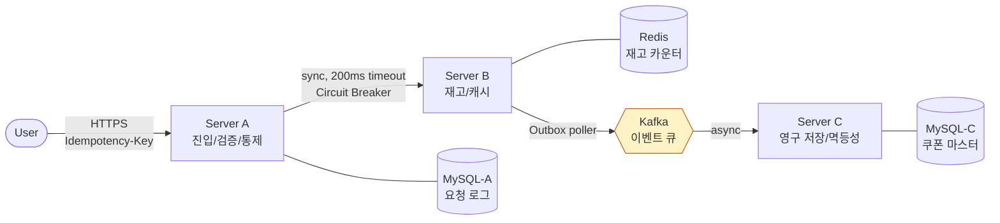

# 선착순 쿠폰 발급 시스템 — 백엔드 채용 과제

> 5일 일정의 백엔드 채용 과제. 1 vCPU / 2 GB RAM 노드 3대로 구성된 분산 시스템에서
> **콘서트 사전 예매 할인 쿠폰 — 선착순 10,000장** 시나리오를 처리하는 구현.
>
> 본 README 는 평가자에게 전달하는 단일 진입점. 더 깊은 컨텍스트는 [`CLAUDE.md`](./CLAUDE.md) 참조.

---

## 1. 개요

| 항목 | 값 |
|------|------|
| 시나리오 | 콘서트 사전 예매 할인 쿠폰 (선착순 10,000장) |
| 도메인 책임 | 발급(Issue) + 사용(Redeem) |
| 인프라 제약 | 인스턴스당 1 vCPU / 2 GB RAM (Server A/B/C 각각) |
| 트래픽 | 사용자 1,000명 × 10초 100건 = 평균 10,000 TPS |
| 인스턴스당 목표 | 500 ~ 1,000 TPS |
| 일정 | 5일 |

**핵심 명제**: "vCPU 1 / RAM 2 GB 서버 3대로 10,000 TPS 를 어떻게 안정적으로 처리할 거냐" —
인프라 제약을 **소프트웨어 (큐 + 비동기 + 백프레셔 + 분산 캐시)** 로 푼다.

---

## 2. 시스템 아키텍처

### 2.1 다이어그램



**데이터 흐름** (정상 케이스):

1. User → A: `POST /api/v1/coupons/issue-requests` + `Idempotency-Key` 헤더
2. A: 인증 → Rate Limit 검사 → Idempotency 검사 → 요청 로그 적재 → B 호출
3. A → B (sync, 200ms): Redis Lua 로 재고 차감 → 쿠폰 코드 생성 → Outbox 적재
4. B → A: 즉시 결과 응답 (성공 / 매진)
5. A → User: 결과 응답
6. B → C (async, Kafka): 쿠폰 영구 저장 (멱등성 보장)

**핵심**: A→B 는 동기 (즉시 결과 응답), B→C 는 비동기 (영구 저장은 응답 latency 와 분리). 자세한 근거는 [§4.1](#41-ab-동기-bc-비동기) 참조.

### 2.2 기술 스택

| 카테고리 | 기술 | 버전 |
|---|---|---|
| 언어 | Java | 21 |
| 프레임워크 | Spring Boot | 3.5.14 |
| 빌드 | Gradle (Kotlin DSL) | 8.14.4 |
| RDBMS | MySQL | 8.0 |
| In-memory | Redis | 7-alpine |
| 메시지 큐 | Kafka (KRaft mode) | 3.7 |
| ORM / Migration | Spring Data JPA + Hibernate, Flyway | 번들 |
| Rate Limiter | Bucket4j | 8.14.0 |
| Resilience | Resilience4j | 2.3.0 |
| 부하 테스트 | k6 | latest |
| 컨테이너 | Docker, docker-compose | - |
| 모니터링 | Spring Actuator + Micrometer Prometheus | 번들 |

---

## 3. 시나리오 및 도메인

### 3.1 비즈니스 시나리오

콘서트 사전 예매 할인 쿠폰 발급. 발급 수량 10,000장, 1,000명이 10초 안에 평균 100건씩 요청.
선착순으로 한 사용자에게 1장만 정식 발급되며, 사용자는 즉시 결과를 안다.

### 3.2 핵심 Aggregate

| 노드 | Aggregate | 책임 |
|---|---|---|
| Server A | `IssueRequest` | 진입 검증 + 멱등성 키 매칭 + 요청 audit (RECEIVED / FORWARDED / SUCCEEDED / FAILED / REJECTED) |
| Server A | `Event` | 마스터 (id, name, totalStock, period). 실시간 재고는 Server B 권위 |
| Server B | (Redis 키만) | `event:{id}:stock:{0..9}` 샤딩, `coupon:code:{code}` |
| Server C | `Coupon` | code UNIQUE + idempotencyKey UNIQUE + version 낙관락. 영구 저장 |

상세 ER 다이어그램: PR #2 본문 또는 `docs/architecture.md` (TBD).

---

## 4. 핵심 설계 결정 (ADR)

CLAUDE.md §6 의 ADR-001 ~ ADR-007 참조. 본 섹션은 평가자 시점의 요약.

### 4.1 A→B 동기, B→C 비동기

- **결정**: A→B 는 sync HTTP, B→C 는 async (Outbox + Kafka)
- **근거**: 선착순 UX 는 즉시 결과를 요구. 비동기 + 폴링은 사용자 F5 연타로 트래픽 폭증. 영구 저장은 사용자 응답 latency 와 분리해도 무방.
- **트레이드오프**: A 의 스레드가 B 응답까지 묶임 → Resilience4j Circuit Breaker + 200ms timeout 으로 보완.
- 상세: ADR-001

### 4.2 Saga (Choreography) + Outbox

- **결정**: Choreography 기반 saga. B 가 발급 후 Outbox 적재 → poller 가 Kafka 발행 → C 가 consume.
- **근거**: Orchestrator 를 따로 두면 1 vCPU 부담. Choreography 가 경량.
- **보상 트랜잭션**: C 저장 N회 실패 시 DLQ → 알림 → 운영자 수동 보상. 자동 보상은 Day 5 후속.
- **CDC (Debezium) 미선택**: 5일 일정 — Outbox poller 로 진행. 프로덕션 진화 방향으로 README §9 명시.
- 상세: ADR-002

### 4.3 Redis 기반 재고 관리

- **결정**: 재고 카운터는 Redis. Lua script 로 atomic DECR + 음수 방지 + 쿠폰 코드 생성.
- **금지**: RDBMS row lock 기반 재고 관리. 1 vCPU 에서 lock 경합으로 처리량이 수십 TPS 로 떨어진다.
- **Hot Spot 대응**: 재고 10,000장 → 10개 샤드 (`event:{id}:stock:{0..9}`). 사용자 hash 로 샤드 라우팅.
- 상세: ADR-003

### 4.4 Idempotency-Key 전략

- **결정**: 클라이언트가 `Idempotency-Key` 헤더로 UUID 전달.
- **1차 보장**: Server A 의 `(user_id, idempotency_key) UNIQUE` + Redis SETNX 캐시 (24h TTL)
- **최종 보장**: Server C 의 `coupon.idempotency_key UNIQUE` constraint — Kafka 메시지 재처리 시 DB 가 중복 거부
- 적용 범위: 발급(issue), 사용(redeem) 양쪽
- 상세: ADR-004

### 4.5 Rate Limiting / Backpressure

- **결정**: Bucket4j + Redis backend (Lettuce). 사용자별 토큰 버킷.
- **정책**: 사용자당 10 req/sec, burst 20 (10초에 100건 시나리오에 맞춤). 초과 시 즉시 429.
- **백프레셔**: A 의 큐가 가득 차면 503 반환 (시스템 보호 우선).
- 상세: ADR-005

### 4.6 Database per Service

- **결정**: Server A 의 MySQL, Server B 의 Redis, Server C 의 MySQL 은 독립 스토리지.
- **로컬 환경**: docker-compose 단일 MySQL 컨테이너에 `server_a` / `server_c` schema 분리. Outbox 추가 시 `server_b` schema 합류 (Day 2).
- **운영**: 서비스별 분리된 인스턴스 권장 — README §9 후속.
- 상세: ADR-006

### 4.7 쿠폰 사용(Redeem) — 낙관적 락

- **결정**: `@Version` 컬럼으로 낙관락. 실패 시 클라이언트에 재시도 안내.
- **근거**: 한 쿠폰 동시 사용 시도는 흔치 않음. 비관 락은 1 vCPU 에서 오버헤드.
- 상세: ADR-007

---

## 5. 평가 항목별 구현

### 5.1 동시성 제어 (Server A 진입점)

> Day 4 부하 테스트 후 본 섹션을 본격 채움. 현재는 토대만.

- HikariCP `maximum-pool-size: 10` (server-a) — 1 vCPU 보수적, Day 4 튜닝 대상
- 비동기 로깅 / batch insert: TBD (Day 4)
- `@Version` 낙관락 (issue_request, coupon)

### 5.2 분산 정합성 + 멱등성

- **이중 멱등성 방어**: Server A `(user_id, idempotency_key) UNIQUE` (1차) + Server C `idempotency_key UNIQUE` (2차) + Redis SETNX (캐시)
- **상태 전이**: `IssueRequestStatus` 그래프 (RECEIVED → FORWARDED → SUCCEEDED|FAILED, RECEIVED → REJECTED) — 도메인 객체 안에서 검증
- **Kafka consumer 멱등성**: DB UNIQUE constraint 가 중복 거부 (DLQ 없이도 안전)
- 상세: ADR-002, ADR-004

### 5.3 캐시 + Hot Spot

> Day 2 (Server B) 시작 시 본격 채움.

- Redis 재고 샤딩 (10 샤드, `RedisKeys.shardIdFor(userId)`)
- Lua script 기반 atomic 차감 (예정)
- request coalescing / probabilistic early refresh (선택, README §9)
- L1 (Caffeine) + L2 (Redis) 2단 캐시 (선택)

### 5.4 Rate Limiting

> PR #5 (Idempotency + Rate Limiter) 머지 후 본격 채움.

- Bucket4j Lettuce backend. 사용자별 10 req/sec, burst 20.
- Filter chain: RateLimit → Idempotency → Controller
- 초과 시 429 + `X-RateLimit-Remaining` / `X-RateLimit-Retry-After-Seconds` 헤더

### 5.5 인프라 사이징

> Day 5 마무리 단계에 본격 채움.

- k6 부하 테스트 결과 → Little's Law (`L = λW`) 적용
- 단일 인스턴스 측정 TPS → 100,000명 트래픽 처리에 필요한 인스턴스 수 산출
- HikariCP / JVM / Tomcat 풀 사이즈 튜닝 결과

---

## 6. 부하 테스트 결과

> Day 4 작업. k6 시나리오 + 결과 보고서 첨부 예정.

```
TBD: load-test/scenarios/issue-burst.js, redeem-steady.js
TBD: docs/load-test-report.md
```

---

## 7. 100,000명 처리 시 인프라 계산

> Day 5 작업.

```
TBD: Little's Law 기반 인스턴스 수 산출
TBD: 비용 추정 (단순화 가정 명시)
```

---

## 8. 로컬 실행 방법

### 8.1 사전 요구사항

- JDK 21
- Docker / docker-compose
- (선택) `k6` — 부하 테스트용

### 8.2 인프라 기동

```bash
docker compose up -d
docker compose ps                 # mysql / redis / kafka 모두 healthy 확인
```

서비스 / 포트:
- MySQL `3306` (root password `rootpassword`, schemas: `server_a`, `server_c`)
- Redis `6379`
- Kafka `9092` (컨테이너 간) / `29092` (호스트)
- Kafka UI `http://localhost:8081`

### 8.3 서비스 빌드 / 기동

```bash
./gradlew clean build -x test     # 4 모듈 컴파일

./gradlew :server-a:bootRun       # Server A on :8080
./gradlew :server-c:bootRun       # Server C on :8082
# Server B 는 Day 2 부터 본격 작업
```

기동 시 Flyway 가 마이그레이션을 자동 적용. `/actuator/health` 로 상태 확인:

```bash
curl http://localhost:8080/actuator/health
# {"status":"UP"}
```

### 8.4 정리

```bash
docker compose down               # 컨테이너 정지 + 네트워크 삭제 (볼륨 보존)
docker compose down -v            # 볼륨까지 모두 제거 (Flyway 재실행 시)
```

### 8.5 CI

> 5일 일정상 GitHub Actions 미구현. PR 단위 검증은 작성자가 로컬에서 `./gradlew clean build` 통과 확인 후 머지. Day 5 여유 시 추가 또는 후속 작업으로.

---

## 9. 한계 및 개선 방향

### 9.1 의도적 단순화 (5일 일정)

| 영역 | 본 과제 | 운영 진화 방향 |
|---|---|---|
| Outbox 발행 | poller 방식 | CDC (Debezium) → Kafka Connect |
| Saga 보상 | DLQ + 운영자 수동 보상 | Orchestrator 기반 자동 보상 (Camunda 등) |
| 인증 | `X-User-Id` 헤더 단순 식별 | JWT + OAuth2 / API Gateway |
| Database per Service | 단일 MySQL 컨테이너에 schema 분리 | 서비스별 분리 인스턴스 |
| CI | 미구현 | GitHub Actions (build / test / docker push) |
| 모니터링 | `/actuator/prometheus` 노출만 | Prometheus + Grafana + alert rule |
| 자동 재고 복구 | 미구현 | DLQ consumer 가 재고 복구 이벤트 발행 |

### 9.2 캐시 / 성능 후속

- Caffeine + Redis 2단 캐시 (Server B 의 Event 마스터 조회 등)
- Redis 의 probabilistic early refresh / request coalescing
- HikariCP / JVM 풀 사이즈 튜닝 (Day 4 부하 테스트 후)
- batch insert / 비동기 audit 로그 (Server A 의 issue_request)

### 9.3 코드 품질 후속

- 통합 테스트 — 동시성 핵심 로직 (재고 차감, idempotency) 우선 (Testcontainers)
- ADR 문서를 `docs/decisions/` 에 별도 파일로 분리
- BusinessException 체계 도입 (`CouponAlreadyRedeemedException` 등)

---

## 10. 진행 상황 (Day 1)

본 PR 시점 기준 (squash merge 히스토리):

```
0d30470 chore(infra): Gradle 멀티모듈 + docker-compose + PR 템플릿 셋업 (#1)
cf5985e feat(domain): Server A/C 도메인 모델 + Flyway 마이그레이션 (#2)
<this>  docs(readme): 골격 + Mermaid 다이어그램 + 로컬 실행 방법 (#3)
```

이후 PR (#4 발급 API + Stub 클라이언트, #5 Idempotency + Rate Limit, #6 Circuit Breaker)
이 머지되면 Day 1 단일 Server A 가 완전히 동작하는 상태가 됨.

Day 2 ~ Day 5 일정은 [`CLAUDE.md` §12](./CLAUDE.md) 참조.
