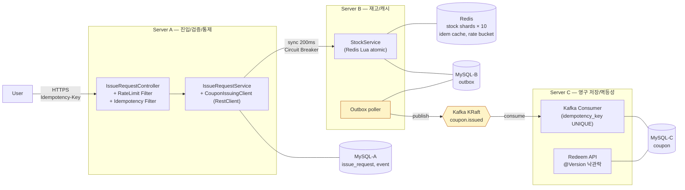
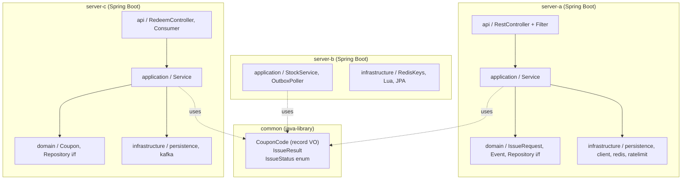

# 아키텍처 개요

> 본 문서는 평가자가 시스템 의도와 구조를 5분 안에 파악하기 위한 단일 진입점입니다.
> 더 깊은 컨텍스트 (개발자용) 는 저장소 루트의 [`CLAUDE.md`](../../CLAUDE.md) 참조.

---

## 1. 프로젝트 목표

이 프로젝트는 단순 CRUD 보다 아래 관점을 우선해 구현합니다.

- 1 vCPU / 2 GB RAM 노드 3대로 평균 10,000 TPS 의 선착순 트래픽을 안정적으로 처리
- 분산 시스템에서의 정합성과 멱등성을 코드로 증명
- 도메인 규칙을 계층 밖으로 새지 않게 유지
- Database per Service 원칙 — 서비스 간 직접 DB 공유 금지
- Docker Compose 로 애플리케이션과 인프라를 한 번에 실행 가능
- 부하 테스트 결과로 사이징 산출 (Little's Law)

---

## 2. 시스템 아키텍처

### 2.1 다이어그램



### 2.2 데이터 흐름 — 정상 발급

1. User → A: `POST /api/v1/coupons/issue-requests` + `Idempotency-Key` 헤더
2. A: 인증 (`X-User-Id` 단순 식별) → Rate Limit 검사 → Idempotency 검사 → 요청 audit 적재 (`issue_request`)
3. A → B (sync, 200ms timeout, Circuit Breaker): Redis Lua 로 재고 차감 → 쿠폰 코드 생성 → Outbox 적재 (`server_b.outbox`)
4. B → A: 즉시 결과 응답 (성공 / 매진 / 이미 발급)
5. A → User: 결과 응답
6. B → C (async, Outbox poller → Kafka `coupon.issued` → C consume): 쿠폰 영구 저장 (`server_c.coupon`)

**핵심**: A→B 는 동기 (사용자에게 즉시 결과 응답), B→C 는 비동기 (영구 저장은 응답 latency 와 분리). 근거는 §5.1 ADR-001 참조.

---

## 3. 인스턴스 / 인프라 제약

| 항목 | 값 |
|------|------|
| 서버 사양 (Server A/B/C 각각) | vCPU 1 / RAM 2 GB |
| 총 사용자 | 1,000명 |
| 사용자당 요청 | 10초 내 100건 |
| 전체 부하 | 평균 10,000 TPS |
| 인스턴스당 목표 | 500 ~ 1,000 TPS |
| 데이터 형식 | JSON, 10개 필드 |
| 프로토콜 | HTTPS |

이 제약은 모든 설계 결정의 전제입니다. 예를 들어 Redis 재고 차감을 RDBMS row lock 으로 대체하면 1 vCPU 환경에서 락 경합으로 처리량이 수십 TPS 로 떨어집니다 (ADR-003 금지 사항).

---

## 4. 멀티 모듈 구조

```text
promotion/
├── common                    # CouponCode VO, IssueResult, IssueStatus
├── server-a                  # 진입/검증/통제
├── server-b                  # 재고/캐시
├── server-c                  # 영구 저장/멱등성
├── docker-compose.yml        # MySQL / Redis / Kafka KRaft / Kafka UI
└── docs/
    └── architecture/         # 본 문서 시리즈
```



### 4.1 각 모듈의 책임

#### `common` — `java-library`

- 노드 간 공유되는 값 객체와 enum
- `CouponCode` (record VO, 길이 12, `[A-Z0-9]+`, `generate()` 정적 팩토리)
- `IssueResult` (Server A ↔ Server B 호출 결과)
- `IssueStatus` enum (ISSUED / SOLD_OUT / ALREADY_ISSUED / INTERNAL_ERROR)
- Spring Boot bootJar 비활성, 외부 의존 최소

#### `server-a` — 진입점 (Gateway / Validator)

> "빠르게 받고, 잘못된 건 거르고, B 로 위임"

- API: `POST /api/v1/coupons/issue-requests`, `GET /api/v1/coupons/issue-requests/{requestId}`
- 인증/인가: `X-User-Id` 헤더 단순 식별 (5일 일정상 JWT 미적용, 운영 진화 대상)
- Rate Limiter: Bucket4j + Redis backend, 사용자당 10 req/sec
- Idempotency-Key 검사: Redis SETNX (24h TTL) + DB UNIQUE
- 요청 audit: `issue_request` 테이블에 비동기/batch 적재
- Server B 호출: RestClient + Resilience4j Circuit Breaker (200ms timeout)
- **금지**: A 에서 재고 관리, A 에서 무거운 트랜잭션, A→B 호출에 timeout/circuit 없음

#### `server-b` — 재고 관리 (Cache / Decision)

> "한정 자원의 분배 결정자"

- API (내부): `POST /internal/v1/coupons/issue`
- Redis Lua atomic 재고 차감 (`event:{id}:stock:{0..9}` 10 샤드)
- 쿠폰 코드 생성 (`CouponCode.generate()`)
- Outbox 적재 (`server_b.outbox`) — Day 2 작업
- Outbox poller → Kafka publish — Day 2~3 작업
- **금지**: 재고를 RDBMS row lock 으로 관리, GET 후 SET (atomic 아님), 동기적으로 C 까지 호출

#### `server-c` — 영구 저장 (Source of Truth)

> "최종 진실의 보관자"

- API: `POST /api/v1/coupons/{code}/redeem`, `GET /api/v1/users/{userId}/coupons`
- Kafka consumer (`coupon.issued` topic): 발급 이벤트 → MySQL 영구 저장
- 멱등성: `coupon.idempotency_key UNIQUE` constraint 가 중복 메시지 거부 (DLQ 안 가도 안전)
- redeem: `@Version` 낙관적 락 (ADR-007), 비관 락 회피
- **금지**: UNIQUE 없이 Kafka 처리, consumer 안에서 동기 외부 호출 (lag 폭증)

---

## 5. 핵심 설계 결정 (ADR)

각 결정의 상세 근거와 대안 비교는 [`CLAUDE.md` §6](../../CLAUDE.md) 참조.

### 5.1 ADR-001: A→B 동기, B→C 비동기

- **결정**: A→B 는 sync HTTP, B→C 는 async (Outbox + Kafka)
- **근거**: 선착순 UX 는 즉시 결과를 요구. 비동기 + 폴링은 사용자 F5 연타로 트래픽 폭증. 영구 저장은 사용자 응답 latency 와 분리해도 무방
- **트레이드오프**: A 의 스레드가 B 응답까지 묶임 → Resilience4j Circuit Breaker + 200ms timeout 으로 보완

### 5.2 ADR-002: Saga (Choreography) + Outbox

- **결정**: Choreography 기반 saga. B 가 발급 후 Outbox 적재 → poller 가 Kafka 발행 → C 가 consume
- **근거**: Orchestrator 를 따로 두면 1 vCPU 부담. Choreography 가 경량
- **CDC (Debezium) 미선택**: 5일 일정 — Outbox poller 로 진행. 운영 진화 방향으로 README §9 명시

### 5.3 ADR-003: Redis 기반 재고 관리

- **결정**: 재고 카운터는 Redis. Lua script 로 atomic DECR + 음수 방지 + 쿠폰 코드 생성
- **금지**: RDBMS row lock 기반 재고 관리. 1 vCPU 에서 lock 경합으로 처리량이 수십 TPS 로 떨어짐
- **Hot Spot 대응**: 재고 10,000 장 → 10 샤드 (`event:{id}:stock:{0..9}`). 사용자 hash 로 샤드 라우팅

### 5.4 ADR-004: Idempotency-Key 전략

- **결정**: 클라이언트가 `Idempotency-Key` 헤더로 UUID 전달
- **1차 보장**: Server A `(user_id, idempotency_key) UNIQUE` + Redis SETNX (24h TTL)
- **최종 보장**: Server C `coupon.idempotency_key UNIQUE` constraint — Kafka 메시지 재처리 시 DB 가 중복 거부
- **적용 범위**: 발급(issue), 사용(redeem) 양쪽

### 5.5 ADR-005: Rate Limiting

- **결정**: Bucket4j + Redis backend (Lettuce). 사용자별 토큰 버킷
- **정책**: 사용자당 10 req/sec, burst 20 (10초에 100건 시나리오 기준). 초과 시 즉시 429 + `Retry-After`
- **백프레셔**: A 의 큐가 가득 차면 503 반환 (시스템 보호 우선)

### 5.6 ADR-006: Database per Service

- **결정**: Server A 의 MySQL, Server B 의 Redis + 보조 MySQL, Server C 의 MySQL 은 독립 스토리지
- **로컬**: docker-compose 단일 MySQL 컨테이너에 `server_a` / `server_c` schema 분리. Day 2 에 `server_b` schema 합류 (Outbox)
- **운영**: 서비스별 분리 인스턴스 권장 — README "한계 및 개선 방향" 후속

### 5.7 ADR-007: 쿠폰 사용 — 낙관적 락

- **결정**: `@Version` 컬럼으로 낙관락. 실패 시 클라이언트에 재시도 안내
- **근거**: 한 쿠폰 동시 사용 시도는 흔치 않음. 비관 락은 1 vCPU 에서 오버헤드

---

## 6. 로컬 실행

### 6.1 사전 요구사항

- JDK 21
- Docker / docker-compose
- (선택) `k6` — 부하 테스트용 (Day 4)

### 6.2 인프라 기동

```bash
docker compose up -d
docker compose ps      # mysql / redis / kafka 모두 healthy 확인
```

서비스 / 포트:

| 서비스 | 포트 | 용도 |
|---|---|---|
| MySQL | `3306` | schemas: `server_a`, `server_c` (Day 2 에 `server_b` 추가). root password `rootpassword` |
| Redis | `6379` | 재고 샤드, idempotency 캐시, rate limit bucket |
| Kafka (KRaft) | `9092` (컨테이너 간) / `29092` (호스트) | `coupon.issued` 토픽 (Day 2 생성) |
| Kafka UI | `http://localhost:8081` | 디버깅 |

### 6.3 서비스 빌드 / 기동

```bash
./gradlew clean build -x test     # 4 모듈 컴파일

./gradlew :server-a:bootRun       # Server A on :8080
./gradlew :server-c:bootRun       # Server C on :8082
# Server B 는 Day 2 부터 본격 작업
```

기동 시 Flyway 가 마이그레이션 자동 적용. health 확인:

```bash
curl http://localhost:8080/actuator/health
# {"status":"UP"}

curl http://localhost:8082/actuator/health
# {"status":"UP"}
```

### 6.4 정리

```bash
docker compose down               # 컨테이너 정지 + 네트워크 삭제 (볼륨 보존)
docker compose down -v            # 볼륨까지 모두 제거 (Flyway 재실행 시)
```

### 6.5 CI

5일 일정상 GitHub Actions 미구현. PR 단위 검증은 작성자가 로컬에서 `./gradlew clean build` 통과 확인 후 머지. Day 5 여유 시 추가 또는 후속 작업.

---

## 7. 다음 문서

본 시리즈는 작업이 진행되며 추가됩니다.

| # | 문서 | 작성 시점 |
|---|---|---|
| 02 | 도메인 설계 (Aggregate / VO / 상태 전이) | Day 2~3 |
| 03 | 시퀀스 다이어그램 (발급 / 멱등성 / Rate Limit / Outbox poller) | Day 2~3 |
| 04 | ERD / JPA 설계 | Day 2~3 |
| 05 | API 설계 (요청/응답 스키마, 에러 매핑) | Day 2~3 |
| 06 | 설계 결정 / 트레이드오프 / 한계 | Day 2~5 |

부하 테스트 / 사이징 결과는 별도 `docs/report/` 폴더에 작성 예정 (Day 4~5).
