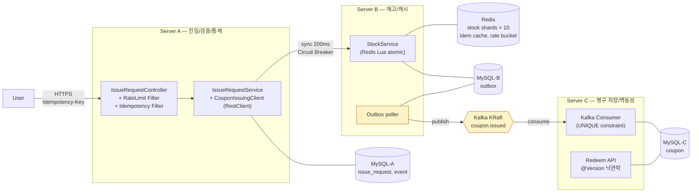

# 아키텍처 개요

> **5분 안에 시스템을 이해할 수 있는 한 페이지**. 더 깊은 컨텍스트는 본 시리즈의 다른 문서로 점프.

---

## 1. 한 줄 요약

> "**1 vCPU / 2 GB RAM 노드 3대로 평균 10,000 TPS 의 선착순 트래픽을 정합성 깨짐 없이 처리**" — 하드웨어 한계를 소프트웨어 (큐 + 비동기 + 백프레셔 + 분산 캐시) 로 푼다.

---

## 2. 시스템 다이어그램

---

## 3. 데이터 흐름 — 정상 발급

1. User → A: `POST /api/v1/coupons/issue-requests` + `Idempotency-Key`
2. A: 인증 → Rate Limit → Idempotency 검사 → 요청 audit
3. A → B (sync, 200ms timeout, CB): Redis Lua atomic 차감 + 코드 발급 + Outbox 적재
4. A → User: 즉시 결과 응답 (성공 / 매진 / 이미 발급)
5. B → C (async, Outbox poller → Kafka → Consumer): 쿠폰 영구 저장

**핵심**: A→B 는 동기 (선착순 UX), B→C 는 비동기 (응답 latency 와 분리).

상세 시퀀스 다이어그램 4개 (정상 / 보상 / SOLD_OUT / redeem race): [`03.Sequence-Diagrams.md`](./03.Sequence-Diagrams.md)

---

## 4. 5축 평가 매핑

| # | 평가 항목 | 핵심 기법 | 책임 서비스 | 검증 |
|---|---|---|---|---|
| ① | 대량 트래픽 + 동시성 | HikariCP, batch insert (Day 4 결정) | Server A | day2-04 burst |
| ② | 분산 정합성 + 멱등성 | Saga + Outbox + UNIQUE 3 단계 | A→B→C 전체 | day3-01..03 |
| ③ | Hot Spot 회피 | Redis 재고 10 샤드 + Lua atomic | Server B | (Day 4 측정) |
| ④ | Rate Limit / Backpressure | Bucket4j Lettuce + Resilience4j CB | Server A | phase9-04 |
| ⑤ | 인프라 사이징 | k6 부하 + Little's Law | 전체 | (Day 4) |

전체 ADR 인덱스: [`../decisions/`](../decisions/)

---

## 5. 인스턴스 / 인프라 제약

| 항목 | 값 |
|------|------|
| 서버 사양 (Server A/B/C 각각) | vCPU 1 / RAM 2 GB |
| 총 사용자 | 1,000명 |
| 사용자당 요청 | 10초 내 100건 |
| 전체 부하 | 평균 10,000 TPS |
| 인스턴스당 목표 | 500 ~ 1,000 TPS |

이 제약은 모든 설계 결정의 전제. 예: Redis 재고 차감을 RDBMS row lock 으로 대체하면 1 vCPU 환경에서 처리량이 수십 TPS 로 떨어짐 (ADR-003).

---

## 6. 다음 문서

| # | 문서 | 다루는 내용 |
|---|---|---|
| 02 | [도메인 모델](./02.Domain-Model.md) | Aggregate / VO / 상태 전이 / ERD |
| 03 | [시퀀스 다이어그램](./03.Sequence-Diagrams.md) | 발급 / 보상 / SOLD_OUT / redeem race |
| 04 | [데이터 저장소](./04.Data-Stores.md) | MySQL schema / Redis 키 / Kafka 토픽 |
| 05 | [모듈 구조](./05.Modules.md) | Gradle 멀티 모듈 / 패키지 레이어 / 책임 |

| 카테고리 | 위치 | 다루는 내용 |
|---|---|---|
| 결정 (ADR) | [`../decisions/`](../decisions/) | CLAUDE.md ADR-001~007 + 추가 결정 6개 |
| 운영 / 장애 | [`../runbooks/`](../runbooks/) | 장애 시나리오 + Day 2 부하 가이드 |
| 보고서 | (Day 4~5 작성 예정) | 부하 결과 + 사이징 |

루트 진입점: [`../../README.md`](../../README.md)
