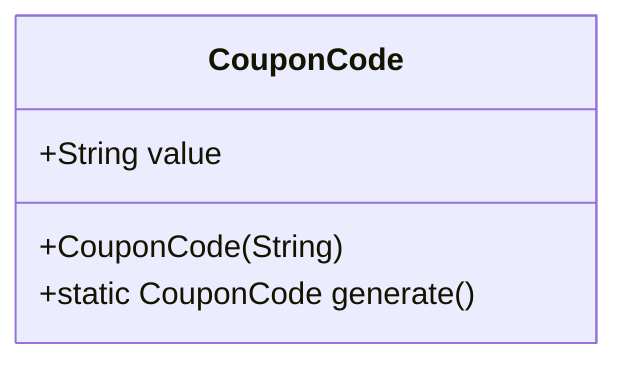
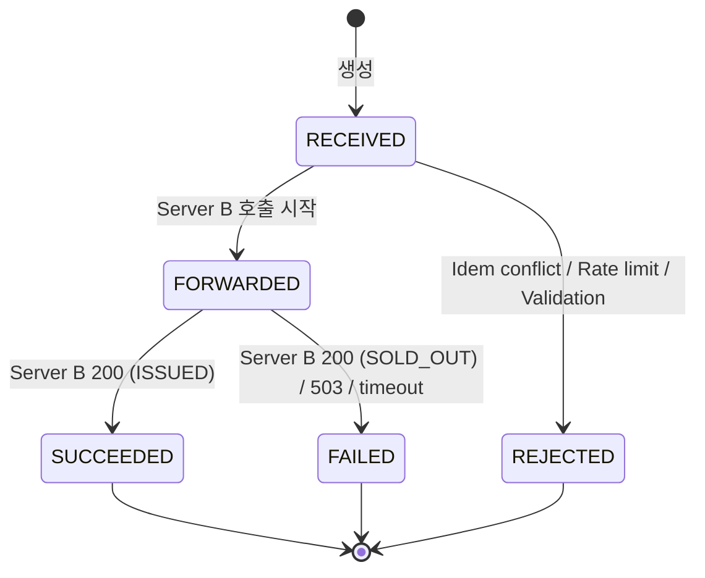
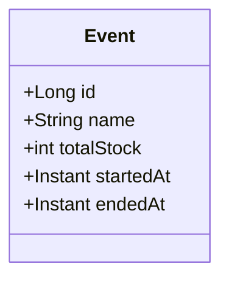
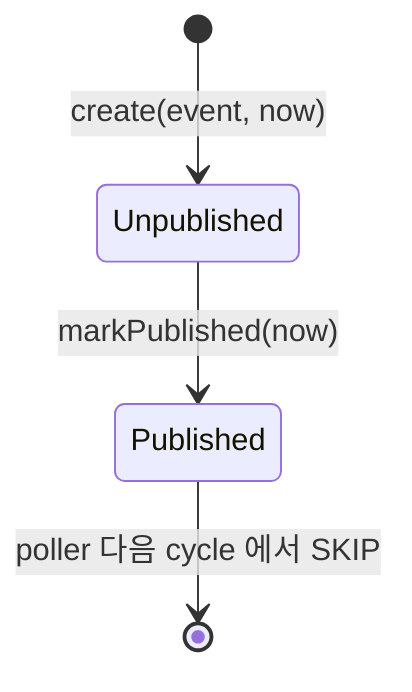
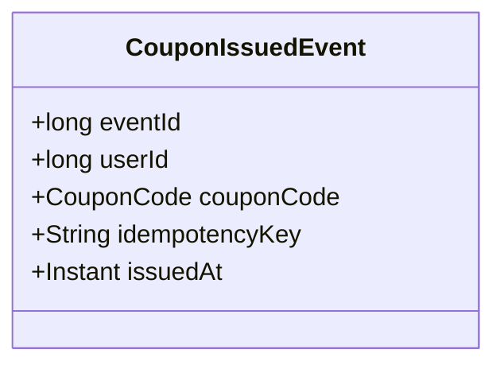
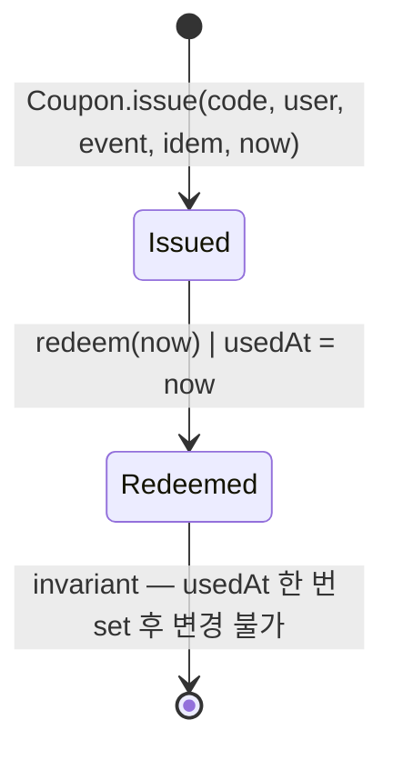
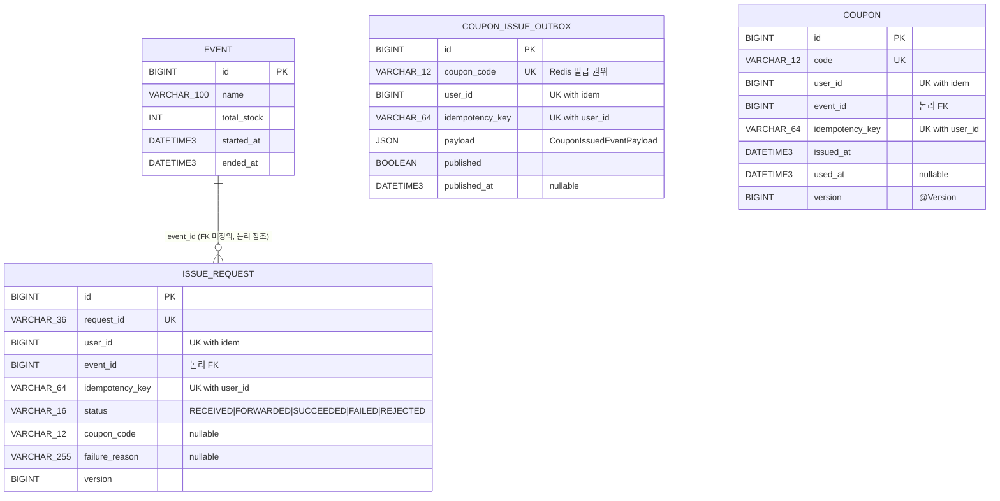

# 도메인 모델

> 본 문서는 발급 / 사용 도메인의 Aggregate, VO, 상태 전이를 한 페이지로 정리. ERD 와 매핑 관계는 §4 참조.

---

## 1. Aggregate 한눈에

| 모듈 | Aggregate Root | 책임 | 영속 위치 |
|---|---|---|---|
| `common` | — | `CouponCode` (VO), `IssueResult`, `IssueStatus` (enum) | 노드 간 공유 |
| `server-a` | `IssueRequest` | 발급 요청의 상태 전이 + 멱등성 1차 보장 | MySQL `server_a.issue_request` |
| `server-a` | `Event` | 이벤트 마스터 (이름 / 기간 / 총 재고 스냅샷) | MySQL `server_a.event` |
| `server-b` | `CouponIssueOutbox` | 발급 사건의 영속 + Kafka 발행 상태 | MySQL `server_b.coupon_issue_outbox` |
| `server-c` | `Coupon` | 발급된 쿠폰의 영구 + 사용(redeem) 상태 | MySQL `server_c.coupon` |

**도메인 객체와 JPA 객체는 분리** (`xxxJpaEntity` 명명 + `Mapper` static utility). 도메인은 Spring/JPA
어노테이션 비침투. 근거: CLAUDE.md §11.

---

## 2. `CouponCode` (VO)

- 길이 12, `[A-Z0-9]+` (Crockford base32 의 일부)
- `generate()` — `SecureRandom` 으로 매번 새 코드. 충돌 확률 ~ 32^12 ≈ 10^18
- 검증: 길이 / 문자 알파벳 — 잘못된 코드는 `IllegalArgumentException` (역직렬화 단계에서도 동일)

**위치**: `common/src/main/java/com/promotion/common/coupon/CouponCode.java`

---

## 3. `IssueRequest` (Server A)

### 3.1 상태 전이

### 3.2 불변식

- `(user_id, idempotency_key)` UNIQUE — DB constraint (PR #6 의 Idempotency 1차 보장)
- `couponCode` 는 `status == SUCCEEDED` 일 때만 non-null
- `failureReason` 은 `status ∈ {FAILED, REJECTED}` 일 때만 non-null
- 종단 상태 (SUCCEEDED / FAILED / REJECTED) 에서 재전이 금지 — `IssueRequestStatus.canTransitionTo()` 가 강제
- Setter 미노출 — 상태 전이는 도메인 메서드 (`markForwarded` / `markSucceeded` / `markFailed` / `reject`) 만

### 3.3 멱등성 위치

| 보호 위치 | 매체 | 키 | TTL |
|---|---|---|---|
| 1차 (응답 캐시) | Redis | `idem:{userId}:{key}` (server-a 자체) | 24h |
| 1차 (영속) | MySQL | `(user_id, idempotency_key)` UNIQUE | 영구 |

server-b 의 발급 응답 캐시 (`coupon:idem:{userId}:{key}`) 와 별도 prefix — 두 서비스가 자기
관심사의 캐시를 독립적으로 보유. server-a 의 race 처리는 의도적으로 단순화 (`GET → chain → SET`,
SETNX 아님) — 동시 첫 요청 시 두 요청 모두 downstream 진입, 최종 차단은 Server C UNIQUE 가 권위.

상세 ADR: [`../decisions/server-b-user-scoped-idempotency-cache.md`](../decisions/server-b-user-scoped-idempotency-cache.md)

---

## 4. `Event` (Server A)

- `total_stock` 은 운영 입력 시점의 **스냅샷**. 실시간 재고 권위는 server-b 의 Redis 샤드 합계 (ADR-003)
- `chk_event_period`: `startedAt < endedAt`
- `chk_event_stock`: `totalStock > 0`

운영 시 별도 admin 도구로 마스터 INSERT. 본 과제에서는 Flyway V1 INSERT (id=1, "Concert Pre-Sale 2026", 10,000) 로 시드.

---

## 5. `CouponIssueOutbox` (Server B)

### 5.1 상태 전이

### 5.2 불변식

- `published == true` ⇔ `publishedAt != null`
- 한번 `published=true` 이후 `false` 로 되돌릴 수 없음 (멱등 발행 보장)
- `(user_id, idempotency_key)` UNIQUE — server-a 의 1차 멱등과 정합 (Flyway V2)
- `coupon_code` UNIQUE — Redis 가 발급한 코드의 영구 권위 (user 무관, 코드 자체의 유일성)
- `event` (`CouponIssuedEvent` record) 는 도메인 사건 — JSON 직렬화는 Mapper 가 영속 시점에 변환

### 5.3 Outbox 사건 (`CouponIssuedEvent`)

- 도메인 단의 record (불변)
- Kafka 발행 시 `CouponIssuedEventPayload` (common module) 로 평탄화 직렬화
- 같은 형식이 **Outbox payload JSON 컬럼 + Kafka value** 모두에 사용됨 — 재변환 없음

상세 ADR: [`../decisions/server-b-outbox-poller-kafka.md`](../decisions/server-b-outbox-poller-kafka.md)

---

## 6. `Coupon` (Server C)

### 6.1 상태 전이

### 6.2 불변식

- `code` UNIQUE — DB constraint (Redis 가 발급한 코드의 영구 권위)
- `(user_id, idempotency_key)` UNIQUE — Kafka 메시지 재처리 / 중복 발급 거부 (Flyway V2)
- `usedAt` 은 한 번 set 후 변경 불가 — `Coupon.redeem(now)` 의 invariant 가 보장
- `issuedAt` 은 생성 시점 set 후 변경 불가
- `version` (`@Version`) — redeem 동시 호출 race 방어 (ADR-007)

### 6.3 멱등성 위치

| 보호 위치 | 매체 | 키 | 용도 |
|---|---|---|---|
| 발급 (consume) | MySQL | `(user_id, idempotency_key)` UNIQUE + `code` UNIQUE | Kafka 재처리 / 중복 발급 거부 |
| 사용 (redeem) | 도메인 자체 | `usedAt` 한 번 set | 별도 캐시 미도입 |

redeem 의 멱등 결정은 [`../decisions/redeem-idempotency-without-cache.md`](../decisions/redeem-idempotency-without-cache.md) 참조.

---

## 7. ERD

**물리적 FK 미정의** — Database per Service 원칙 (ADR-006). 같은 user_id / event_id / coupon_code 가
세 schema 에 분산되지만 RDBMS 는 schema 별 독립.

| schema | 테이블 | 역할 |
|---|---|---|
| `server_a` | `event` | 이벤트 마스터 |
| `server_a` | `issue_request` | 발급 요청 audit + 멱등 1차 |
| `server_b` | `coupon_issue_outbox` | 발급 사건의 Outbox |
| `server_c` | `coupon` | 발급된 쿠폰의 영구 + 사용 상태 |

---

## 8. 멱등성 / UNIQUE 정합 종합

| 위치 | UNIQUE | 의미 |
|---|---|---|
| Server A `issue_request` | `(user_id, idempotency_key)` | 같은 user 의 같은 idem 중복 요청 차단 |
| Server A `issue_request` | `request_id` | UUID, 외부 노출 식별자 |
| Server A Redis | `idem:{userId}:{key}` (TTL 24h) | 응답 캐시 (race 의도적 단순화 — `GET → SET`) |
| Server B `coupon_issue_outbox` | `(user_id, idempotency_key)` | Outbox 중복 적재 차단 |
| Server B `coupon_issue_outbox` | `coupon_code` | Redis 발급 코드 권위 |
| Server B Redis | `coupon:idem:{userId}:{key}` (TTL 24h) | server-b 응답 캐시 (PR #12) |
| Server C `coupon` | `(user_id, idempotency_key)` | Kafka 메시지 재처리 거부 |
| Server C `coupon` | `code` | 발급 코드 영구 권위 |

세 단계 모두 **user-scoped** 정합. ADR-004 의 의도 — "다른 user 가 우연히 같은 idem 을 써도 격리".

---

## 9. 다음 문서

- [`03.Sequence-Diagrams.md`](./03.Sequence-Diagrams.md) — 발급 / 보상 / redeem 의 시퀀스
- [`04.Data-Stores.md`](./04.Data-Stores.md) — Redis 키 패턴 / Kafka 토픽 / Flyway 마이그레이션
- [`05.Modules.md`](./05.Modules.md) — 모듈 구조 + 책임 + 패키지 레이어
- [`../decisions/`](../decisions/) — ADR 인덱스 + 상세 결정 문서
