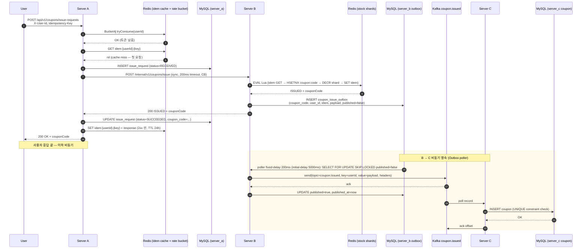
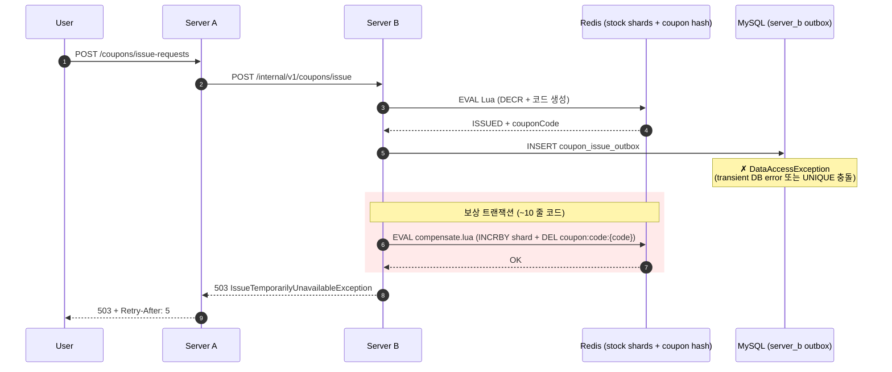
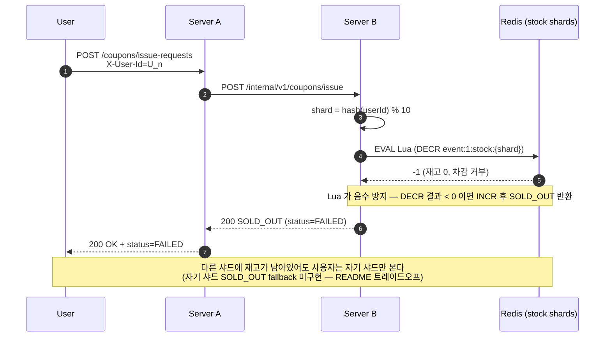
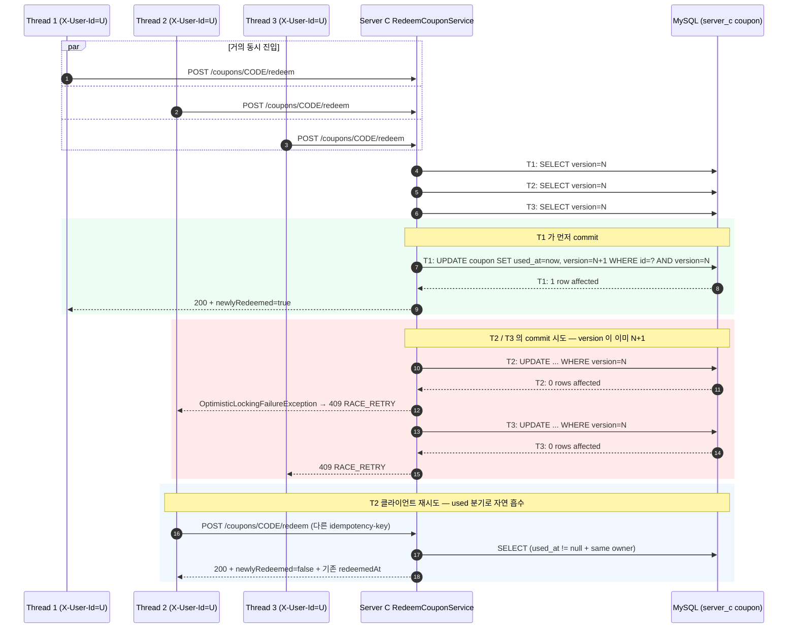

# 시퀀스 다이어그램

> 본 문서는 시스템의 핵심 흐름 4개를 시퀀스 다이어그램으로 시각화. 각 흐름의 코드 위치와 ADR 링크를 함께 제공.

---

## 1. 발급 정상 (ISSUED)

가장 흔한 흐름. A→B 동기 (즉시 응답) + B→C 비동기 (Outbox + Kafka).

**핵심 포인트**:
- ① ~ ⑪ 까지는 사용자 응답 latency 안에 일어남. ⑫ ~ 이하는 비동기.
- A 는 Redis 캐시 GET (hit miss) → DB INSERT → B 호출 → DB UPDATE → 2xx 일 때만 캐시 SET 순서.
  GET 후 chain → SET 패턴이라 race 가능 — 의도적 단순화. 최종 차단은 Server C UNIQUE 가 권위.
- B 는 Lua atomic 으로 race 차단. Outbox INSERT 실패 시 보상 (다음 시퀀스).
- 의미적 exactly-once 는 Server C 의 UNIQUE 가 권위.

**관련 코드**:
- `server-a/.../api/IssueRequestController.java` + `IssueRequestService.java`
- `server-b/.../application/CouponIssueService.java` + `infrastructure/redis/RedisStockClient.java`
- `server-b/src/main/resources/redis/issue-coupon.lua`
- `server-b/.../application/OutboxPoller.java` + `infrastructure/kafka/KafkaCouponIssuedEventPublisher.java`
- `server-c/.../infrastructure/kafka/CouponConsumer.java` + `application/CouponIngestService.java`

**관련 ADR**: [ADR-001](../../CLAUDE.md), [ADR-002](../../CLAUDE.md), [ADR-003](../../CLAUDE.md)

---

## 2. 발급 보상 트랜잭션 (Outbox INSERT 실패)

Server B 가 Lua 차감 성공 후 / Outbox INSERT 실패 시. 보상 = Redis 차감 복구.

**핵심 포인트**:
- 보상 코드는 ~10 줄 (catch + Lua INCR + 로그). "거창한 Saga Orchestrator 없이 Choreography 로 충분"의 시그널.
- 사용자에게 503 + Retry-After. idempotency 캐시는 503 저장 안 함 — 재시도 가능.
- B JVM 이 Lua 직후 / Outbox INSERT 직전 크래시 시는 보상 못 함 — **유령 재고**, [`../runbooks/failure-modes.md`](../runbooks/failure-modes.md) §1.2 참조.

**관련 코드**:
- `server-b/.../application/CouponIssueService.java` (try/catch 보상 분기)
- `server-b/src/main/resources/redis/compensate.lua`

**관련 ADR**: [`../decisions/outbox-mysql-vs-redis-streams.md`](../decisions/outbox-mysql-vs-redis-streams.md) §5

---

## 3. 발급 SOLD_OUT (자기 샤드 재고 0)

**핵심 포인트**:
- HTTP 200 + body 의 `status=FAILED` — 200 은 호출 성공, FAILED 는 비즈니스 결과 (재고 소진).
- 사용자 hash 가 자기 샤드만 본다 — 다른 샤드 fallback 없음. 의도적 단순화 (CLAUDE.md §10 / README 트레이드오프).
- Hot Spot 회피 — 단일 키 (`event:1:stock`) 대신 10 샤드.

**관련 코드**:
- `server-b/src/main/resources/redis/issue-coupon.lua` (DECR 음수 방지)
- `server-b/.../infrastructure/redis/RedisKeys.java` (`shardId(userId, eventId)`)

**관련 ADR**: [ADR-003](../../CLAUDE.md)

---

## 4. 사용 (redeem) 동시성 race + 멱등 흡수

같은 coupon 을 같은 user 가 동시에 redeem 시도. 낙관적 락이 한 명만 통과.

**핵심 포인트**:
- `@Version` 자동 동작 — Hibernate 의 `WHERE version=?` 절이 affected rows=0 시 OptimisticLockingFailureException.
- 첫 commit (T1) 만 used_at 을 set. T2 / T3 의 commit 은 0 rows → exception → 409 RACE_RETRY.
- 클라이언트 재시도 시 service 의 `if (coupon.isUsed())` 분기가 200 + newlyRedeemed=false 로 흡수.
- 의미적 멱등 — 두 idem 분기 응답은 둘 다 DB ms 정밀도로 정확히 일치.

**관련 코드**:
- `server-c/.../application/RedeemCouponService.java` (분기 + 낙관락 propagate)
- `server-c/.../api/exception/GlobalExceptionHandler.java` (`OptimisticLockingFailureException` → 409)
- `server-c/.../domain/Coupon.java` (`@Version` + `redeem()` invariant)

**관련 ADR**: [ADR-007](../../CLAUDE.md), [`../decisions/redeem-idempotency-without-cache.md`](../decisions/redeem-idempotency-without-cache.md)

---

## 5. 다음 문서

- [`02.Domain-Model.md`](./02.Domain-Model.md) — Aggregate / VO / 상태 전이 / ERD
- [`04.Data-Stores.md`](./04.Data-Stores.md) — MySQL / Redis / Kafka 의 키 패턴 / 마이그레이션
- [`../runbooks/failure-modes.md`](../runbooks/failure-modes.md) — 위 4 흐름의 부분 장애 시나리오
- [`../decisions/`](../decisions/) — 결정 ADR 인덱스
