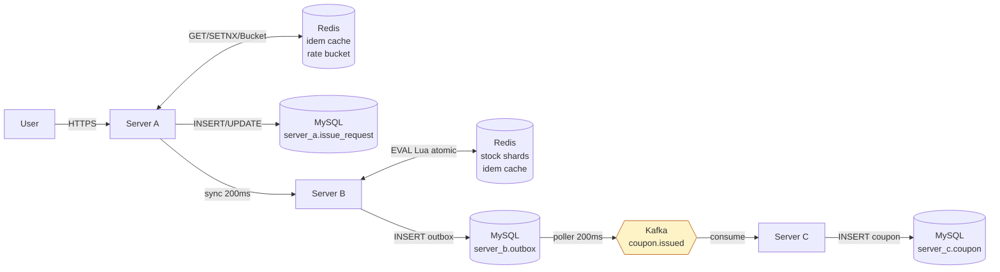

# 데이터 저장소

> 본 문서는 MySQL / Redis / Kafka 의 키 / 토픽 / 마이그레이션을 한 페이지로 정리.
> 각 저장소의 운영 권위와 정합성 책임을 명시.

---

## 1. 저장소 책임 분배

| 저장소 | 권위 | 데이터 종류 | 영속성 |
|---|---|---|---|
| MySQL `server_a` | 발급 요청 audit + 멱등 1차 보장 | `event` 마스터 (스냅샷), `issue_request` (전이 + UNIQUE) | ACID, 영구 |
| MySQL `server_b` | 발급 사건의 Outbox + Kafka 발행 상태 | `coupon_issue_outbox` | ACID, 영구 |
| MySQL `server_c` | **발급된 쿠폰의 영구 권위** | `coupon` (사용 상태 포함) | ACID, 영구 |
| Redis | **실시간 재고 권위** + 응답 캐시 + Rate bucket | stock 샤드 / idem 캐시 / Bucket4j bucket | RDB+AOF (운영 정책) |
| Kafka | **B → C 비동기 채널** | `coupon.issued` 토픽 | broker disk |

권위가 분산되어 있다는 사실 자체가 핵심 설계 — 단일 저장소로 ACID 묶기를 포기하고 각 단계의 보호로 정합성 회복.

근거: [ADR-006](../../CLAUDE.md)

---

## 2. MySQL — 서비스별 schema

### 2.1 `server_a`

| 테이블 | 마이그레이션 | UNIQUE / 인덱스 | 비고 |
|---|---|---|---|
| `event` | `V1__create_event.sql` | PK(id) | 마스터 스냅샷, Day 1 시드 (id=1, total_stock=10000) |
| `issue_request` | `V2__create_issue_request.sql` | `(user_id, idempotency_key)` UK, `request_id` UK, idx(event_id, created_at), idx(status, created_at) | 발급 audit + 멱등 1차 |

### 2.2 `server_b`

| 테이블 | 마이그레이션 | UNIQUE / 인덱스 | 비고 |
|---|---|---|---|
| `coupon_issue_outbox` | `V1__create_coupon_issue_outbox.sql` | `coupon_code` UK, idx(published, created_at) | 발급 사건 + Kafka 발행 상태 |
| 동일 | `V2__outbox_user_scoped_idem.sql` (마이그레이션) | `(user_id, idempotency_key)` UK 추가 (ADR-004 정합화) | PR #12 |

### 2.3 `server_c`

| 테이블 | 마이그레이션 | UNIQUE / 인덱스 | 비고 |
|---|---|---|---|
| `coupon` | `V1__create_coupon.sql` | `code` UK, `idempotency_key` UK (idem-only) | Day 1 도메인 |
| 동일 | `V2__align_coupon_idempotency_user_scoped.sql` | idem-only UK 제거 → `(user_id, idempotency_key)` UK 추가 | PR #16 정합화 |

### 2.4 Database per Service 의 로컬 구현

5일 일정 + local 환경 — docker-compose 단일 MySQL 컨테이너에 schema 분리 (`server_a`, `server_b`, `server_c`).
운영 진화 시 별도 인스턴스 권장. 근거: [ADR-006](../../CLAUDE.md)

```sql
-- docker/mysql/init.sql
CREATE DATABASE server_a CHARACTER SET utf8mb4 COLLATE utf8mb4_unicode_ci;
CREATE DATABASE server_b CHARACTER SET utf8mb4 COLLATE utf8mb4_unicode_ci;
CREATE DATABASE server_c CHARACTER SET utf8mb4 COLLATE utf8mb4_unicode_ci;
GRANT ALL PRIVILEGES ON server_a.* TO 'promotion'@'%';
GRANT ALL PRIVILEGES ON server_b.* TO 'promotion'@'%';
GRANT ALL PRIVILEGES ON server_c.* TO 'promotion'@'%';
```

각 서비스가 자기 schema 로 Flyway 마이그레이션 자동 적용 (`spring.flyway.enabled=true`, `ddl-auto=validate`).

---

## 3. Redis — 키 패턴

### 3.1 키 컨벤션

| 키 | 자료형 | 용도 | TTL | 권위 |
|---|---|---|---|---|
| `event:{eventId}:stock:{0..9}` | INTEGER | 재고 샤드 (10개) | 영구 (운영) | **server-b** (재고) |
| `coupon:code:{code}` | HASH | 임시 발급 정보 (eventId, userId 등) | 24h | server-b |
| `idem:{userId}:{key}` | STRING | server-a 의 일반 응답 캐시 (race 의도적 단순화 — `GET → SET`) | 24h | server-a |
| `coupon:idem:{userId}:{key}` | STRING | server-b 의 발급 응답 캐시 (Lua atomic SET) | 24h | server-b |
| `bucket:{userId}` | Bucket4j 내부 | server-a Rate Limit 토큰 | 1초 (refill) | server-a |

근거: `server-b/.../infrastructure/redis/RedisKeys.java`

### 3.2 Hot Spot 회피 — 재고 샤딩

```
사용자 hash → shardId = Math.floorMod(Long.hashCode(userId), 10)
              → event:1:stock:{0..9} 중 한 키만 DECR
```

- 단일 키 (`event:1:stock`) 에 1만 사용자가 동시 DECR → Redis 단일 thread 의 contention.
- 10 샤드로 분할 → 각 샤드에 평균 1000 DECR → Hot Spot 완화.
- 트레이드오프: 자기 샤드 SOLD_OUT 시 다른 샤드에 재고가 남아 있어도 사용자는 SOLD_OUT 응답 (fallback 미구현 — README 트레이드오프).

### 3.3 atomic 보장 — Lua script

`server-b/src/main/resources/redis/issue-coupon.lua` (실제 흐름 4 단계):
```lua
-- KEYS[1] = event:{eventId}:stock:{shardId}        (INTEGER)
-- KEYS[2] = coupon:code:{couponCode}                (HASH)
-- KEYS[3] = coupon:idem:{userId}:{idempotencyKey}   (STRING — server-b 캐시)
-- ARGV = couponCode, userId, eventId, ttlSeconds, nowEpochMillis

-- 1. idem 캐시 hit → 같은 결과 반환
local cached = redis.call('GET', KEYS[3])
if cached then return {'ALREADY_ISSUED', cached} end

-- 2. 쿠폰 코드 충돌 검사 (HSETNX) — 이미 점유된 코드면 CODE_COLLISION
local registered = redis.call('HSETNX', KEYS[2], 'userId', ARGV[2])
if registered == 0 then return {'CODE_COLLISION', ''} end
redis.call('HSET', KEYS[2], 'eventId', ARGV[3], 'issuedAtMs', ARGV[5])
redis.call('PEXPIRE', KEYS[2], tonumber(ARGV[4]) * 1000)

-- 3. atomic DECR + 음수 방지 (보상: INCR + DEL hash)
local newStock = redis.call('DECR', KEYS[1])
if tonumber(newStock) < 0 then
    redis.call('INCR', KEYS[1])
    redis.call('DEL', KEYS[2])
    return {'SOLD_OUT', ''}
end

-- 4. idem 캐시 등록
redis.call('SET', KEYS[3], ARGV[1], 'EX', tonumber(ARGV[4]))
return {'ISSUED', ARGV[1]}
```

EVAL 전체가 single Redis thread 에서 atomic — race condition 0. GET 후 SET 패턴이면 race 발생.

**`CODE_COLLISION` 분기**: `CouponCode.generate()` 의 충돌 확률은 32^12 ≈ 10^18 으로 사실상 0이지만, 발생 시
Java 단의 `CouponIssueService` 가 새 SecureRandom 코드로 최대 N회 재시도
(`app.coupon-issue.code-collision-max-retries`).

### 3.4 영속성 정책

본 과제: docker default (RDB only). 운영 진화: AOF `everysec`, Redis Sentinel / Cluster.

근거: [`../runbooks/failure-modes.md`](../runbooks/failure-modes.md) §3.1

---

## 4. Kafka — 토픽 / 발행 / 소비

### 4.1 토픽

| 토픽 | partitions | replication | key | value |
|---|---|---|---|---|
| `coupon.issued` | 3 | 1 (single broker, 운영은 RF≥2 권장) | userId | `CouponIssuedEventPayload` JSON (평탄화 record) |

- partition 수 3 — 단일 broker 환경 + 향후 확장 여유. 너무 많은 partition 은 broker 메타데이터 부담.
- key=userId — 같은 사용자의 여러 이벤트가 같은 partition 에 모여 ordering 보장. eventId key 는 단일 이벤트(`event_id=1`)에 트래픽이 몰려 partition skew → 거부.

근거: [`../decisions/server-b-outbox-poller-kafka.md`](../decisions/server-b-outbox-poller-kafka.md)

### 4.2 Producer (server-b OutboxPoller)

```yaml
producer:
  acks: all                           # leader + ISR ack
  enable.idempotence: true            # broker 측 retry dedup
  max.in.flight.requests.per.connection: 5
  delivery.timeout.ms: 30000
  request.timeout.ms: 5000
  linger.ms: 5
  compression.type: lz4
  retries: 5
  key-serializer: StringSerializer
  value-serializer: StringSerializer
```

- 트랜잭션 분리: SELECT FOR UPDATE SKIP LOCKED (트랜잭션 1) → publish (트랜잭션 밖) → markPublished (트랜잭션 N).
- 200ms fixed-delay 로 사용자 응답 직후 평균 1 cycle 안에 발행.

### 4.3 Consumer (server-c CouponConsumer)

```yaml
consumer:
  group-id: coupon-server-c
  auto-offset-reset: earliest
  enable-auto-commit: false
  isolation-level: read_committed
  max-poll-records: 10
  key-deserializer: StringDeserializer
  value-deserializer: StringDeserializer
listener:
  ack-mode: RECORD                     # record 단위 즉시 commit
  type: SINGLE
  concurrency: 1                       # 1 vCPU 환경, README 트레이드오프
```

- `RECORD` ack-mode + 정상 종료 시 commit. throw 발생 시 commit 안 됨 → DefaultErrorHandler retry.
- `concurrency=1` — 1 vCPU 환경에서 컨텍스트 스위칭 비용 > 병렬 이득. partition 3 개를 단일 consumer 가 처리.
- DataIntegrityViolationException → ack-and-skip (UNIQUE 거부 = 이미 처리됨, 의미적 exactly-once 의 권위).
- JsonProcessingException → ack-and-skip (poison pill 흡수).

### 4.4 의미적 exactly-once

Producer at-least-once + Consumer DB UNIQUE 거부 흡수 = **의미적 exactly-once**. 정통의 Kafka transactional producer (read_committed isolation + transactional.id) 는 본 과제 외 — README 진화 방향.

---

## 5. 데이터 흐름 — 저장소 시점



---

## 6. 다음 문서

- [`02.Domain-Model.md`](./02.Domain-Model.md) — Aggregate / VO / 상태 전이 / ERD
- [`03.Sequence-Diagrams.md`](./03.Sequence-Diagrams.md) — 4 가지 핵심 흐름 시퀀스
- [`05.Modules.md`](./05.Modules.md) — 모듈 구조 / 패키지 / 책임
- [`../runbooks/failure-modes.md`](../runbooks/failure-modes.md) — 저장소별 장애 시나리오
