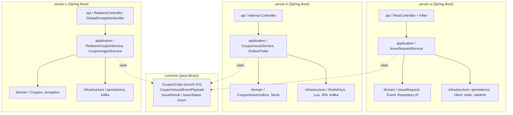
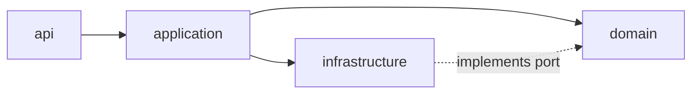

# 모듈 구조

> Gradle 멀티 모듈 + 각 서비스의 패키지 레이어 + 책임. CLAUDE.md §5 와 §11 의 코딩 컨벤션을 시각화.

---

## 1. Gradle 모듈

```
promotion/
├── settings.gradle.kts          # include(":common", ":server-a", ":server-b", ":server-c")
├── build.gradle.kts             # 공통 의존성 + Java 21 toolchain + Spring Boot BOM
├── docker-compose.yml           # MySQL / Redis / Kafka KRaft
│
├── common                       # java-library (bootJar 비활성)
├── server-a                     # Spring Boot bootJar
├── server-b                     # Spring Boot bootJar
├── server-c                     # Spring Boot bootJar
│
├── load-test/                   # k6 시나리오 + run-integrated.sh
└── docs/                        # 본 문서 시리즈
```



---

## 2. `common` — 공유 라이브러리

| 클래스 | 종류 | 용도 |
|---|---|---|
| `CouponCode` | record VO | 길이 12 + 알파벳 검증, `generate()` static factory |
| `CouponIssuedEventPayload` | record | server-b → server-c 의 producer-consumer 계약 (평탄화) |
| `IssueResult` | record | server-a ↔ server-b 호출 결과 |
| `IssueStatus` | enum | ISSUED / SOLD_OUT / ALREADY_ISSUED / INTERNAL_ERROR |

- `bootJar` 비활성 (`tasks.named<Jar>("jar") { enabled = false }` 안 함, java-library 플러그인)
- 외부 의존 최소 (Lombok / Jackson 만)
- 도메인 leak 방지 — 어느 모듈의 도메인 객체도 들어가지 않음 (record 만)

---

## 3. `server-a` — 진입점 (Gateway / Validator)

> "빠르게 받고, 잘못된 건 거르고, B 로 위임"

### 3.1 책임 (CLAUDE.md §5.1)

- **API**: `POST /api/v1/coupons/issue-requests`, `GET /api/v1/coupons/issue-requests/{requestId}` (선택)
- **인증/인가**: `X-User-Id` 헤더 단순 식별 (5일 일정상 JWT 미적용)
- **Rate Limiter**: Bucket4j + Redis backend, 사용자당 10 req/sec
- **Idempotency-Key 검사**: Redis SETNX (24h TTL) + DB UNIQUE
- **요청 audit**: `issue_request` 테이블 (Day 4 batch insert 결정 영역)
- **Server B 호출**: RestClient + Resilience4j Circuit Breaker (200ms timeout)

### 3.2 패키지

```
com.promotion.servera/
├── api/
│   ├── IssueRequestController.java
│   ├── filter/
│   │   ├── IdempotencyFilter.java         # Redis 분산 캐시
│   │   └── RateLimitFilter.java           # Bucket4j Lettuce
│   ├── exception/
│   │   └── GlobalExceptionHandler.java    # 400 / 409 / 500 / 503 매핑
│   └── dto/
│       ├── ApiResponse.java + ErrorResponse.java
│       └── IssueCouponRequest / Response
├── application/
│   ├── IssueRequestService.java           # @Transactional 분리 (RECEIVED save → B 호출 → 마감 save)
│   └── CouponIssuingClient.java           # 포트
├── domain/
│   ├── IssueRequest.java                  # AR + 상태 전이 메서드
│   ├── IssueRequestStatus.java            # transition graph
│   ├── Event.java                         # 이벤트 마스터
│   └── *Repository.java                   # 도메인 port
└── infrastructure/
    ├── persistence/                       # JpaEntity + Mapper + RepositoryImpl
    ├── client/CouponIssuingRestClient.java # RestClient + CB
    ├── redis/                             # Bucket4j Lettuce, idem cache
    └── ratelimit/                         # Bucket4j 빈 + 정책
```

### 3.3 금지

- A 에서 재고 관리 — 재고 권위는 server-b Redis
- A→B 호출에 timeout / circuit breaker 없음 — 200ms timeout + Resilience4j 필수
- A 안에서 무거운 트랜잭션 (외부 호출 포함) — `@Transactional` 분리

---

## 4. `server-b` — 재고 관리 (Cache / Decision)

> "한정 자원의 분배 결정자"

### 4.1 책임 (CLAUDE.md §5.2)

- **API (내부)**: `POST /internal/v1/coupons/issue` — 재고 차감 + 쿠폰 코드 생성
- **Redis Lua atomic 차감**: `event:{id}:stock:{0..9}` 10 샤드 + 음수 방지 + 쿠폰 코드 생성
- **Outbox 적재**: `server_b.coupon_issue_outbox` (보상 트랜잭션 포함)
- **Outbox poller**: 200ms fixed-delay + Kafka publish

### 4.2 패키지

```
com.promotion.serverb/
├── api/
│   ├── CouponIssueController.java
│   ├── exception/GlobalExceptionHandler.java
│   └── dto/...
├── application/
│   ├── CouponIssueService.java            # Lua + Outbox + 보상
│   ├── OutboxPoller.java                  # @Scheduled fixed-delay 200ms
│   └── CouponIssuedEventPublisher.java    # 포트
├── domain/
│   ├── CouponIssueOutbox.java             # AR + markPublished 메서드
│   ├── CouponIssuedEvent.java             # record (도메인 사건)
│   ├── Stock.java                         # 샤드 수 권위 (DEFAULT_SHARD_COUNT=10)
│   └── *Repository.java                   # 도메인 port
└── infrastructure/
    ├── persistence/                       # Outbox JpaEntity + Mapper + Native SKIP LOCKED query
    ├── redis/                             # RedisKeys + RedisStockClient (Lua eval)
    └── kafka/                             # KafkaConfig (NewTopic) + KafkaCouponIssuedEventPublisher
└── resources/redis/                       # issue-coupon.lua, compensate.lua
```

### 4.3 금지

- 재고를 RDBMS row lock 으로 관리 — 1 vCPU 락 경합으로 처리량 폭락
- Redis GET 후 SET — atomic 아님, 반드시 EVAL Lua
- 동기적으로 server-c 까지 호출 — 서버 응답 latency 폭증

---

## 5. `server-c` — 영구 저장 (Source of Truth)

> "최종 진실의 보관자"

### 5.1 책임 (CLAUDE.md §5.3)

- **Kafka consumer**: `coupon.issued` topic 의 메시지 → MySQL 영구 저장
- **API**: `POST /api/v1/coupons/{code}/redeem` (사용)
- **(선택, 미구현)**: `GET /api/v1/users/{userId}/coupons` (조회)
- **멱등성**: `(user_id, idempotency_key)` UNIQUE + `code` UNIQUE 가 중복 메시지 거부 — DLT 안 가도 안전
- **redeem 동시성**: `@Version` 낙관적 락 (ADR-007)

### 5.2 패키지

```
com.promotion.serverc/
├── api/
│   ├── RedeemCouponController.java
│   ├── exception/GlobalExceptionHandler.java   # 404 / 409 RACE_RETRY / 400 / 500
│   └── dto/...
├── application/
│   ├── CouponIngestService.java            # Kafka 메시지 → @Transactional 영속
│   ├── RedeemCouponService.java            # 소유권 검증 + 멱등 분기 + 낙관락
│   ├── RedeemCommand / RedeemResult        # record
│   └── exception/...
├── domain/
│   ├── Coupon.java                         # AR + redeem(now) invariant
│   ├── exception/CouponNotFoundException.java   # 404 마스킹용
│   └── *Repository.java                    # 도메인 port
└── infrastructure/
    ├── persistence/                        # CouponJpaEntity + Mapper + JpaRepository
    └── kafka/CouponConsumer.java           # @KafkaListener + 3 단계 예외 흡수
```

### 5.3 금지

- UNIQUE constraint 없이 Kafka 메시지 처리 — 재시도 시 중복 발급
- consumer 안에서 동기 외부 호출 — lag 폭증
- `@Transactional` 안에서 RuntimeException catch — rollback-only 트랩

---

## 6. 패키지 레이어 컨벤션 (CLAUDE.md §11)

| 레이어 | 위치 | 의존 방향 | 비고 |
|---|---|---|---|
| `domain` | `*/domain/` | 어디에도 의존 안 함 | Spring/JPA 비침투 (어노테이션 0건) |
| `application` | `*/application/` | `domain` + 외부 포트 | `@Service` + `@Transactional` |
| `api` | `*/api/` | `application` | `@RestController`, DTO 변환 |
| `infrastructure` | `*/infrastructure/` | `domain` 포트 구현 + 외부 lib | `@Repository`, `@Component` |



- 가벼운 DDD — Aggregate 개념까지만, 풀 DDD (CQRS / 이벤트 소싱) 는 5일 일정 외
- **헥사고날 금지** — CLAUDE.md §10 안티패턴 — 추상화 비용 > 가치
- JpaEntity 는 `xxxJpaEntity` 명명 + `Mapper` static utility (양방향 변환)
- 도메인은 record VO + `@Getter` + 수동 equals/hashCode (id 기반)
- DTO 는 record + `@JsonInclude(NON_NULL)`

---

## 7. 다음 문서

- [`01.Overview.md`](./01.Overview.md) — 시스템 한눈 요약
- [`02.Domain-Model.md`](./02.Domain-Model.md) — Aggregate / VO / 상태 전이 / ERD
- [`03.Sequence-Diagrams.md`](./03.Sequence-Diagrams.md) — 4 가지 핵심 흐름 시퀀스
- [`04.Data-Stores.md`](./04.Data-Stores.md) — MySQL / Redis / Kafka 의 키 / 토픽 / 마이그레이션
- [`../decisions/`](../decisions/) — ADR 인덱스
