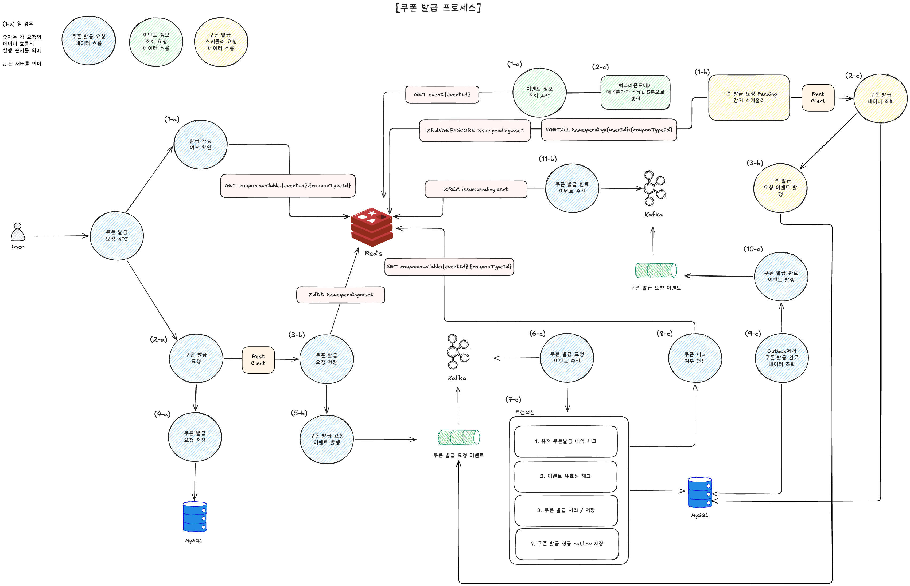

# 시스템 아키텍처 (Data Flow)

## 📚 문서 목록

- [요구사항 분석](requirements.md)
- **시스템 아키텍처** ← 현재 문서
- [다이어그램](diagrams.md)
  - [시퀀스 다이어그램](diagram-sequence.md)
  - [상태 다이어그램](diagram-state.md)
- [ERD](erd.md)
- [API 명세](api-spec.md)

[← README](../../README.md)

---

## 시스템 아키텍처 / Data Flow



> 다이어그램의 라벨은 `(순서-서버)` 형식입니다. 예를 들어 `(1-a)` 는 첫 번째 단계, Server A 의 동작.
> Server A = 진입(Gateway), Server B = 신청 접수 + 결과 캐시, Server C = 영구 저장 + 재고 권위.

---

## 주요 시스템 흐름

### [쿠폰 발급 요청 API]

#### 1) 발급 가능 여부 확인 (1-a)
쿠폰 발급 요청이 Server A 에 도착하면, 가장 먼저 Redis 의 negative cache 를 조회해 매진 여부를 판정한다.

- **발급 가능 (cache miss)** : 다음 단계 (B 호출) 로 진행한다.
- **발급 불가 (cache hit)** : Server B / Server C 까지 가지 않고 즉시 `SOLD_OUT` 응답을 반환한다. 매진된 이벤트의 후속 트래픽이 시스템 자원을 낭비하지 않도록 가장 일찍 단락한다.

```
GET coupon:available:{eventId}:{couponTypeId}
```

#### 2) 쿠폰 발급 요청 (2-a)
Server A 가 Server B 의 internal API 를 sync HTTP 로 호출한다 (Resilience4j Circuit Breaker + Retry 적용).

```
POST /internal/v1/coupons/issue   (A → B)
```

#### 3) 쿠폰 발급 요청 저장 (3-b)
Server B 가 Redis 에 신청 정보를 적재한다. `(userId, couponTypeId)` 단위로 중복을 차단하면서 동시에 사용자 폴링용 상세 데이터를 보관한다.

- `HSETNX` 로 첫 필드(`userId`) 만 atomic 하게 set — 이미 존재하면 중복 신청으로 보고 즉시 종료
- 통과한 호출만 나머지 필드 (status=PENDING, requestId, createdAt, publishAttempts=1) `HSET` + ZSET 등록 (스케줄러가 보는 work queue 인덱스)
- 멱등성의 권위는 Server C 의 `(user_id, coupon_type_id)` UNIQUE — 본 단계는 비용 절감용 first-line guard

```
HSETNX issue:pending:{userId}:{couponTypeId} userId <userId>   # first-write 판정
HSET   issue:pending:{userId}:{couponTypeId} status PENDING ... # 통과 시 나머지 필드
ZADD   issue:pending:zset {createdAt} "{userId}:{couponTypeId}"
```

#### 4) 쿠폰 발급 요청 저장 (4-a)
Server A 가 자신의 MySQL 에 요청 로그를 per-request commit 으로 적재한다 (audit/추적용). 발급 결과의 권위는 Server C 의 `user_coupon` 이며, A 의 `issue_request` 는 입력 트래픽의 흔적만 남기는 역할.

#### 5) 쿠폰 발급 요청 이벤트 발행 (5-b)
Server B 가 Kafka 의 `coupon-issue-request` 토픽으로 발급 신청 이벤트를 publish 한다.
`acks=all + enable.idempotence=true + retries` 로 일시 장애를 producer 차원에서 흡수한다.

#### 6) 쿠폰 발급 요청 이벤트 수신 (6-c)
Server C 의 Kafka consumer 가 `coupon-issue-request` 메시지를 consume 한다. 1 vCPU 자원 보호를 위해 `max.poll.records=10`, `concurrency=1` 로 throttle.

#### 7) 트랜잭션 처리 (7-c)
Server C 가 단일 트랜잭션 안에서 다음을 순서대로 처리한다.

1. **유저 쿠폰 발급 내역 체크** — `(userId, couponTypeId)` 가 이미 존재하면 멱등 처리(early return). UNIQUE 가 권위.
2. **이벤트 유효성 체크** — `started_at ≤ now ≤ ended_at` 인지 확인. 만료된 이벤트면 FAILED 로 기록.
3. **쿠폰 발급 처리 / 저장** — `coupon_type_inventory` 의 row 를 `SELECT ... FOR UPDATE` 비관적 락으로 잠그고 재고를 차감한 뒤 `user_coupon` 을 INSERT.
4. **쿠폰 발급 성공 outbox 저장** — Kafka publish 의 트랜잭션 안전성을 위해 결과를 `outbox_event` 테이블에 같이 INSERT.

이후 트랜잭션을 commit 한다.

#### 8) 쿠폰 재고 여부 갱신 (8-c)
트랜잭션 commit 직후 `afterCommit` hook 이 발화하여, 재고를 fresh read 한 뒤 `availableCount == 0` 이면 매진 신호를 Redis 에 적재한다. 다음 요청부터는 1) 단계의 negative cache 가 단락한다.

```
SET coupon:available:{eventId}:{couponTypeId} 1 EX 86400
```

#### 9) Outbox 폴링 (9-c)
Server C 의 Outbox poller 가 500ms 주기로 `outbox_event` 의 PENDING row 를 조회한다. 여기서 `PENDING` 은 "아직 Kafka 로 안 보낸 row" 라는 메타-상태이며, 결과(SUCCESS/SOLD_OUT/FAILED)는 payload 안에 들어있다.

#### 10) 쿠폰 발급 완료 이벤트 발행 (10-c)
Outbox poller 가 fetch 한 row 의 payload 를 Kafka `coupon-issue-result` 토픽으로 publish 하고, 성공 시 row 의 status 를 `PUBLISHED` 로 갱신한다. 실패 시 status 유지 → 다음 주기 재시도 (at-least-once).

#### 11) 쿠폰 발급 완료 이벤트 수신 (11-b)
Server B 의 Kafka consumer 가 `coupon-issue-result` 메시지를 consume 하고, Redis 의 신청 상태를 갱신한다.

- HASH 의 `status` 를 SUCCESS / SOLD_OUT / FAILED 로 update (사용자 폴링 응답용으로 24h TTL 동안 유지)
- ZSET 에서 해당 엔트리를 ZREM (스케줄러가 다시 잡지 않도록)

```
HSET issue:pending:{userId}:{couponTypeId} status SUCCESS code <code>
ZREM issue:pending:zset "{userId}:{couponTypeId}"
```

---

### [이벤트 정보 조회 API]

#### 1) 이벤트 정보 조회 (1-c)
사용자가 이벤트 정보를 조회하면, Server C 가 먼저 Redis 캐시(`event:{eventId}`)를 본다. 캐시 hit 이면 즉시 응답, miss 면 MySQL 에서 read 후 캐시에 적재(Cache-Aside).

#### 2) Refresh-Ahead 갱신 (2-c)
백그라운드 스케줄러가 매 **1 분마다** `IN_PROGRESS` 상태인 이벤트들을 DB 에서 읽어 Redis 에 다시 SET (TTL 5 분). refresh 주기 < TTL 이라 키가 만료될 시점 자체가 오지 않으므로 cache stampede 위험을 원천 차단한다.

```
SET event:{eventId} <json> EX 300   (매 1분 발화)
```

---

### [쿠폰 발급 스케줄러]

발급 신청이 어떤 사유로든 결과 메시지를 받지 못하고 10초 이상 PENDING 상태로 남았을 때, Server B 의 스케줄러가 회복 시도를 한다. 30초 SLA 안에 SUCCESS 또는 FAILED 결정을 보장한다 (cutoff 10s × maxAttempts 3 = 30s).

#### 1) 쿠폰 발급 요청 pending 감지 (1-b)
Server B 의 `@Scheduled` 가 1초 주기로 Redis ZSET (`issue:pending:zset`) 을 조회해 score(=lastPublishedAt) 가 cutoff 보다 오래된 항목을 batch 로 가져온다. 정상 처리된 항목은 11) 단계의 ZREM 에 의해 이미 빠져있으므로 "여전히 PENDING 인 것" 만 결과에 포함된다.

#### 2) 쿠폰 발급 데이터 조회 (2-c)
스케줄러가 각 PENDING 항목에 대해 Server C 의 internal GET API 를 호출해 `user_coupon` row 의 존재 여부를 직접 확인한다.

```
GET /internal/v1/users/{userId}/coupons/{couponTypeId}   (B → C)
```

- **C 에 row 존재** : result 메시지가 유실됐을 뿐 실제 처리는 완료된 상태. 스케줄러가 결과를 Redis 에 동기화하고 ZSET 에서 제거 → 종결.
- **C 에 없음 + publishAttempts < 3** : Kafka 메시지 자체가 안 닿은 상태. 다음 단계(3-b)로 진행.
- **C 에 없음 + publishAttempts ≥ 3** : 30초 안에 결정 못 했으므로 Redis 의 status 를 FAILED 로 마감하고 ZSET 에서 제거.

#### 3) 쿠폰 발급 요청 이벤트 발행 (3-b)
스케줄러가 `coupon-issue-request` 토픽에 동일 payload 를 다시 publish 한다. 카운터를 publish 시도 직전에 증가시켜 영구 publish 장애에서도 cap 이 항상 수렴하도록 보장한다 (영구 무한 cycle 방지).

C 의 UNIQUE `(userId, couponTypeId)` constraint 가 중복 publish 의 안전성을 보장하므로 재발행 자체는 무해하다.
