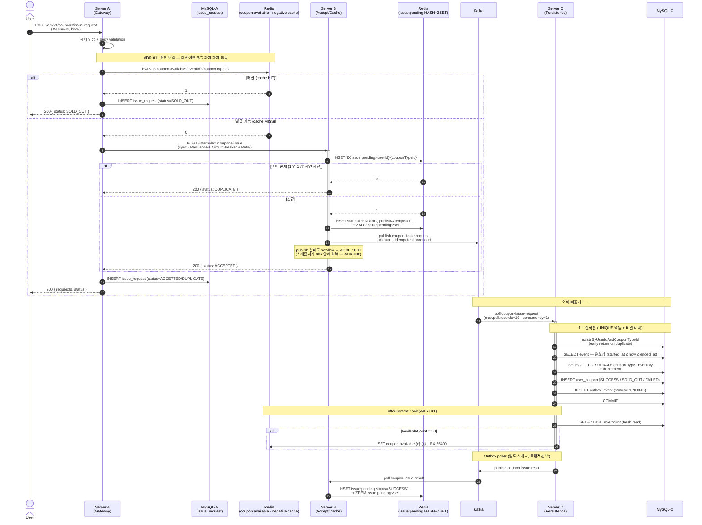
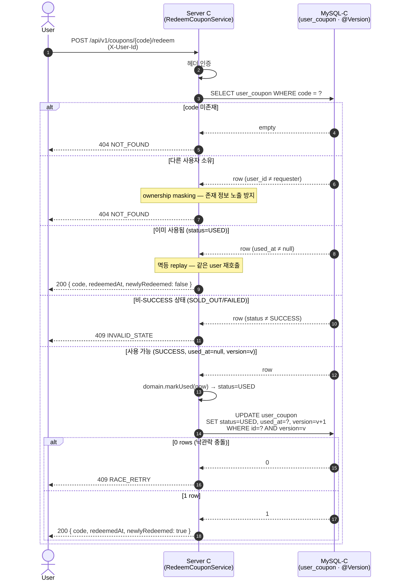
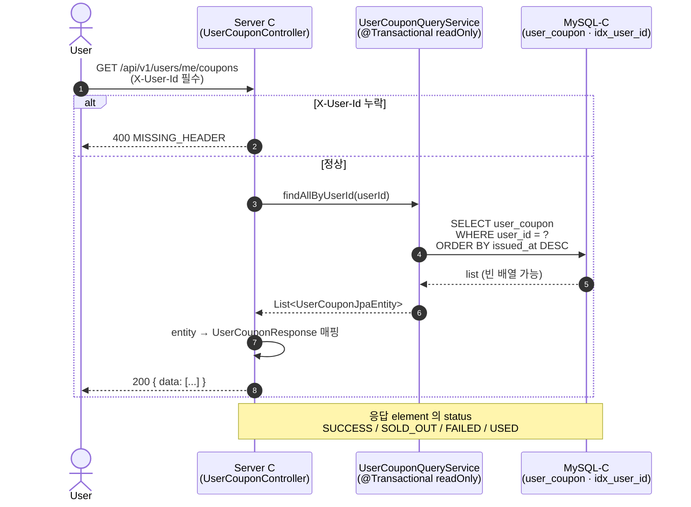
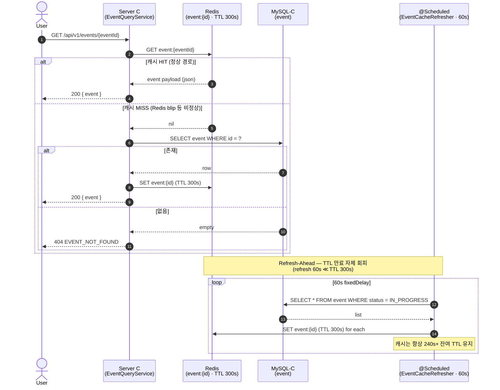
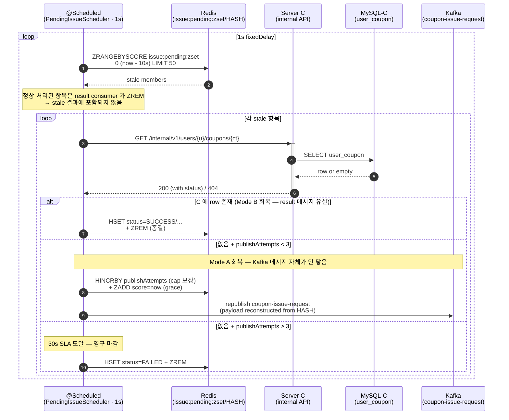
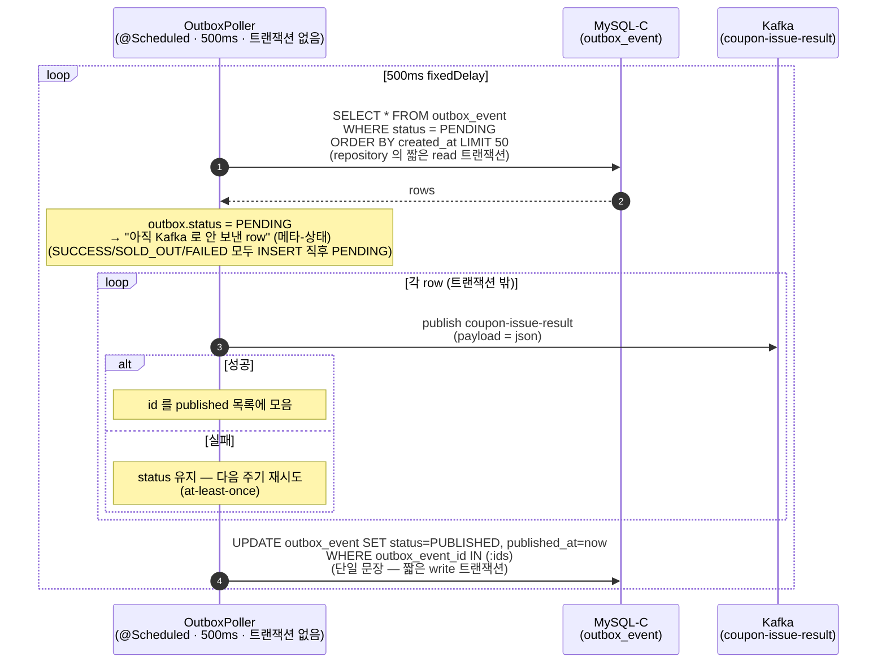

# 시퀀스 다이어그램

## 📚 문서 목록

- [요구사항 분석](requirements.md)
- [시스템 아키텍처](architecture.md)
- [다이어그램](diagrams.md)
  - **시퀀스 다이어그램** ← 현재 문서
  - [상태 다이어그램](diagram-state.md)
- [ERD](erd.md)
- [API 명세](api-spec.md)

[← README](../../README.md)

---

## 1. 쿠폰 발급 요청 — `POST /api/v1/coupons/issue-request`

Server A → Server B → Server C 분산 흐름. 사용자 응답은 **즉시 종결** (`ACCEPTED / DUPLICATE / SOLD_OUT`), 실제 발급(재고 차감)은 비동기.

> 다이어그램 비고
> - `coupon:available` 키 존재 = 매진 (값 의미 없음). C 가 SET, A 가 GET — Server B 까지 도달하지 않음.
> - HASH 와 ZSET 은 같은 prefix `issue:pending` 을 쓰지만 역할 분리 — HASH = 상세 (사용자 폴링용), ZSET = 미완료 work queue.
> - Outbox 의 `status=PENDING` 은 "Kafka 로 안 보낸 row" 의 메타-상태이며 발급 결과(payload.status)와 별개.

---

## 2. 쿠폰 사용 — `POST /api/v1/coupons/{code}/redeem`

Server C 단일 트랜잭션. `@Version` **낙관적 락** 으로 동시 호출 1 명만 성공 (ADR-007). 다른 사용자 자원은 404 로 마스킹.

---

## 3. 내 쿠폰 목록 조회 — `GET /api/v1/users/me/coupons`

`/me` 패턴 — `X-User-Id` 헤더가 사용자를 결정 (path 에 userId 두지 않음). `idx_user_coupon_user` 인덱스 단건 쿼리. 페이지네이션 없음 (사용자당 ≤ 100).

---

## 4. 이벤트 조회 — `GET /api/v1/events/{eventId}`

Cache-Aside + **Refresh-Ahead** 의 2 단 방어로 stampede 회피 (평가 항목 ③).

---

## 5. 발급 보완 스케줄러 (B 의 `@Scheduled`)

Server B 의 `PendingIssueScheduler` — 결과 메시지를 10초 안에 못 받은 신청을 회복. cutoff(10s) × maxAttempts(3) = **30s SLA** (ADR-008).

> 핵심 보장
> - **카운터를 publish 직전 INCR** → 영구 publish 장애에서도 cap 이 항상 수렴 (무한 cycle 방지)
> - C 의 `(user_id, coupon_type_id)` UNIQUE 가 중복 publish 의 안전성 보호
> - lookup 자체 실패 시 catch + log → 다음 cycle 재시도 (zset 그대로 둠)

---

## 6. Outbox Poller (C 의 `@Scheduled`)

Server C 의 `OutboxPoller` — 트랜잭션 안전성을 위해 발급 결과를 Kafka 로 분리 publish (ADR-002).

poller 자체에는 `@Transactional` 을 걸지 않는다. 걸면 batch (기본 50) 만큼의 Kafka publish 왕복이 하나의 DB 트랜잭션 안에 들어가, 같은 MySQL-C 에서 재고 행에 비관적 락을 잡는 발급 트랜잭션과 커넥션을 두고 경합한다 (CLAUDE.md §10 — 트랜잭션 안 외부 호출). 조회 / 발행 / 상태 갱신을 세 단계로 나눈다.

> 중복 publish 방지: 발행에 성공한 row 의 status 를 cycle 끝에서 PUBLISHED 로 갱신해 다음 cycle 에서 재선택 안 됨. publish 는 됐는데 상태 갱신 직전 죽으면 다음 cycle 이 한 번 더 publish — at-least-once. B 의 result consumer 는 동일 메시지를 멱등 처리 (status 덮어쓰기는 idempotent).
