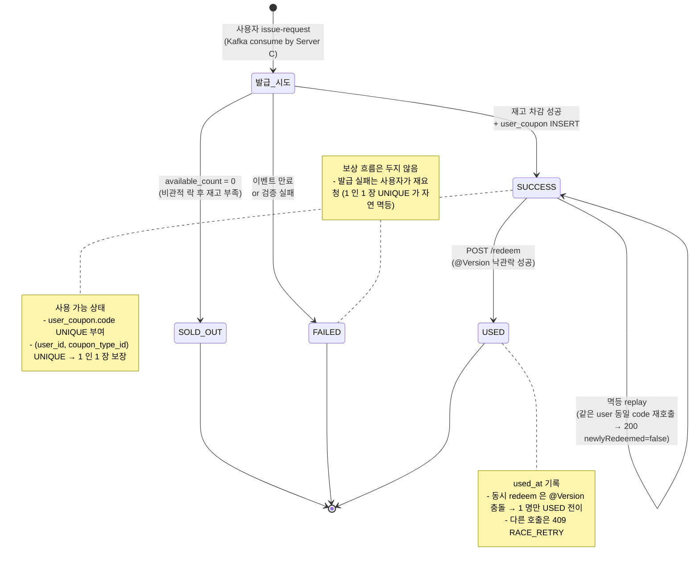
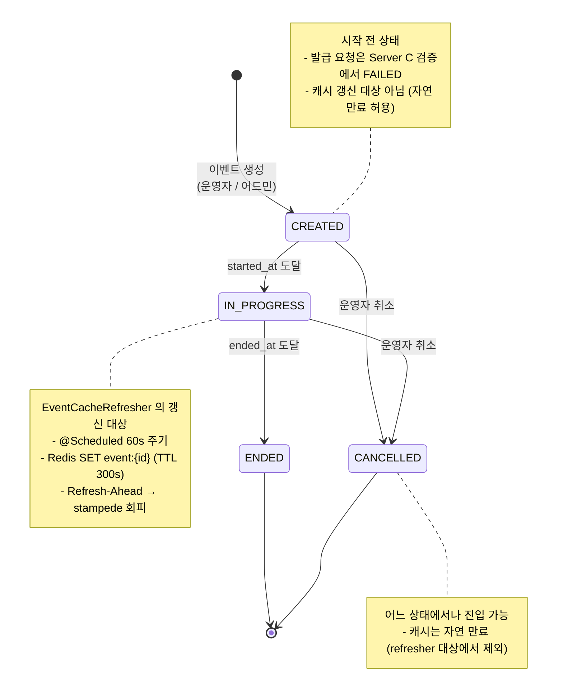
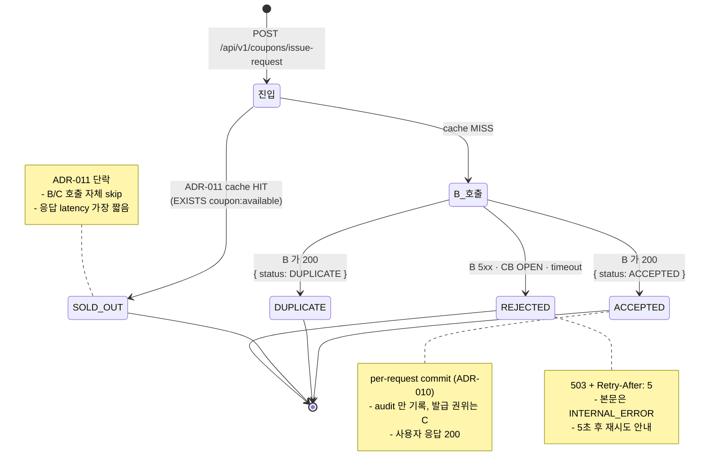
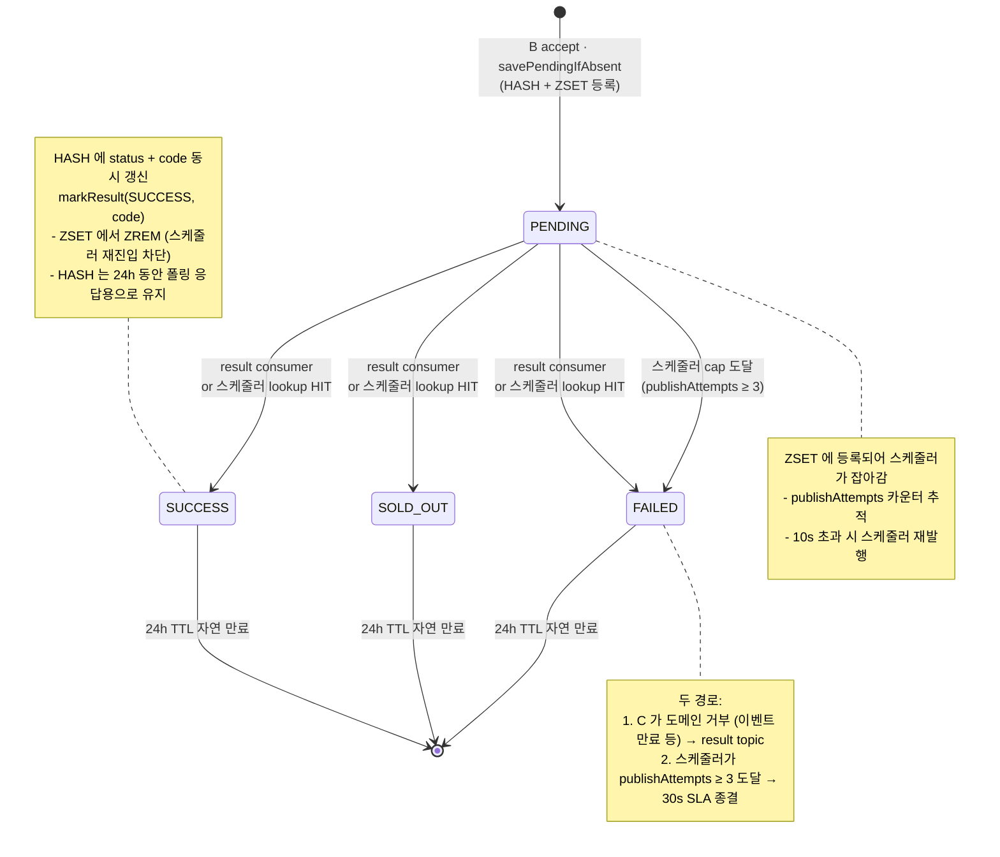
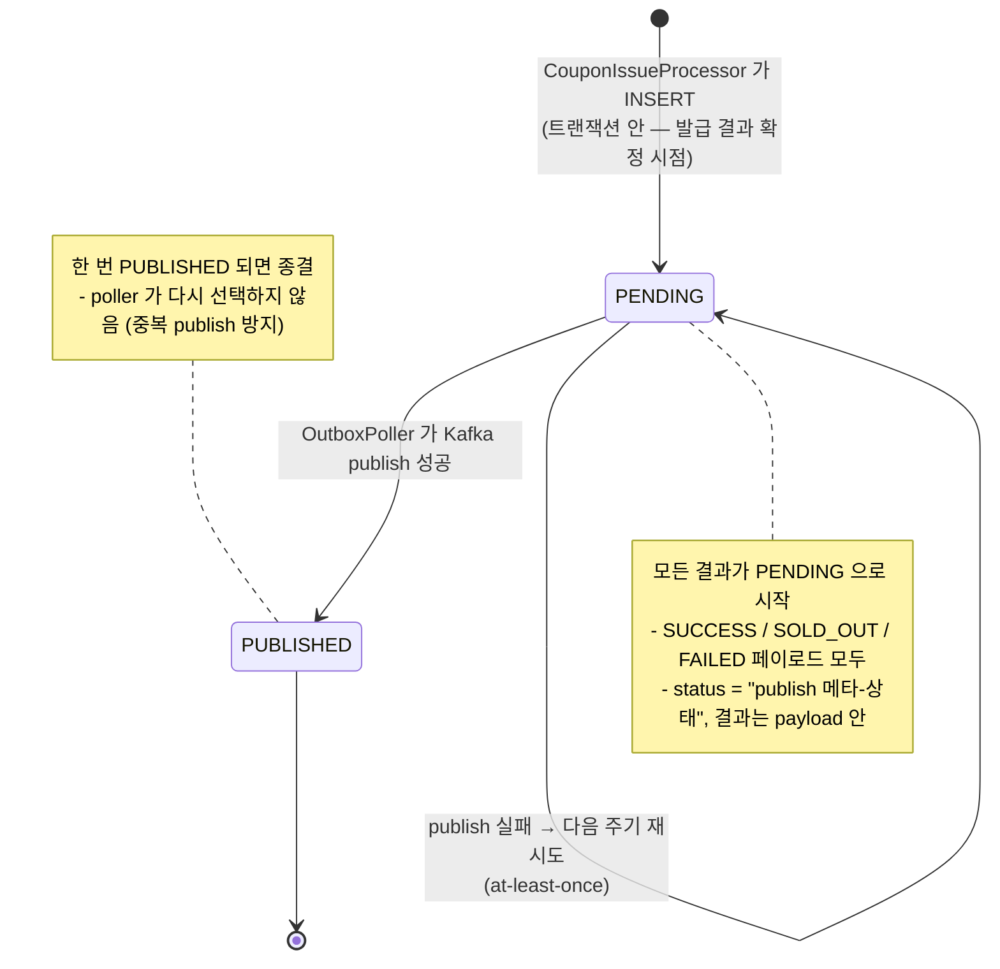

# 상태 다이어그램

## 📚 문서 목록

- [요구사항 분석](requirements.md)
- [시스템 아키텍처](architecture.md)
- [다이어그램](diagrams.md)
  - [시퀀스 다이어그램](diagram-sequence.md)
  - **상태 다이어그램** ← 현재 문서
- [ERD](erd.md)
- [API 명세](api-spec.md)

[← README](../../README.md)

---

## 1. 쿠폰 (UserCoupon) 상태

`UserCouponStatus` enum 의 4 가지 상태와 전이 (Server C 의 `user_coupon.status`).

- **SUCCESS** — 정상 발급, 사용 가능 상태 (`code` 부여)
- **SOLD_OUT** — 매진 (재고 차감 시점 `available_count = 0`)
- **FAILED** — 발급 실패 (이벤트 만료 / 사전 검증 실패)
- **USED** — 사용 완료 (`used_at` 기록, 재사용 불가)

### 전이 규칙 요약

| From | To | 트리거 | 메커니즘 |
|---|---|---|---|
| (없음) | `SUCCESS` | Kafka consume 후 재고 차감 성공 | `coupon_type_inventory` 비관적 락 + `user_coupon` INSERT |
| (없음) | `SOLD_OUT` | 비관적 락 획득 후 `available_count = 0` | 동일 트랜잭션 |
| (없음) | `FAILED` | 이벤트 만료 / 사전 검증 실패 | 트랜잭션 진입 전 거부 |
| `SUCCESS` | `USED` | `POST /redeem` | `@Version` 낙관적 락 (ADR-007) |

> `SOLD_OUT` / `FAILED` / `USED` 는 **terminal**. 상태에서 빠져나오는 전이 없음 (멱등성 + 단순성).

---

## 2. 이벤트 (Event) 상태

`EventStatus` enum 의 4 가지 상태와 전이 (Server C 의 `event.status`). 운영자가 제어하거나, 시간 기반 자동 전이.

- **CREATED** — 생성됨, 시작 전 (사용자 발급 요청 거부)
- **IN_PROGRESS** — 진행 중 (발급 가능 상태, **캐시 백그라운드 갱신 대상**)
- **ENDED** — 종료됨
- **CANCELLED** — 운영자 취소 (어느 상태에서나 진입 가능)

### 전이 규칙 요약

| From | To | 트리거 | 비고 |
|---|---|---|---|
| (없음) | `CREATED` | 어드민 이벤트 등록 | — |
| `CREATED` | `IN_PROGRESS` | `started_at` 도달 (시간 기반) | 발급 가능 상태 진입 |
| `IN_PROGRESS` | `ENDED` | `ended_at` 도달 (시간 기반) | 자연 종료 |
| `CREATED` / `IN_PROGRESS` | `CANCELLED` | 운영자 강제 취소 | 보상 / 환불은 별도 운영 |

> `IN_PROGRESS` 만 `EventCacheRefresher` 의 백그라운드 갱신 대상. 빈번 조회 트래픽이 없는 다른 상태는 stampede 위험이 작아 자연 만료 허용.

---

## 3. 발급 요청 audit (IssueRequest) 상태

`IssueRequestStatus` enum 의 4 가지 상태 (Server A 의 `issue_request.status`). A 진입 시점에 결정되는 audit log — 발급 결과의 권위는 Server C 의 `user_coupon` 이고, 본 enum 은 **A 가 본 결과** 의 기록.

- **ACCEPTED** — B 가 Redis 적재 + Kafka publish 완료
- **DUPLICATE** — 같은 `(user_id, coupon_type_id)` 가 이미 pending / 발급됨 (1 인 1 장 자연 차단)
- **SOLD_OUT** — A 진입 단계에서 negative cache 단락으로 즉시 매진 결정 (ADR-011)
- **REJECTED** — B 호출이 Resilience4j Circuit Breaker OPEN / B 일시 장애로 실패

### 전이 규칙 요약

| 결정 시점 | status | 사용자 응답 | 후속 처리 |
|---|---|---|---|
| A 진입 캐시 단락 | `SOLD_OUT` | 200 `{ status: SOLD_OUT }` | (없음) — 종결 |
| B 응답 200 ACCEPTED | `ACCEPTED` | 200 `{ status: ACCEPTED }` | C 가 비동기 처리 → 폴링/내쿠폰 조회 |
| B 응답 200 DUPLICATE | `DUPLICATE` | 200 `{ status: DUPLICATE }` | (없음) — 이미 pending/발급됨 |
| B 5xx / CB OPEN / timeout | `REJECTED` | 503 + `Retry-After: 5` | 클라이언트 재시도 |

> 모든 상태가 terminal — A 의 audit 은 한 요청에 한 번만 결정 (per-request commit, ADR-010).

---

## 4. B 의 사용자 신청 상태 (PendingIssue, Redis)

`IssuePendingStatus` enum 의 4 가지 상태 (Server B 의 Redis HASH `issue:pending:{userId}:{couponTypeId}` 의 `status` 필드). 사용자가 폴링으로 직접 보는 lifecycle.

- **PENDING** — 신청 적재됨, C 처리 대기
- **SUCCESS** — 발급 완료 (code 부여)
- **SOLD_OUT** — 매진 결과
- **FAILED** — 이벤트 만료 등 도메인 거부 또는 30s SLA 도달 후 마감

### 전이 규칙 요약

| From | To | 트리거 | 메커니즘 |
|---|---|---|---|
| (없음) | `PENDING` | B accept (cache miss) | `HSETNX` (first-write) → `HSET` 나머지 필드 + `ZADD` |
| `PENDING` | `SUCCESS` / `SOLD_OUT` / `FAILED` | result consumer (Kafka) | `markResult` — HASH update + ZSET ZREM |
| `PENDING` | `SUCCESS` / `SOLD_OUT` / `FAILED` | 스케줄러 lookup C HIT | 동일 (`markResult`) |
| `PENDING` | `FAILED` | 스케줄러 cap 도달 | `markResult(FAILED)` — `publishAttempts ≥ maxPublishAttempts` |

> HASH 와 ZSET 의 분리:
> - **HASH** = 사용자 폴링 응답용 상세 데이터 (24h TTL, 결과 후에도 유지)
> - **ZSET** = 스케줄러의 work queue (결과 확정 시 즉시 제거 → 재발행 대상에서 빠짐)

> ZSET ZREM 이 "정상 처리됨 = 재발행 대상에서 제외" 라는 신호를 표현. 스케줄러는 ZSET 만 보므로 SUCCESS/SOLD_OUT/FAILED 종결된 항목은 다시 잡히지 않음.

---

## 5. Outbox row 상태 (참고)

`OutboxEventStatus` enum 의 2 가지 상태 (Server C 의 `outbox_event.status`). **이 status 는 publish 메타-상태이며 발급 결과(payload.status)와 별개**임에 유의.

- **PENDING** — 아직 Kafka 로 보내지 않은 row (INSERT 직후 default)
- **PUBLISHED** — OutboxPoller 가 Kafka publish 성공 후 갱신

> at-least-once 보장: publish 직후 status 갱신 직전에 죽으면 다음 cycle 이 같은 row 를 한 번 더 publish. B 의 result consumer 가 멱등 처리하므로 안전.
