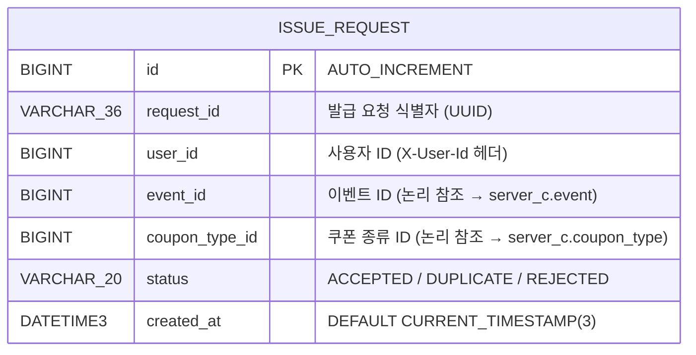
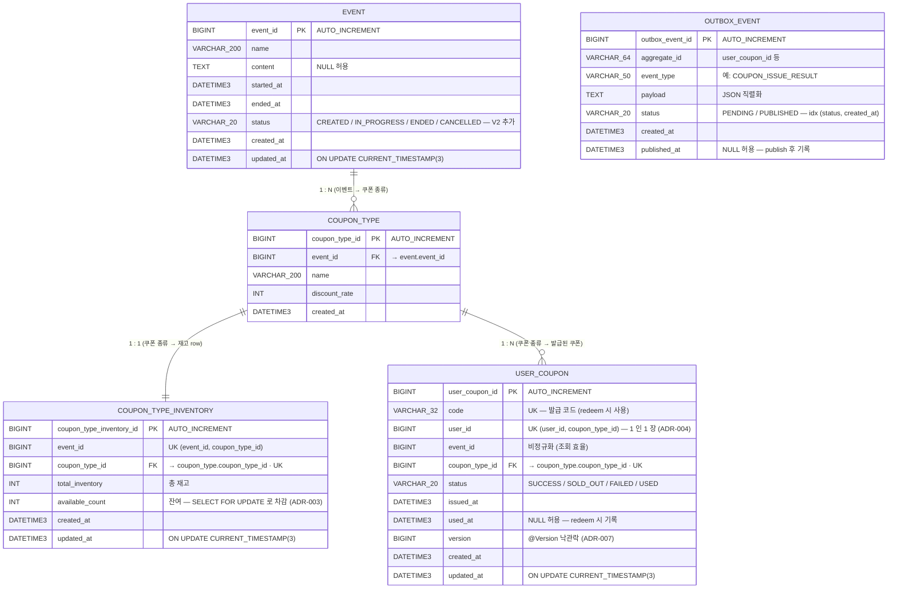

# ERD

## 📚 문서 목록

- [요구사항 분석](requirements.md)
- [시스템 아키텍처](architecture.md)
- [다이어그램](diagrams.md)
  - [시퀀스 다이어그램](diagram-sequence.md)
  - [상태 다이어그램](diagram-state.md)
- **ERD** ← 현재 문서
- [API 명세](api-spec.md)

[← README](../../README.md)

---

본 시스템은 **Database per Service** (ADR-006) 원칙으로 MySQL 인스턴스를 두 개 분리해서 운영한다.

| 인스턴스 | 컨테이너 | Schema | 책임 |
|---|---|---|---|
| MySQL-A | `promotion-mysql-a` (`:3306`) | `server_a` | 발급 요청 감사 로그 (per-request commit) |
| MySQL-C | `promotion-mysql-c` (`:3307`) | `server_c` | 이벤트 / 쿠폰 마스터 / 재고 / 발급 결과 / Outbox (재고 권위) |

> 두 인스턴스 사이에는 **Foreign Key 가 없다** — `user_id`, `event_id`, `coupon_type_id` 는 같은 의미를 갖는 논리 키지만, 물리적 FK 는 schema 내부에서만 정의한다.

---

## 1. MySQL-A (`server_a`) — 발급 요청 로그

A 가 받은 모든 발급 요청을 **per-request commit** 으로 적재 (ADR-010). 감사 / 추적 용도이며, 멱등성 권위는 Server C 에 있다.

### 인덱스

| 이름 | 컬럼 | 용도 |
|---|---|---|
| `PRIMARY` | `id` | 클러스터 키 |
| `idx_issue_request_user` | `user_id` | 사용자별 요청 감사 |
| `idx_issue_request_request_id` | `request_id` | 요청 식별자 추적 |

### 비고

- **단일 테이블, 외래키 없음** — A 의 책임은 진입 + 감사. cross-schema FK 는 결합도를 만들기 때문에 의도적으로 생략 (ADR-006).
- `(user_id, coupon_type_id)` UNIQUE 는 여기에 두지 않는다 — 멱등 권위는 C 의 `user_coupon` (ADR-004).

---

## 2. MySQL-C (`server_c`) — 이벤트 / 쿠폰 / 재고 / 발급 결과 / Outbox

재고 권위 (`coupon_type_inventory`) 와 멱등 권위 (`user_coupon` UNIQUE) 가 모두 모여 있다. Outbox 패턴 (ADR-002) 으로 Kafka publish 의 트랜잭션 안전성을 보장.

### 관계 요약

| From | To | 관계 | 의미 |
|---|---|---|---|
| `event` | `coupon_type` | 1 : N | 한 이벤트 안에 여러 쿠폰 종류 (할인율별 등) |
| `coupon_type` | `coupon_type_inventory` | 1 : 1 | 쿠폰 종류 1 개당 재고 row 1 개 (`UK (event_id, coupon_type_id)`) |
| `coupon_type` | `user_coupon` | 1 : N | 한 종류로 여러 사용자가 발급. 단 `(user_id, coupon_type_id)` UNIQUE 로 1 인 1 장 |
| `outbox_event` | (관계 없음) | — | 도메인과 분리된 이벤트 전송 큐. `aggregate_id` 로 논리 추적만 |

### 핵심 제약 (Constraints)

| 테이블 | 제약 | 의미 |
|---|---|---|
| `coupon_type` | `fk_coupon_type_event (event_id) → event(event_id)` | 이벤트 없는 쿠폰 종류 불가 |
| `coupon_type_inventory` | `fk_inventory_coupon_type (coupon_type_id) → coupon_type` | 종류 없는 재고 불가 |
| `coupon_type_inventory` | `uk_inventory_event_type (event_id, coupon_type_id)` | 재고 row 의 단일성 |
| `user_coupon` | `uk_user_coupon_code (code)` | 발급 코드 유일성 |
| `user_coupon` | `uk_user_coupon_user_type (user_id, coupon_type_id)` | **1 인 1 장 + Kafka 멱등성** (ADR-004) |
| `user_coupon` | `fk_user_coupon_coupon_type (coupon_type_id) → coupon_type` | 종류 없는 발급 불가 |

### 인덱스

| 테이블 | 이름 | 컬럼 | 용도 |
|---|---|---|---|
| `event` | `idx_event_status` | `status` | `EventCacheRefresher` 가 `status=IN_PROGRESS` 만 스캔 |
| `coupon_type` | `idx_coupon_type_event` | `event_id` | 이벤트별 쿠폰 종류 조회 |
| `user_coupon` | `idx_user_coupon_user` | `user_id` | 사용자 보유 쿠폰 목록 조회 |
| `outbox_event` | `idx_outbox_status_created` | `status, created_at` | `OutboxPoller` 가 PENDING 을 시간순으로 poll |

---

## 3. 비-RDBMS 저장소 (참고)

ERD 범위는 아니지만, Server B 의 Redis 키 / Kafka 토픽도 함께 표기.

### Server B — Redis

| 키 | 자료구조 | 용도 |
|---|---|---|
| `issue:pending:{user_id}:{coupon_type_id}` | Hash | 발급 신청 상태 (`status`, `created_at`, `event_id`, `request_id`) |
| `issue:pending:zset` | Sorted Set | 멤버 = `user_id:coupon_type_id`, score = `created_at` epoch ms (스케줄러 `ZRANGEBYSCORE` 용) |
| `event:{event_id}` | Hash | 이벤트 정보 캐시 (TTL 300s) |

### Kafka 토픽

| 토픽 | 방향 | Payload |
|---|---|---|
| `coupon-issue-request` | B → C | 발급 신청 이벤트 |
| `coupon-issue-result` | C → B | 발급 결과 이벤트 (Outbox poller 가 publish) |
