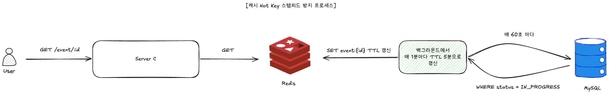

# 캐시

>
> **자원 제약 표기 정정** — `docker-compose.yml` 의 `cpus: 1.0` 제한은 앱 컨테이너(server-a/b/c)에만,
> `cpus: 2.0` 은 Kafka 에만 걸려 있다. **MySQL 과 Redis 에는 CPU 제한이 없다.** 아래 서술의 "MySQL" 은
> 1 vCPU 로 제한된 컨테이너가 아니라 호스트 자원을 공유하는 컨테이너다.



## 0. 요약

- **대상**: 이벤트 정보 조회 (`GET /api/v1/events/{eventId}`) — 인기 이벤트는 단일 key 에 읽기 트래픽 집중 (hot spot).
- **위험**: TTL 만료 순간 동시 다발 cache miss 가 DB 로 몰리는 **cache stampede (thundering herd)**.
- **결정**: **Refresh-Ahead 패턴** — 백그라운드 스케줄러가 매 1 분마다 `IN_PROGRESS` 이벤트를 DB 에서 읽어 Redis 에 다시 SET (TTL 5 분). refresh 주기 (1 분) ≪ TTL (5 분) 이므로 **TTL 만료 자체가 일어나지 않음** → stampede 원천 차단.
- **Cache-Aside 는 fallback** — Redis blip / 신규 IN_PROGRESS 전환 직후의 짧은 윈도우에서만 DB 가 받음.
- **두 번째 캐시 — 매진 negative cache (ADR-011)**: 매진 신호를 Redis 키 하나로 두고 **A 진입에서 단락**한다.
  명세 조건 측정에서 요청의 **82 %** 를 B/C 에 닿기 전에 끊어, 큐 유입을 **94 % 줄였다** (§5).

---

## 1. 문제 정의

이벤트 정보 조회는 다음 특성을 가진다.

| 특성 | 결과 |
|---|---|
| **조회 비중이 압도적으로 높음** | 발급 시도 전후로 이벤트 정보 확인이 빈번 |
| **단일 key 에 트래픽 집중** | 인기 이벤트일수록 동시 조회 사용자 수가 폭발적 |
| **데이터 변경은 드묾** | 이벤트 master 는 운영자가 가끔 갱신 (분 ~ 시간 단위) |

→ **단일 key 에 hot spot 이 형성되는 전형적인 캐시 워크로드**. MySQL-C 가 직접 받기엔 부담이 크고, TTL 만료 순간의 cache stampede 가 가장 큰 위험.

---

## 2. 고려한 대안

### 대안 A — 캐시 없음 (DB 직접 조회)

가장 단순. Cache 인프라 불필요.

- ❌ **거부 이유**: MySQL-C 가 발급 트랜잭션 (비관적 락 + INSERT) 과 이벤트 조회 트래픽을 같이 받게 됨. 발급 처리량 침해.

### 대안 B — Cache-Aside 만 사용 (TTL 만료 시 DB fallback)

표준 cache-aside: hit → 응답, miss → DB 읽고 캐시 적재.

- ❌ **부분 거부**: 평상시는 잘 동작하나, **TTL 만료 순간에 동시 cache miss 가 발생** 하면 모든 워커가 DB 로 몰림 (cache stampede / thundering herd). MySQL 의 순간 부하가 spike.
- 그러나 **fallback 으로는 유지** — Redis 일시 장애 / 신규 IN_PROGRESS 전환 직후의 짧은 윈도우에서 안전망 역할.

### 대안 C — Refresh-Ahead (채택)

백그라운드 스케줄러가 TTL 만료 전에 미리 갱신.

- ✅ **채택 이유**:
  - **TTL 만료 자체가 일어나지 않음** → stampede 원천 차단 (확률 / 락 / fallback 의존 X).
  - 갱신 대상이 한정 (`status = IN_PROGRESS` 만) → 부담 작음.
  - 코드가 단순 — `@Scheduled` 한 줄.

---

## 3. 결정 — Refresh-Ahead + Cache-Aside Fallback

### 3.1 핵심 파라미터

| 파라미터 | 값 | 이유 |
|---|---|---|
| TTL | **300 s (5 분)** | 길어도 백그라운드 갱신으로 항상 fresh — 길게 잡아 cache miss 빈도 최소화 |
| Refresh interval | **60 s (1 분)** | TTL/5 — 어떤 시점에도 잔여 TTL ≥ 240s 보장 |
| 갱신 대상 | `status = IN_PROGRESS` 만 | 빈번 조회는 진행 중 이벤트만 발생, 다른 상태는 자연 만료 허용 |

### 3.2 흐름

```
[EventCacheRefresher — @Scheduled, 60s fixedDelay]
  SELECT * FROM event WHERE status = IN_PROGRESS
  for each:
    SET event:{eventId} <json> EX 300

[EventQueryService — 사용자 조회 경로]
  ① GET event:{eventId}  →  hit  →  응답 (정상 경로 100%)
  ② miss (Redis blip / 신규 IN_PROGRESS 직후)
       SELECT event WHERE id = ?
       SET event:{eventId} (TTL 300s)
       응답
```

### 3.3 보장

- **stampede 방어**: TTL 만료가 일어나지 않으므로 동시 miss 자체가 발생하지 않음 (이론적으로 보장).
- **Fallback 안전망**: refresher 가 1 cycle 놓치거나 신규 이벤트 전환 직후엔 cache-aside 가 받음.
- **부하 한정**: 갱신 대상이 IN_PROGRESS 이벤트 N 개로 제한 → DB 부담 = N 쿼리 / 분.

---

## 4. 캐시 정책 — IN_PROGRESS 만 갱신 대상

이벤트 lifecycle 별 캐시 전략 차등:

| EventStatus | 갱신 대상 여부 | 이유 |
|---|---|---|
| `CREATED` | ❌ | 시작 전 — 사용자 조회 트래픽 거의 없음 |
| **`IN_PROGRESS`** | ✅ **갱신** | 발급 진행 중 — 트래픽 집중. stampede 위험 큼 |
| `ENDED` | ❌ | 종료 — 트래픽 자연 감소. 캐시 자연 만료 허용 |
| `CANCELLED` | ❌ | 운영자 취소 — 트래픽 거의 없음 |

→ **트래픽 패턴에 맞춘 비대칭 정책**. 모든 이벤트를 갱신하면 운영자가 100 개 이벤트를 등록한 경우 매 1 분마다 100 쿼리 (= 부담)지만, IN_PROGRESS 만 갱신하면 동시 진행 이벤트 N 개로 한정.

---

## 5. 매진 negative cache — 측정 결과 (ADR-011)

이벤트 캐시가 **읽기 hot spot** 을 다룬다면, 매진 캐시는 **쓰기 경로의 hot spot** 을 다룬다.
`coupon:available:{eventId}:{couponTypeId}` 키의 **존재 자체가 매진**을 뜻하고 (값은 의미 없음, TTL 24h),
C 가 트랜잭션 `afterCommit` 에서 재고를 fresh read 해 0 이면 SET, **A 가 진입에서 `EXISTS` 로 단락**한다.

명세 조건 그대로 측정했다 — 재고 100 장, 사용자 1,000 명, 1,000 TPS × 10 초.

| 지표 | 값 |
|---|---|
| A 가 실제로 받은 요청 | 3,430 |
| **매진 단락 (캐시 hit)** | **2,808 (82 %)** |
| 큐 진입 = C 소비 | **579** (최악 상정 10,000 건 대비 **−94 %**) |
| SUCCESS | **100** (재고 잔여 0) |
| 결론까지 시간 | **1 초** |

- **차단 위치가 A 진입이라는 점이 핵심이다.** 매진 이후의 요청은 A→B HTTP, Redis 적재, Kafka 왕복,
  C 의 비관적 락을 **하나도 쓰지 않는다.** 이 단락이 없었다면 큐 소진에 71 초가 걸린다 (10,000 ÷ 141 건/s).
- **캐시는 권위가 아니다.** 재고 권위는 C 의 MySQL 이고, cache miss / Redis blip 은 정상 흐름으로 fall-through
  한다. stale 이 정합성을 깨지 않는다 — 측정에서도 SUCCESS 는 정확히 100 건이었다.

### 한계

- **매진된 뒤에만 작동한다.** 재고 100 장이 소진되기까지 약 **1.7 초** 동안은 모든 요청이 B 로 간다.
  그 구간이 이 시나리오에서 부하가 가장 몰리는 지점인데 캐시가 도와주지 못한다 (p95 3.12 초).
- **재고 보충 시 stale** — admin 이 재고를 채우면 키를 수동으로 지워야 한다.

---

## 6. 결정 요약

| 위험 | 대응 | 메커니즘 |
|---|---|---|
| Cache stampede (TTL 만료 시 동시 miss) | TTL 만료 자체 회피 | Refresh-Ahead (60s < 300s) |
| Redis 일시 장애 | DB fallback | Cache-Aside |
| 신규 IN_PROGRESS 전환 직후 1 tick 갭 | DB fallback (짧은 윈도우만) | Cache-Aside |
| 비-IN_PROGRESS 이벤트의 갱신 부담 | 갱신 대상 제외 | `status = IN_PROGRESS` 필터 |
| 캐시 데이터 stale | 1 분 이내 갱신 | refresh interval = 60s |


[← README](../../README.md)
