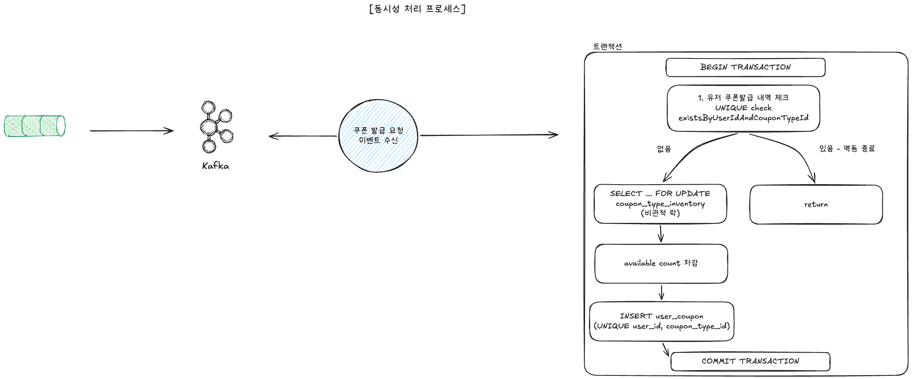
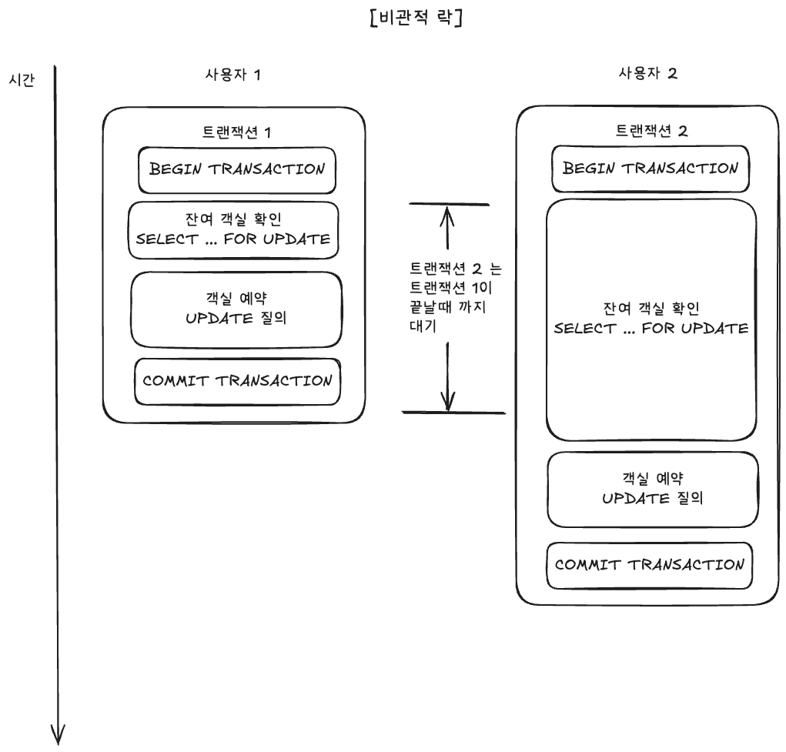
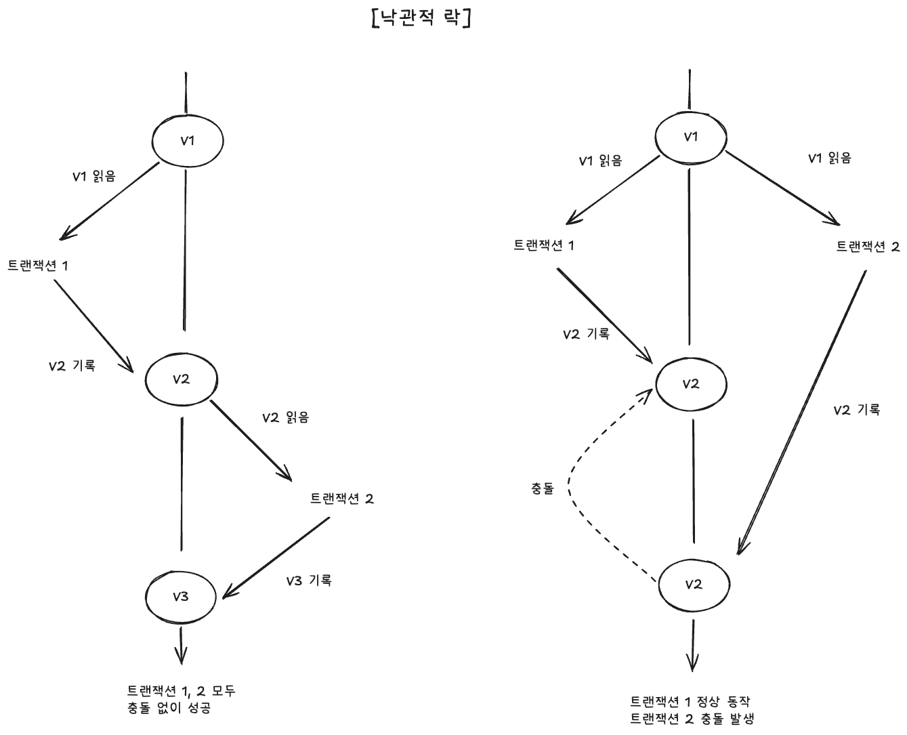

# 동시성 이슈 분석 및 해결



## 0. 요약

- **멱등성**: `user_coupon (user_id, coupon_type_id)` UNIQUE 로 1 인 1 장을 DB 레벨에서 강제. Kafka 중복 메시지 / 사용자 중복 요청 모두 동일하게 차단.
- **재고 동시성 (발급)**: `coupon_type_inventory` row 에 **비관적 락 (`SELECT ... FOR UPDATE`)**. 500–1,000 TPS 의 hot-row 경합에서 충돌 재시도 비용이 큰 낙관적 락보다 유리.
- **쿠폰 사용 (Redeem)**: 같은 row 의 동시 호출이 드물기 때문에 **`@Version` 낙관적 락**. 비관적 락의 오버헤드 회피 (ADR-007).
- **단일화 원칙**: 두 가지 동시성 도구를 도메인 특성에 맞게 **다르게** 사용 — 발급은 비관적, 사용은 낙관적.

---

## 1. 문제 정의

선착순 쿠폰 발급에서 동시성 문제는 두 축으로 나뉜다.

| 축 | 충돌 대상 | 빈도 | 결과의 의미 |
|---|---|---|---|
| **재고 차감** | 1 row (`coupon_type_inventory`) — 인기 이벤트의 hot-row | **매우 잦음** (TPS 만큼 동시 갱신 시도) | 락 실패 시 사용자 발급 실패 → 직접적 UX 타격 |
| **쿠폰 사용 (Redeem)** | 1 row (`user_coupon` 한 장) | **거의 없음** (한 사용자가 동시에 두 번 사용 시도하는 경우만) | 낙관락 충돌 → 재시도 안내 |
| **사용자 중복 요청** | (user_id, coupon_type_id) 조합 | 드묾 + Kafka 중복 메시지 | 1 인 1 장 위반 → 도메인 invariant 깨짐 |

세 축에 동일한 도구를 쓰면 한쪽이 과보호 / 한쪽이 과부하가 되므로, **각각의 빈도와 영향에 맞춰 다른 메커니즘** 을 채택했다.

---

## 2. 멱등성 — DB UNIQUE 제약

### 결정
`user_coupon` 테이블에 `UNIQUE (user_id, coupon_type_id)` 제약을 둔다.

### 보호 범위
- **사용자 중복 요청** — 같은 user 의 두 번째 요청은 UNIQUE 위반으로 차단.
- **Kafka at-least-once 의 중복 메시지** — 같은 신청이 두 번 consume 돼도 두 번째는 UNIQUE 로 무해하게 실패 → 멱등.
- **B 의 스케줄러 재발행** — 30s SLA 내 재시도 시에도 안전.

### 거부한 대안
- **애플리케이션 레벨 중복 검사** — race condition 의 여지 (TOCTOU). DB constraint 가 권위.
- **Redis 의 `(user_id, coupon_type_id)` 캐시 set** — Redis 와 DB 가 atomic 하지 않음. 캐시는 보조 (B 의 HSETNX) 일뿐 권위는 DB.

> **권위는 DB UNIQUE 한 곳** (single source of truth). 다른 매체는 사전 차단의 보조일 뿐.

---

## 3. 재고 동시성 — 비관적 락 (SELECT ... FOR UPDATE)




### 3.1 결정
`coupon_type_inventory` row 를 `SELECT ... FOR UPDATE` 로 잠그고 차감한다 (ADR-003).

```java
@Lock(LockModeType.PESSIMISTIC_WRITE)
@Query("SELECT i FROM CouponTypeInventoryJpaEntity i " +
       "WHERE i.eventId = :eventId AND i.couponTypeId = :couponTypeId")
Optional<CouponTypeInventoryJpaEntity> findForUpdate(...)
```

### 3.2 고려한 대안

#### 대안 A — 낙관적 락 (`@Version`)
재고 row 에 version 컬럼을 두고 `UPDATE ... WHERE version = ?` 로 갱신, 0 row 면 재시도.

- ❌ **거부 이유**: 본 도메인은 **500–1,000 TPS 가 hot-row 1 개에 집중되는 high-contention 워크로드**. 낙관적 락은 충돌 빈도가 높을 때 다음 비용을 부담:
  - 충돌 재시도마다 SELECT → INSERT → 재SELECT → 재INSERT 사이클 반복
  - 애플리케이션 레벨 retry loop 가 Tomcat 워커 / DB 커넥션을 더 오래 점유
  - 결과적으로 낙관적 락의 throughput 이 비관적 락보다 **낮아짐** (high-contention 영역의 일반적인 결과)
- 일반적으로 낙관적 락은 **충돌이 드물 때** 가벼움 — 본 시나리오와 정반대.

#### 대안 B — Redis 분산 락 (Redisson 등)
Redis 에서 락 획득 후 DB 처리.

- ❌ **거부 이유**:
  - Redis 와 DB 가 atomic 하지 않음 → 락 보유 중 노드 죽으면 정합성 위험.
  - DB 가 이미 권위인데 락만 외부에 두면 **두 시스템에 락 상태가 분산** → 운영 복잡도.
  - 1 vCPU 환경에서 Redis 왕복 비용이 추가됨.

#### 대안 C — 비관적 락 (`SELECT ... FOR UPDATE`) — 채택
DB 가 락을 직접 관리.

- ✅ **채택 이유**:
  - High-contention 환경에서 **재시도 없이 한 번에 직렬화** — 락 큐가 DB 안에서 형성되고 순서대로 처리.
  - 락 보유와 데이터 갱신이 같은 트랜잭션 → 원자성 자연 보장.
  - Redis / 애플리케이션 별도 메커니즘 불필요 → 단순.

### 3.3 비관적 락의 위험과 대응

| 위험 | 대응 |
|---|---|
| 락 큐 폭주 (1 vCPU MySQL 의 처리 한계 초과) | Kafka consumer throttle (`max.poll.records=10`, `concurrency=1`) 로 **유입을 제한** — [유량 조절 보고서](rate-limiting.md) |
| 사용자 응답 latency 가 락 대기에 묶임 | **사용자 응답 경로에서 락을 분리** — Server A → B → Kafka 까지만 동기, 락은 C consumer 에서. [대량 트래픽 보고서](traffic.md) |
| 트랜잭션 길어지면서 deadlock | 트랜잭션 안에서 외부 호출 금지 (Outbox 분리), 단일 row 락만 잡음 (multi-row 락 회피) |

---

## 4. 쿠폰 사용 (Redeem) — 낙관적 락 (`@Version`)



### 결정
`user_coupon.version` 컬럼 (`@Version`) 으로 낙관적 락. 충돌 시 409 RACE_RETRY 응답으로 재시도 안내 (ADR-007).

### 도메인 정당성
- 한 쿠폰을 **여러 사용자가 동시에 사용하려는 시도는 불가능** — `user_coupon` 1 row 는 1 사용자 소유.
- 같은 사용자가 동시에 두 번 사용 버튼을 누르는 경우만 충돌 가능 → **빈도가 매우 낮음**.

### 거부한 대안
- **비관적 락** — 충돌이 드문데 행 락의 오버헤드를 항상 부담. 낙관적이 자연스러움.

---

## 5. 결정 요약 — 도구 선택 매트릭스

| 동시성 축 | 빈도 | 채택 도구 | 이유 |
|---|---|---|---|
| 사용자 중복 요청 / 메시지 중복 | 드묾 ~ 자주 (Kafka 재시도) | **DB UNIQUE** | 권위 단일화, race 없는 보장 |
| 재고 차감 (발급) | **매우 잦음** (high-contention) | **비관적 락** | 충돌 재시도 비용이 큰 환경에선 직렬화가 빠름 |
| 쿠폰 사용 (Redeem) | 매우 드묾 | **낙관적 락** | 비관적 락 오버헤드 회피 |


[← README](../../README.md)
