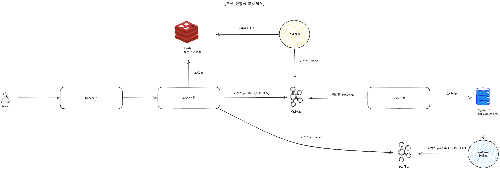

# 분산 서비스 간 정합성



## 0. 요약

- **정합성 기준점**: **Redis 적재 시점** 부터 at-least-once 보장. 이전 시점에 실패하면 사용자가 다시 요청, 이후에 실패하면 시스템이 회복.
- **거부한 대안**: ① Redis atomic 으로 재고 관리 ② 재고 sharding ③ Service B 안에서 Redis + Kafka 의 all-or-nothing 트랜잭션 ④ 의미 없는 무계획 Outbox 적용
- **회복 메커니즘**:
  - **B → C 방향** — Kafka publish 실패 / 메시지 유실은 B 의 `@Scheduled` 가 ZSET 인덱스로 감지 → C 의 internal API 로 실제 처리 여부 검증 후 재발행 (30s SLA)
  - **C → B 방향** — 발급 트랜잭션과 같은 트랜잭션 안에 `outbox_event` INSERT → Outbox poller 가 Kafka publish (트랜잭션 안전성 확보)

---

## 1. 문제 정의

분산 시스템에서 정합성 문제는 본질적으로 **"두 매체에 걸친 변경을 어떻게 원자적으로 만들 것인가"** 다. 본 시스템은 두 지점에서 이 문제를 마주한다.

| 지점 | 두 매체 | 위험 |
|---|---|---|
| Server B (접수) | **Redis** (신청 적재) + **Kafka** (이벤트 발행) | Redis 는 적재됐는데 Kafka 발행 실패 → 사용자에게 "받았다" 응답했지만 처리 안 됨 |
| Server C (처리) | **MySQL-C** (재고 차감 + user_coupon INSERT) + **Kafka** (결과 발행) | 트랜잭션 commit 됐는데 결과 publish 실패 → B 의 Redis 가 영원히 PENDING |

**Redis ↔ Kafka 또는 MySQL ↔ Kafka 는 본질적으로 트랜잭션으로 묶을 수 없다** (외부 시스템). 이 한계를 인정하고 **회복 가능한 형태로 설계** 하는 것이 핵심.

---

## 2. 고려한 대안

### 대안 A — Redis atomic 으로 재고 관리 (Lua / DECR)

발급 자체를 Redis 에서 처리. `DECR` 또는 Lua 스크립트로 atomic 차감 후 user_coupon 만 DB 에 비동기 적재.

- ❌ **거부 이유**:
  - Redis 장애 시 재고 데이터 회복이 매우 복잡 — Redis snapshot 이 가장 최근 상태가 아니면 차감/발급 정합 무너짐
  - Redis 가 권위가 되면 RDB 가 보조가 되는데, **사후 감사 / 운영 복구가 RDB 없이 어려움**
  - 재고는 **DB 권위, Redis 는 캐시** 라는 명확한 책임 분리가 운영상 안전 (CLAUDE.md ❌ Anti-pattern: 재고를 Redis 로 관리하지 마라)

### 대안 B — 재고 row sharding (`event:{id}:stock:{0..9}`)

hot-row 분산을 위해 재고 row 자체를 N 개로 쪼갬.

- ❌ **거부 이유**:
  - 매진 판정 / 잔여 합산 / 재고 보충 시 **모든 shard 를 합쳐야** 함 → 코드 복잡도 증가
  - 1 vCPU 환경의 throughput 한계는 **샤드 수가 아니라 MySQL CPU** 에 묶임 → 분산해도 큰 이득 없음
  - "trade-off 가 큰 데 효익이 작은" 최적화 (scope-discipline)

### 대안 C — Service B 안에서 Redis + Kafka all-or-nothing

B 가 Redis 적재 + Kafka publish 를 한 트랜잭션처럼 묶기.

- ❌ **불가능**:
  - Redis 와 Kafka 는 **서로 다른 외부 시스템** — JTA 같은 분산 트랜잭션 없이 atomic 보장 안 됨
  - 분산 트랜잭션 (XA) 도입은 1 vCPU 환경에 부담 + 운영 복잡도 폭증
  - **이 한계를 인정하고 "회복 가능" 으로 풀어야 함** ← 본 설계의 출발점

### 대안 D — 무계획 Outbox 적용

문제 정의 없이 모든 Kafka publish 에 Outbox 패턴 적용.

- ❌ **거부 이유**:
  - Outbox 는 "**RDB 트랜잭션으로 publish 의 정합성을 묶을 때**" 의미가 있음
  - B 처럼 Redis 만 쓰는 곳에는 Outbox 가 적합하지 않음 (RDB 추가 부담)
  - "패턴을 위한 패턴" — **C 의 발급 트랜잭션처럼 정확히 필요한 곳에만** 적용 (ADR-008)

---

## 3. 결정 — 정합성 기준점을 Redis 적재 시점으로

### 3.1 기준점의 의미

```
User → A → B → [Redis HSETNX + ZADD]   ← ⭐ 정합성 기준점 (at-least-once 시작)
              → Kafka publish 시도
              → 200 ACCEPTED 응답
```

- **이 시점 이전에 실패** (예: Server A 가 죽음, B 호출 실패) → 사용자에게 5xx 반환, **사용자가 재요청**.
- **이 시점 이후에 실패** (Kafka publish 실패, C 처리 실패, 결과 메시지 유실) → 사용자는 200 받았으므로 **시스템이 책임지고 회복**.

### 3.2 왜 Redis 인가

- **at-least-once** 를 보장하려면 "받았다" 를 영속 가능한 매체에 기록 필요
- RDB 는 1 vCPU 환경에서 commit 비용이 사용자 응답 latency 를 직접 늘림
- Redis 는 빠른 쓰기 + ZSET 같은 자료구조로 **회복 인덱스** 도 함께 만들 수 있음 (스케줄러용)

상세 근거는 [대량 트래픽 보고서 §4](traffic.md) 참조.

---

## 4. 회복 — B → C 방향 (Kafka publish 실패 / 메시지 유실)

### 메커니즘

Server B 의 `@Scheduled` (1s 주기) 가 ZSET (`issue:pending:zset`) 의 score 가 cutoff (10s) 를 넘은 항목을 batch 로 가져와서 회복 시도.

```
1. ZRANGEBYSCORE 로 10s 이상 PENDING 항목 발견
2. C 의 internal API 호출: GET /internal/v1/users/{userId}/coupons/{couponTypeId}
   - row 존재 → 결과 메시지만 유실됨. Redis 동기화 + ZSET 제거 → 종결
   - row 없음 + publishAttempts < 3 → 처리 안 됨. Kafka 재발행
   - row 없음 + publishAttempts ≥ 3 → 30s SLA 도달. FAILED 마감
```

### 안전성

- **중복 publish 가 무해** — Server C 의 `(user_id, coupon_type_id)` UNIQUE 가 자연 차단 ([동시성 보고서 §2](concurrency.md)).
- **30s SLA 보장** — cutoff (10s) × maxAttempts (3) = 30s 안에 SUCCESS / FAILED 결정 (ADR-008).

### 거부한 대안

- **무한 재시도** — 영구 장애 시 cycle 무한 반복. cap 도입 (publishAttempts ≤ 3) 으로 수렴 보장.

---

## 5. 회복 — C → B 방향 (결과 전파의 트랜잭션 안전성)

### 5.1 문제

발급 트랜잭션 (재고 차감 + user_coupon INSERT) 이 commit 된 후 Kafka 로 `coupon-issue-result` 를 publish 해야 한다. 그런데:

- **트랜잭션 안에서 Kafka publish** → 트랜잭션이 publish 동안 길어지고, publish 실패 시 롤백할지 결정이 모호 (`@Transactional` 안의 외부 호출 anti-pattern, CLAUDE.md §10).
- **트랜잭션 commit 후 Kafka publish** → commit 성공 + publish 실패 시 **DB 에는 반영됐는데 B 의 Redis 는 영원히 PENDING** → 결국 사용자 폴링이 영원히 결과를 못 받음.

### 5.2 결정 — Outbox 패턴 (의미를 부여한 사용)

같은 트랜잭션 안에서 `outbox_event` 테이블에도 INSERT 한다. publish 책임은 별도 poller 가 가져간다.

```
[Server C 의 1 트랜잭션]
  ① user_coupon INSERT
  ② coupon_type_inventory 차감
  ③ outbox_event INSERT (status=PENDING, payload=결과)
  COMMIT

[Outbox Poller — 별도 스레드, 트랜잭션 밖]
  500ms 주기로 outbox_event WHERE status=PENDING 조회
  → Kafka publish
  → 성공 시 status=PUBLISHED 갱신
  → 실패 시 status 유지 → 다음 주기 재시도 (at-least-once)
```

### 5.3 보장

- **DB 와 publish 의 정합성** — outbox row 가 RDB 트랜잭션 안에 INSERT 되므로 commit 됐다면 publish 시도가 보장됨.
- **트랜잭션 짧게 유지** — Kafka publish 가 트랜잭션 밖이라 락 점유 시간 최소.
- **at-least-once publish** — 실패 시 status 유지 → 재시도. 중복 publish 는 B 의 결과 consumer 가 멱등 처리.

### 5.4 왜 Outbox 가 "의미 있는" 적용인가

처음에는 무계획 Outbox 적용을 고려했으나 (대안 D), 실제 가치는 다음 조건이 모두 만족될 때만 발현:

| 조건 | 본 케이스 |
|---|---|
| 변경 매체가 RDB 인가 | ✅ MySQL-C 의 발급 트랜잭션 |
| publish 실패 시 정합성 깨지는가 | ✅ B 의 Redis 가 PENDING 으로 남음 |
| 트랜잭션 안에서 publish 하는 게 위험한가 | ✅ 1 vCPU 에서 트랜잭션 길어지면 락 큐 폭주 |

**B 처럼 Redis 만 쓰는 곳에는 Outbox 가 적합하지 않다** — RDB 가 없으므로 트랜잭션을 묶을 매체가 없음. B 의 publish 실패는 스케줄러로 보완 (ADR-008).

---

## 6. 결정 요약 — 매체 / 회복 메커니즘 매핑

| 정합성 위험 | 발생 위치 | 회복 메커니즘 | 비고 |
|---|---|---|---|
| Redis 적재 실패 | Server B | 사용자가 재요청 (시스템 책임 아님) | "기준점 이전" |
| Kafka publish 실패 (B → C) | Server B | 스케줄러 (ZSET 기반) → 재발행 | 30s SLA |
| 메시지 유실 (B → C) | Kafka 또는 C | 스케줄러 → C internal GET 검증 후 재발행 | UNIQUE 가 중복 안전 |
| 발급 트랜잭션 실패 | Server C | 트랜잭션 자동 롤백 | DB 가 권위 |
| 결과 publish 실패 (C → B) | Server C | **Outbox poller** → 재시도 | RDB 트랜잭션 안전 |
| 결과 메시지 유실 (C → B) | Kafka 또는 B | 스케줄러 → C internal GET 검증 | 위와 동일 |

[← README](../../README.md)
