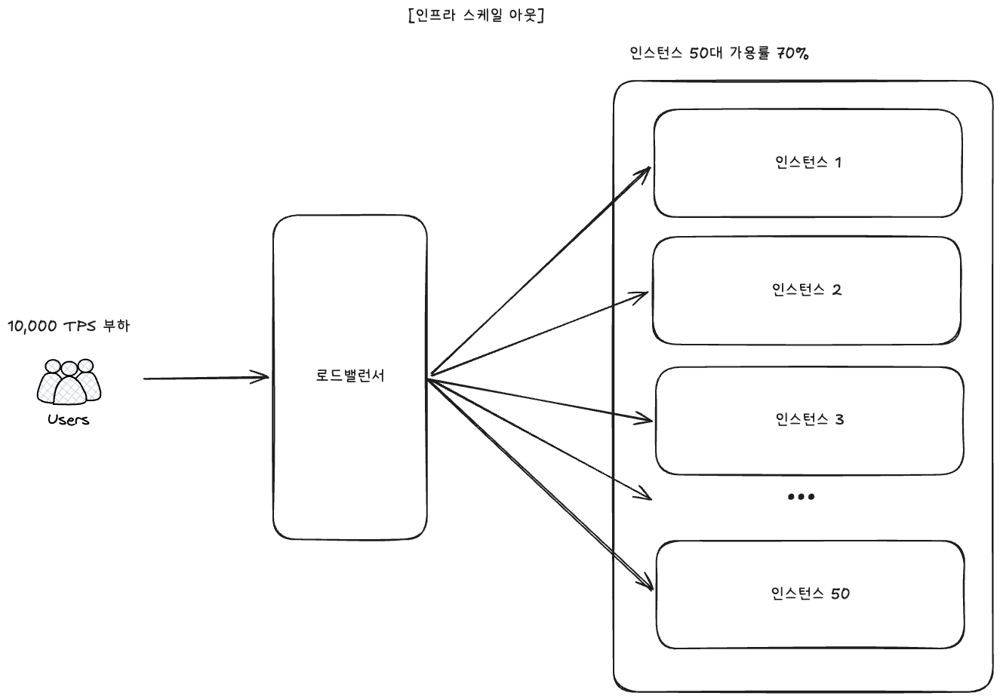

# 인프라 사이징




## 0. 요약

- **현재 인스턴스 (1 vCPU / 2 GB) 의 측정 처리량**: A 진입 기준 **median 499 RPS** (5 차례 반복 측정의 중간값, steady-state). cold start 시 285 RPS, warmup 후 ~500 RPS 로 수렴.
- **목표 부하**: **10 초에 1,000 명 사용자가 사용자당 10 건 → 1,000 TPS 평균**. (사용자당 100 건은 10 초 안에 발생할 수 없다고 보고 10 건으로 재정의)
- **필요 인스턴스 수 (산식)**: `목표 TPS / (인스턴스당 처리량 × 가용률)` = `1,000 / (499 × 0.7)` ≈ **3 대** (가용률 70% 헤드룸 포함).
- **사전 증설** — 이벤트 시작 30 분 전 3 대로 미리 scale-out.

---

## 1. 측정 결과 — 현재 단일 인스턴스 처리량

### 1.1 측정 환경

```shell
docker compose up -d --build
./gradlew test #Java 21
./load-test/run-500tps-10sec-10times.sh
```

| 항목 | 값 |
|---|---|
| 서버 사양 | 1 vCPU / 2 GB RAM (Server A / B / C 각각, docker compose `cpus=1` + `mem=2g`) |
| 부하 도구 | k6 |
| 측정 지표 | A 의 `POST /api/v1/coupons/issue-request` 가 **200 응답을 받은 비율** |
| 시나리오 | `load-test/scenarios/issue-500-tps-10s.js` (500 TPS × 10 초) |
| 호스트 | Mac M-series + Colima 6 CPU / 12 GiB |
| Kafka | 단일 broker (`cpus: 2.0`), partition 3 |

### 1.2 측정값 — 5 회 반복

같은 시나리오를 5 회 반복 측정하여 **중간값** 으로 사이징 산정.

| 회차 | 달성 RPS | p50 | p90 | p95 | avg | dropped | accepted | 503 | thresholds |
|---|---|---|---|---|---|---|---|---|---|
| 1차 | 285 | 957ms | 1,190ms | 1,270ms | 943ms | 1,972 | 100% | 0 | p95 미달 |
| 2차 | 448 | 534ms | 663ms | 701ms | 538ms | 350 | 100% | 0 | p95 미달 |
| 3차 | 499 | 27ms | 73ms | 82ms | 36ms | 0 | 100% | 0 | **PASS** ✅ |
| 4차 | 500 | 13ms | 18ms | 22ms | 15ms | 0 | 100% | 0 | **PASS** ✅ |
| 5차 | 499 | 13ms | 18ms | 20ms | 14ms | 0 | 100% | 0 | **PASS** ✅ |
| **median** | **499** | **27ms** | **73ms** | **82ms** | **36ms** | **0** | **100%** | **0** | **PASS** |

#### JIT warmup 효과 (1차 vs 3차~5차)

```
1차 (cold)        : 285 RPS, p95 1,270ms, 1,972 dropped iterations
2차 (warming)     : 448 RPS, p95   701ms,   350 dropped iterations
3~5차 (steady)   : ~499 RPS, p95  20-82ms,  0 dropped iterations
```

→ 부팅 직후 1~2 회 부하는 **HotSpot JIT 컴파일 / HikariCP 풀 워밍 / Kafka client 메타데이터 fetch** 의 cold path. **운영 capability 의 진짜 그림은 steady-state (3차~5차)**. 본 사이징의 baseline 으로 median 499 RPS 사용.

> 측정값은 "사용자가 200 ACCEPTED 를 받았다" 는 사용자 관점 기준. C 의 비동기 발급 처리량은 별도 — 결과는 폴링으로 확인되므로 사용자 입장의 throughput 은 A 진입의 200 비율로 결정.

---

## 2. 목표 부하 정의

### 2.1 CLAUDE.md §2 시나리오 재진술

| 항목 | 값 |
|---|---|
| 총 사용자 (피크) | 1,000 명 |
| 사용자당 요청 | 10 초 내 10 건 |
| **평균 TPS** | **1,000 TPS** (1,000 × 10 / 10) |
| 데이터 형식 | JSON 10 필드 |
| 프로토콜 | HTTPS |

### 2.2 목표 / 현재 / 갭

| 구분 | 값 |
|---|---|
| 목표 TPS | **1,000** |
| 현재 인스턴스 1 대 처리량 (median, steady-state) | **499** |
| 처리 갭 | **약 2 배** |

→ 단일 인스턴스로는 도달 불가. 수평 확장 필요.

---

## 3. 인스턴스 수 산정 (Little's Law 변형)

### 3.1 산식

```
필요 인스턴스 수 = 목표 TPS ÷ (인스턴스당 처리량 × 가용률)
```

- **가용률 (utilization target)**: 70% — 100% 까지 풀로 쓰면 burst / queue 폭주 위험. p95 안정 영역에 헤드룸 30% 확보.

### 3.2 계산

```
필요 인스턴스 수 = 1,000 ÷ (499 × 0.7)
              = 1,000 ÷ 349.3
              ≈ 3 대
```

> 보수적 표기 — **2 대가 이론적 최소** (`1,000 / 499 ≈ 2`), 가용률 70% 헤드룸 고려해 **3 대 권장**. cold start 처리량 (285 RPS) 기준으로 잡으면 `1,000 / 285 ≈ 4 대` 이므로, 배포 직후를 보호하려면 4 대까지 검토.

### 3.3 가용률을 70% 로 두는 이유

| 이유 | 설명 |
|---|---|
| **Burst 흡수** | 평균 1,000 TPS 라도 순간 piking 은 그 이상. 100% 풀로 잡으면 spike 시 즉시 latency 악화 |
| **장애 인스턴스 흡수** | 한 대가 죽거나 GC pause 로 처리하지 못해도 나머지가 받음. 대수가 적을수록 한 대의 비중이 커서 헤드룸이 더 중요하다 |
| **Little's Law 의 큐 비선형성** | 가용률이 100% 에 가까워질수록 큐 길이가 비선형 폭증 (M/M/1 큐 이론) |
| **배포 / 롤링 업데이트 여유** | 일부 인스턴스가 재시작 중이어도 트래픽 처리 가능 |

---

## 4. 운영 전략

### 4.1 사전 증설 (Pre-warming)

이벤트 시작 30 분 전에 인스턴스를 3 대로 미리 scale-out + warmup 부하 (예: 50 RPS × 30 초) 흘려 JIT/풀 워밍.

- ✅ **장점**:
  - 트래픽 spike 시점에 인스턴스가 모두 ready 상태 — JVM warmup / 커넥션 풀 초기화 / 캐시 워밍 완료.
  - **HPA 의 scale-out 지연 (수십 초 ~ 수 분) 회피** — 급증 트래픽 spike 가 시작된 후 늘리면 늦음.
- ❌ **단점**:
  - 평시 / 이벤트 외 시간에도 비용 발생 (이벤트 시작 30 분 전 ~ 종료까지).
  - 이벤트 일정이 정해져 있을 때만 적합 — 비예측 트래픽엔 부적합.


---

## 5. 거부한 사이징 방식

### 거부 1 — 측정 없이 추정으로 사이징

"1 vCPU 면 대충 N TPS 하겠지" 식의 예상.

- ❌ **거부 이유**: 인스턴스당 실제 처리량은 도메인 / 트랜잭션 / 외부 의존성에 따라 천차만별. **측정이 권위**.

### 거부 2 — 단일 시점 측정만으로 결정

한 번 부하 테스트 결과만으로 사이징.

- ❌ **거부 이유**: 단일 측정은 환경 / 워밍업 / 외부 변수에 흔들림. 본 보고서는 **5 회 반복 측정 후 중간값** 을 사이징 baseline 으로 사용.
- JIT warmup 효과로 1차/2차는 cold path (285/448 RPS), 3차~5차는 steady-state (499/500/499 RPS) 로 명확히 분리됨. 둘 다 의미가 있어 함께 명시 — 운영 baseline 은 steady-state, cold start 보호 buffer 는 1차 측정 기준.

### 거부 3 — 가용률 / 헤드룸 미고려

`1,000 / 499 ≈ 2 대` 만 계산하고 끝.

- ❌ **거부 이유**: 100% 가용률 가정은 실제로 **장애 0 / GC 0 / spike 0** 인 이상적 환경에서만 성립. 실운영에서는 30% 헤드룸이 사실상 필수.

---

## 6. 결정 요약

| 항목 | 값 |
|---|---|
| **현재 인스턴스 1 대 처리량** | **median 499 RPS** (5 회 반복, steady-state, 200 응답 기준) |
| cold start 시 처리량 | ~285 RPS (warmup 미완료) |
| **목표 TPS** | 1,000 |
| **이론적 최소 인스턴스** | 2 대 (`1,000 / 499`) |
| **권장 인스턴스 (가용률 70%)** | **3 대** (`1,000 / (499 × 0.7)`) |
| **운영 전략 (예고 이벤트)** | 시작 30 분 전 사전 증설 + warmup 부하 |
| **적용된 튜닝** | Colima 6 CPU/12 GiB, Kafka cpus=2, listener.concurrency=3, max-poll-records=50, batch-size=32K, HikariCP=10, 가상스레드 |
| **추가 검토** | hot row 락 경합 측정 (장시간 부하), Kafka broker 다중화 (단일 broker 가 진정한 ceiling) |

---

## 7. Server A HikariCP pool 사이즈 측정

### 7.1 측정 방법

`HIKARI_POOL_SIZE_A=<value>` 로 server-a 만 force-recreate 후 `./load-test/run-500tps-10sec-10times.sh` 실행 (500 TPS × 10 초 × 10 회 반복, 회차 사이 1 초 sleep). 5 회차부터 steady-state 진입 — **10 회 median 이 운영 baseline**. Server C pool 은 10 으로 고정.

### 7.2 결과 — 6 케이스 (steady-state median)

| pool | RPS | p50 | p90 | p95 | dropped | 평가 |
|---|---|---|---|---|---|---|
| 3 | 244 | 1,196 ms | 1,337 ms | 1,369 ms | 2,270 | ❌ FAIL — pool 자체 ceiling, 500 RPS 절대 도달 불가 |
| **10** | **499** | **12 ms** | **30 ms** | **50 ms** | **0** | ⭐ ✅ PASS — **운영 적용값** (최저 p95) |
| 20 | 499 | 14 ms | 47 ms | 59 ms | 0 | ✅ PASS |
| 30 | 499 | 30 ms | 70 ms | 80 ms | 0 | ✅ PASS — pool=10 대비 latency 악화 |
| 40 | 492 | 66 ms | 150 ms | 185 ms | 25 | ⚠️ PASS — 간헐 outlier 발생 |
| 50 | 481 | 75 ms | 197 ms | 293 ms | 82 | ❌ FAIL — USL knee, p95 threshold 초과 |

> threshold = `p95 < 200 ms` AND `dropped ≈ 0`. 시나리오 `issue-500-tps-10s.js` 와 동일.

### 7.3 핵심 발견

- **pool=3 은 pool 자체가 ceiling** — connection 부족으로 steady-state 에서도 244 RPS 에서 saturate (목표의 절반). 500 TPS 처리 불가.
- **pool 10 ~ 30 모두 안정적으로 500 RPS** — virtual thread + 짧은 commit RTT (~3 ms) 덕에 작은 pool 에서도 충분. **공식 (=1) / CPU-bound 권장 (=3) 보다 훨씬 작은 pool 도 동작**.
- **pool=40 부터 간헐 outlier**, **pool=50 은 USL knee** — 더 늘리면 connection acquire / coherence 비용으로 역효과.
- **HikariCP wiki magic formula** (`Tn × (Cm − 1) + 1`) 는 본 시스템에서 `Cm=1` 이라 결과 = 1. 데드락 방지 최소값 일 뿐 throughput 사이징 가이드 X — **측정이 권위**.

### 7.4 결정

| 인스턴스 | 측정 최적 | 적용값 | 근거 |
|---|---|---|---|
| **Server-A** | **10** | **10** | 500 TPS 처리에 충분 + **p95=50ms 로 6 케이스 중 최저 latency**. pool 키워도 효익 없이 latency 악화 (30→80ms) → outlier (40) → USL knee (50) |
| **Server-C** | 5 ~ 10 | 10 | 어떤 부하에서도 peak active ≤ 3. 안전 헤드룸 포함 10 |

- **진짜 ceiling** 은 connection pool 이 아니라 **A→B sync 호출 + MySQL-A 1 vCPU commit 처리량**. pool 10 으로도 이 ceiling 에 도달 — 더 키우면 connection acquire / coherence 비용만 증가.
- "헤드룸을 위해 더 큰 pool" 은 본 시스템에서 **반증된 직관** — virtual thread 가 pending 큐를 빠르게 drain 해서 small pool 도 spike 흡수 가능.

[← README](../../README.md)
