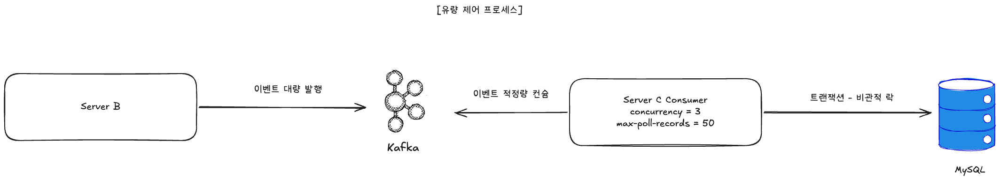

# 유량 제어

>
> **자원 제약 표기 정정** — `docker-compose.yml` 의 `cpus: 1.0` 제한은 앱 컨테이너(server-a/b/c)에만,
> `cpus: 2.0` 은 Kafka 에만 걸려 있다. **MySQL 과 Redis 에는 CPU 제한이 없다.** 아래 서술의 "MySQL" 은
> 1 vCPU 로 제한된 컨테이너가 아니라 호스트 자원을 공유하는 컨테이너다.





## 0. 요약

- **결정**: Server B → Server C 사이에 **Kafka 를 backpressure buffer 로** 두고, **Server C consumer 측에서 처리 가능한 양만 poll** 하여 MySQL-C 를 보호.
- **측정된 속도 차이** (1,000 TPS × 60 초, 2026-08-27): 진입 **977 건/s** ↔ 발급 처리 **141 건/s** — 약 **7 배**.
  유입을 제한하지 않고 그 차이를 Kafka 가 흡수하게 두었다. 설계값은 "얼마나 받을까" 가 아니라 **"밀린 것을 언제까지 소진할까"** 다 (§3.4).
- **핵심 파라미터** (Server C):

  | 설정 | yml 기본값 | **런타임 실효값** | 역할 |
  |---|---|---|---|
  | listener concurrency | `1` | **1** | partition 병렬 소비 스레드 수 |
  | `spring.kafka.consumer.max-poll-records` | `10` | **50** | 한 번 poll 당 가져오는 메시지 상한 — 처리 burst 제한 |
  | `spring.kafka.consumer.enable-auto-commit` | `false` | **false** | 메시지 처리 완료 후 명시적 commit — 처리 실패 시 재처리 가능 |

  > **실효값이 yml 과 다른 이유 (2026-08-27 확인)** — `docker-compose.yml` 이 `SPRING_KAFKA_CONSUMER_MAX_POLL_RECORDS=50`
  > 을 주입해 yml 의 `10` 을 override 한다. 반면 같은 파일의 `SPRING_KAFKA_LISTENER_CONCURRENCY=3` 은 **무효** 다 —
  > `CouponIssueRequestConsumer` 의 `@KafkaListener(concurrency = "${app.kafka.consumer.concurrency:1}")` 애노테이션 값이
  > 컨테이너 팩토리 설정보다 우선하고, compose 는 `KAFKA_CONSUMER_CONCURRENCY` 를 주지 않기 때문이다.
  > 근거: server-c 기동 로그의 `ConsumerConfig … max.poll.records = 50`, 그리고 `kafka-consumer-groups.sh --describe`
  > 결과에서 **컨슈머 인스턴스 1 개가 partition 3 개를 모두 소유**.

---

## 1. 문제 정의

대량 발급 트래픽 환경의 위험:

- **Server A** 가 평균 1,000 TPS 를 받음 → **Server B** 가 즉시 Redis 적재 + Kafka publish (수 ms). 실측 **977 건/s**
- 그러나 **Server C** 의 발급 트랜잭션은 비관적 락 + INSERT 를 포함해 **건당 6.8 ms**, 스레드 1 개 기준 **141 건/s** 가 상한
- C 가 처리할 수 있는 양보다 더 빠르게 메시지가 쌓이면:
  - Kafka consumer 가 무제한 poll → C 가 한 번에 너무 많은 트랜잭션을 시작
  - 비관적 락 큐가 폭주 → DB 커넥션 풀 / Tomcat 워커 점유
  - MySQL-C 의 처리 한계 초과 → p99 latency 폭주, 일부 트랜잭션 timeout

**핵심 원리** — 두 경로의 속도가 다르다. **사용자 응답 throughput 은 A 가 정하고 (977 건/s), 발급 완료
throughput 은 C 가 정한다 (141 건/s).** 차이를 앞단에서 막지 않고 Kafka 에 쌓이게 두는 것이 이 설계의 선택이며,
그래서 설계해야 하는 값은 유입 상한이 아니라 **밀린 것을 언제까지 소진할 것인가** 다 (§3.4).

---

## 2. 고려한 대안

### 대안 A — HTTP A↔B 사이 동기 backpressure (B 가 바쁘면 A 가 대기)

B 의 처리 가능 큐가 가득 차면 A 가 5xx 또는 대기.

- ❌ **거부 이유**:
  - A 는 사용자 응답 경로 — 대기시키면 latency 직접 악화.
  - B 자체는 가벼움 (Redis 적재 + Kafka publish 만) → backpressure 가 필요한 지점이 아님.
  - 진짜 병목은 **Kafka 너머 C** 인데, A 에 backpressure 두면 위치가 잘못됨.

### 대안 B — Consumer throttle 없이 무제한 poll (디폴트)

Kafka consumer 가 max 만큼 가져오고 가능한 빨리 처리.

- ❌ **거부 이유**:
  - MySQL-C 가 동시 트랜잭션을 너무 많이 받게 됨 → 비관적 락 큐 폭주.
  - 처리 burst 가 커지면 lag 가 spike, 다음 poll 까지의 지연도 비예측적.

### 대안 C — Kafka consumer 파라미터로 throttle (채택)

C 의 listener / consumer 파라미터로 한 번에 처리할 양을 제한.

- ✅ **채택 이유**:
  - **병목 (C) 위치에서 직접 제어** — 진짜 처리 한계와 throttle 이 같은 지점.
  - **Kafka 가 자연스러운 buffer** — 초과 메시지는 Kafka partition 에 쌓이고 lag 으로만 보임. 데이터 유실 없음.
  - **사용자 응답 경로에 영향 없음** — A → B 까지는 평소 속도, 사용자는 200 ACCEPTED 받음.
  - 인프라 추가 없이 설정 한 줄 — 단순성.

---

## 3. 결정 — Kafka Consumer 파라미터 3 종

### 3.1 설정

설정의 출처는 `server-c/src/main/resources/application.yml` + `docker-compose.yml` 이다. 아래는 인용이며,
값이 바뀌면 이 문서가 아니라 그 두 파일을 봐야 한다.

```yaml
# server-c/src/main/resources/application.yml
spring:
  kafka:
    consumer:
      max-poll-records: 10                    # ← docker-compose 가 50 으로 override
      enable-auto-commit: false               # 명시적 commit
    listener:
      ack-mode: RECORD                        # 메시지 처리 완료마다 ack
      concurrency: 1
```

```java
// CouponIssueRequestConsumer — 이 애노테이션 값이 listener.concurrency 보다 우선한다.
@KafkaListener(..., concurrency = "${app.kafka.consumer.concurrency:1}")
```

### 3.2 파라미터 의미

#### listener concurrency = 1 (실효값)

- 같은 consumer group 안에서 **listener 스레드 1 개** 가 partition 3 개를 모두 소비한다.
- 1 vCPU 에서 스레드를 키우면 컨텍스트 스위칭 / DB 커넥션 풀 경합으로 역효과라 보수적으로 1 을 둔 것이다.
- **주의** — `docker-compose.yml` 의 주석은 "50 records × 3 thread → ~300/sec 목표" 라고 적고 있으나,
  위 애노테이션 우선순위 때문에 **그 3 스레드는 한 번도 뜬 적이 없다.** 병렬화를 실제로 켜려면
  `KAFKA_CONSUMER_CONCURRENCY` 를 주입해야 한다.

#### `consumer.max-poll-records = 50` (실효값, yml 기본은 10)

- 한 번 `poll()` 호출에서 가져오는 메시지 **최대 50 개**.
- listener 가 50 개를 처리한 뒤에야 다음 poll → 처리 burst 의 상한 형성.
- 너무 작으면 (예: 10) poll 빈도가 높아져 네트워크 / 라운드트립 오버헤드, 너무 크면 (예: 500) 한 번에 받은 메시지 처리 시간이 `max.poll.interval.ms` 를 초과해 rebalance 위험.

#### `consumer.enable-auto-commit = false`

- 자동 commit 비활성화. **메시지 처리 완료 (트랜잭션 commit) 직후 명시적 ack**.
- 처리 도중 인스턴스 죽으면 ack 안 된 메시지는 재처리 → at-least-once 보장.
- 자동 commit 이면 처리 전에 offset 이 진행돼 **메시지 유실 위험** — 본 도메인의 정합성 요구와 정면 충돌.

### 3.3 조합 효과 — 처리 속도를 정하는 것은 `concurrency` 하나뿐

```
C 의 처리량 = listener 스레드 수 ÷ 건당 처리 시간
            = 1 ÷ 0.0068 s
            = 147 건/s (이론)   →   실측 141 건/s, 스레드 이용률 0.96
```

이용률 0.96 은 **스레드가 대기하는 시간이 거의 없다**는 뜻이다. 즉 속도를 정하는 것은 처리 루프의 회전율뿐이다.

| 조건 | 스레드 | 건당 처리 | **C 처리량** | 스레드 이용률 | C CPU max |
|---|---|---|---|---|---|
| 재고 행 1, 스레드 1 (현재 기본값) | 1 | 6.8 ms | **141 건/s** | 0.96 | 0.48 |
| 재고 행 1, 스레드 3 | 3 | 14.9 ms | 187 건/s | 0.93 | 0.75 |
| 재고 행 10, 스레드 1 | 1 | 7.0 ms | 135 건/s | 0.94 | 0.56 |
| 재고 행 10, 스레드 3 | 3 | 8.8 ms | **321 건/s** | 0.94 | 0.92 |

> 측정 조건과 원본 산출물: `load-test/experiments/results/run0 · run8 · run9 · run10`.

**세 파라미터의 역할이 서로 다르다.** 이전 판은 셋을 묶어 "초당 처리 상한 ≈ 21 req/s/instance" 라는 숫자를
적었는데, 그 식의 `평균 처리 시간 0.1 s` 는 측정된 적 없는 추정치였고 `concurrency = 3` 은 실효값이 아니었다.
**그 숫자는 철회한다.**

| 설정 | 실제 역할 | 처리량을 정하는가 |
|---|---|---|
| listener `concurrency` | C 의 **처리 능력**을 정한다 (`처리량 = 스레드 ÷ 건당 시간`) | **그렇다** |
| `max-poll-records` | poll 한 번의 반환 상한 — 왕복 횟수만 줄인다 | **아니다.** `type: SINGLE` 이라 한 건씩 순차 처리한다 |
| `ack-mode` / `enable-auto-commit` | at-least-once 보장 | 아니다. 정합성 설정 |

- **행이 하나면 스레드를 3 배로 늘려도 +33 % 뿐이다.** 건당 처리 시간이 2.2 배가 되고, 늘어난 8 ms 는 전부
  `SELECT ... FOR UPDATE` 대기다 — hot row 락 경합의 직접 측정치.
- **행을 나누면 병렬화가 산다** (135 → 321 건/s). 손실의 원인은 Kafka 병렬도가 아니라 **행 락**이다.
- **비용이 있다.** C 를 3 스레드로 올리면 같은 호스트의 A 가 밀린다 (988 → 781 건/s, −21 %).
  A 와 C 가 분리된 환경이면 사라지는 비용이므로 로컬 단일 머신 측정의 한계로 명시한다.

### 3.4 그래서 C 는 얼마나 빨라야 하는가

유입을 제한하지 않기로 한 이상, 설계값은 **밀린 것을 언제까지 소진하느냐**다.

| 기준 | 필요 처리량 | 근거 |
|---|---|---|
| 회복 스케줄러가 미처리 구간에 닿지 않을 것 | **≥ 42 건/s** | 스케줄러 검사 속도 = batch 50 ÷ cycle 약 1.2 초. C 가 이보다 느려지면 스케줄러가 미처리 구간을 보고 재발행을 시작하고, 그 재발행이 C 부하를 더 키운다 |
| 명세 부하 (10,000 건) 를 30 초 안에 소진할 것 | **≥ 334 건/s** | 최악 가정 — 매진 단락이 하나도 없을 때 |
| **명세 조건의 실제 큐 유입** | **579 건 — 부하 종료 1 초 뒤 전부 결론** | ADR-011 매진 캐시가 요청의 **82 %** 를 A 진입에서 끊었다 |

→ **명세 조건 (재고 100 장 / 사용자 1,000 명 / 1,000 TPS × 10 초) 에서는 스레드 1 개로 충분하다.**
60 초 부하에서는 파티션에 약 10,000 건까지 쌓였다가 소진된다. 사용자는 이미 "접수 완료" 를 받았으므로
이 큐를 기다리지 않는다.

> 인스턴스 대수 산정과 A 진입 측 측정은 [인프라 사이징 보고서](infra-sizing.md) 참조.

---

## 4. Kafka 가 자연 buffer 인 이유

| 측면 | 설명 |
|---|---|
| **Persistent log** | producer 가 쓴 메시지는 broker 의 commit log 에 영속. consumer lag 이 쌓여도 데이터 유실 없음 |
| **Pull 기반** | consumer 가 처리 가능한 양만 가져옴 → 자연스러운 backpressure |
| **Partition 기반 병렬화** | partition 수 ↔ consumer concurrency 로 throughput 조정 가능 |
| **lag 가시화** | Kafka UI / Prometheus 로 큐 깊이 모니터링 — 이상 감지 용이 |

**결과** — Server B 는 burst 트래픽을 그대로 publish 해도 OK. 초과분은 Kafka partition 에 쌓이고, C 가 자기 속도대로 소비. 사용자 입장에서는 "200 ACCEPTED" 만 받고 결과 폴링으로 확인.

**backpressure 는 설정이 아니라 pull 모델 자체에서 나온다.** 컨슈머는 가진 것을 다 처리한 뒤에만 다음 poll 을
하므로 감당하지 못할 양을 애초에 받지 않는다. `max-poll-records` 는 그 위에 왕복 횟수를 줄이는 값일 뿐이다.

**선착순에서 큐가 필요한 이유** — 진입에서 거절하면 당락이 도착 순서가 아니라 운으로 갈린다.
큐는 도착 순서를 보존한다. 밀린 양은 브로커 로그에 남아 유실되지 않는다.

---

## 5. 결정 요약

| 위험 | 대응 | 메커니즘 |
|---|---|---|
| C 의 비관적 락 큐 폭주 | 컨슈머가 처리한 만큼만 다음 poll | pull 모델 + `max-poll-records=50` (왕복 횟수 제한) |
| 1 vCPU 컨텍스트 스위칭 폭주 | listener 스레드 수 제한 | **listener 스레드 1 개** (실효값) — 처리 속도를 정하는 유일한 knob |
| 처리 도중 인스턴스 죽으면 메시지 유실 | 명시적 ack | `enable-auto-commit=false` + `ack-mode=RECORD` |
| 사용자 응답 경로의 latency 악화 | 진입점에 throttle 두지 않음 | A 의 Bucket4j 미적용 (ADR-005) |
| Burst 트래픽 흡수 | Kafka 가 buffer | partition 에 쌓임, lag 으로만 보임 |

---

## 6. 남는 한계

- **컨슈머 하나가 파티션 3 개를 처리하므로 C 의 처리량이 141 건/s 에 묶인다.** 스레드를 늘리면 처리량은 오르지만
  (321 건/s) 같은 호스트의 A 가 21 % 밀린다. 분리 배포 환경에서 다시 재야 하는 값이다.
- **장시간 부하는 측정하지 않았다.** cutoff(10 s)를 넘긴 pending 이 수만 건 쌓이는 조건에서는 스케줄러가
  batch(50)를 계속 채우게 되므로 §3.4 의 42 건/s 기준을 재검증해야 한다.
- **파티션 3 개가 현재 병렬도의 상한**이다. 그 이상 올리려면 파티션부터 늘려야 한다.

[← README](../../README.md)
