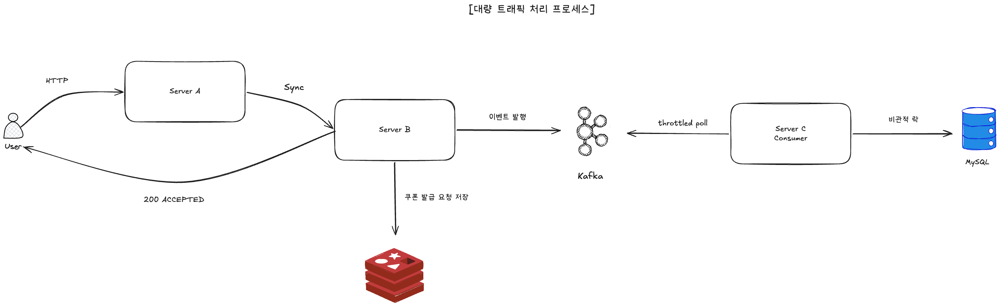

# 대량 트래픽



## 0. 요약

- **핵심 결정**: 사용자 응답 경로에서 **락 경합을 분리**. 트래픽 수용은 Redis (HSETNX) + Kafka publish 로 비동기화, 비관적 락 + 재고 차감은 별도 워커 (Server C) 가 처리.
- **at-least-once 경계**: **Redis 에 신청이 적재된 시점** 부터 보장. 이후 Kafka publish 실패 / 메시지 유실은 스케줄러가 회복.
- **거부한 대안**: ① 단일 동기 처리 (사용자가 락 경합을 직접 대기) ② Batch INSERT (큐 / 플러시 정책의 운영 복잡도)
- **검증**: 단일 인스턴스 **500 TPS 안정 처리**. HikariCP 풀 사이즈는 10 → 50 → 20 단계로 튜닝.

---

## 1. 문제 정의

- 목표: 인스턴스당 1,000 TPS · 1 vCPU / 2 GB RAM (CLAUDE.md §2)
- 도메인: 선착순 쿠폰 발급은 본질적으로 **재고 row 1 개에 락 경합이 집중되는 hot-row 워크로드**
- 위험: 락 경합 트래픽을 **사용자 응답 경로에서 직접 받으면**
  - 락 대기로 Tomcat 워커 스레드 / DB 커넥션이 장시간 점유됨 → 후속 요청이 줄줄이 풀 고갈 대기
  - 1 vCPU 환경에서 락 큐가 폭발하면 카스케이딩 latency / 실패율 급증

가장 먼저 결정해야 했던 것은 **"커넥션을 오래 잡는 락 경합 트래픽을 사용자 응답 경로에 직접 받게 하면 안 된다"** 라는 원칙.

---

## 2. 고려한 대안

### 대안 A — 단일 동기 처리 (User → A → C 동기, 락 경합을 직접 노출)

가장 단순한 구조. 사용자가 즉시 발급 결과 (성공 / 매진) 를 받는다.

- ❌ **거부 이유**: 1 vCPU MySQL 에서 비관적 락의 직렬화 처리량이 사용자 응답 throughput 상한을 결정. 락 대기 중 DB 커넥션 / Tomcat 워커가 점유돼 p95 / p99 latency 가 비선형으로 악화.

### 대안 B — Batch INSERT (요청 / 발급 모두 batch)

요청을 메모리 큐에 모아 일정 단위로 일괄 INSERT.

- ❌ **거부 이유**:
  - 큐 / 플러시 정책 / 인스턴스 종료 시 손실 / 백프레셔 등 **운영 복잡도가 급증**.
  - **단건 INSERT (per-request commit) 측정 결과 1 vCPU 에서도 무리 없음** — 단순성 우선.
- 결과적으로 ADR-010 (A 의 요청 로그는 per-request commit) 으로 정착.

### 대안 C — 요청 처리 ↔ 동시성 제어 분리 (채택)

사용자 응답 경로 = "**접수 완료**" 까지만 보장. 락 경합은 비동기 워커가 별도 처리.

- ✅ **채택 이유**: 도메인 특성상 사용자는 발급 결과를 즉시 알 필요 없음. 사용자가 알고 싶은 것은 "**내가 결국 받았는가**" 이므로 10 초 뒤 보유 목록에서 확인되어도 무방.

---

## 3. 결정 — 요청 처리와 동시성 제어 분리

### 3.1 도메인 정당성

선착순 쿠폰 도메인의 **결과 일관성 요구 수준이 낮음**:
- 사용자 관점에서 "즉시 결과" vs "10 초 뒤 결과" 의 UX 차이가 미미.
- "접수 완료 → 폴링 / 내 쿠폰 조회" 흐름이 자연스럽고 일반적.

### 3.2 두 경로 분리

**사용자 응답 경로** — 빠르고, 락이 없음

```
User → Server A → Server B → Redis 적재 → Kafka publish → 200 ACCEPTED (ms 단위)
```

- A: 요청을 받아 `issue_request` audit (per-request commit) 만 남기고 B 로 위임
- B: Redis `HSETNX issue:pending:{userId}:{couponTypeId}` 로 중복 차단 + pending 적재
- Kafka 로 `coupon-issue-request` publish 후 즉시 200 응답
- **이 경로에 비관적 락 없음** — 사용자는 Tomcat 워커 / DB 커넥션을 짧게만 점유

**비동기 처리 경로** — 락 경합 격리

```
Kafka → Server C consumer → MySQL-C (SELECT FOR UPDATE + INSERT) (100ms~ 단위)
```

- Consumer throttle (`max.poll.records=10`, `concurrency=1`) 로 **1 vCPU MySQL-C 가 받아낼 양만** 흘림
- 락 대기는 워커 풀 안에서만 발생, **사용자 응답 경로에 영향 없음**

---

## 4. at-least-once 경계 — Redis 적재 시점

### 4.1 왜 Redis 인가

at-least-once 보장을 위해서는 "**받았다**" 를 영속 가능한 매체에 기록해야 한다. RDB 는 1 vCPU 환경에서 commit 비용이 사용자 응답 latency 를 직접 늘리므로 부적합.

Redis 채택 이유:
- 쓰기 / 읽기 latency 가 RDB 대비 빠름 (마이크로초 단위).
- 사용자에게는 빠르게 200 응답을 돌려주면서, Kafka publish 는 별도 시도 가능.
- publish 실패해도 스케줄러가 ZSET 인덱스를 보고 **빠르게 재발행** 가능.

### 4.2 보장 흐름

```
User → A → B → [Redis HSETNX + ZADD]   ← ⭐ 이 시점부터 at-least-once 보장
              → Kafka publish 시도
                  ↓ (실패해도 OK)
              → 200 ACCEPTED 즉시 응답

B 의 @Scheduled (1s 주기):
  ZRANGEBYSCORE 로 10s 이상 PENDING 인 신청 발견
  → C 의 internal GET 으로 실제 처리 여부 확인
  → 미처리면 Kafka 재발행 (publishAttempts ≤ 3, 30s SLA)
```

- Kafka publish 가 실패하더라도 Redis 에 신청이 남아 있으므로 스케줄러가 회복.
- **사용자가 한 번 200 받은 신청은 영구 처리** — at-least-once 의 의미.
- 중복 publish 의 안전성은 Server C 의 `(user_id, coupon_type_id)` UNIQUE 가 보장 (멱등 처리는 [정합성 보고서](distributed-consistency.md)).

---

## 5. 커넥션 풀 튜닝

HikariCP `maximumPoolSize` 를 단계적으로 조정한 결과:

| 단계 | 풀 사이즈 | 관찰 |
|---|---|---|
| 1 | 10 | 부하 시 풀 고갈 → 풀 대기로 사용자 latency 급증 |
| 2 | 50 | 풀은 충분, 그러나 1 vCPU MySQL 이 50 동시 쿼리를 처리 못 함 → DB 측 큐 폭주, p99 악화 |
| 3 | **20** | 1 vCPU MySQL 처리 한계와 균형. p95 안정 |

**교훈** — 풀 크기는 **서버 측 처리 한계** 에 맞춰야 한다. 클라이언트 풀을 키운다고 throughput 이 늘지 않으며, 오히려 DB 큐 폭주로 역효과. 1 vCPU MySQL 의 동시 active query 한계를 풀 크기로 자연스럽게 게이트.

---

## 6. 검증 결과

| 시나리오 | TPS | 결과 |
|---|---|---|
| `issue-500-tps.js` | 500 | 안정 처리 (p95 / p99 / 5xx 임계 통과) |
| `issue-1k-tps.js` | 1,000 | 일부 에러 발생 — [인프라 사이징 보고서](infra-sizing.md) 참조 |

- 락 경합 워커 (Server C) 의 처리량 / consumer throttle 상세 → [동시성 보고서](concurrency.md), [유량 조절 보고서](rate-limiting.md)

[← README](../../README.md)
