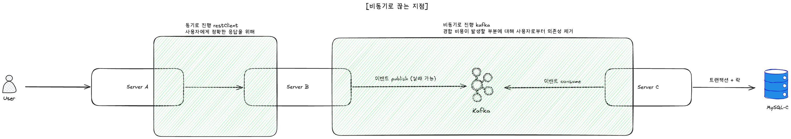

# 과제 관련 스터디

> 본 과제를 수행하며 **처음 학습한 내용들** 을 정리합니다.


[← README](../README.md)

---

## 1. Claude Code 를 잘 사용하기 위한 방법

### 학습 동기

본 과제는 Claude Code Opus 4.7 을 적극적으로 활용해 구현했다. 단순히 "AI 에게 요청하고 받기" 가 아니라, **컨텍스트 / agent / skill 메커니즘을 어떻게 설계해야 의도대로 작동하는지** 가 별도의 학습 과제였다.

### 1.1 CLAUDE.md — 세션마다 자동 로드되는 프로젝트 컨텍스트

`CLAUDE.md` 는 매 세션 시작 시 자동으로 로드되는 프로젝트 컨텍스트 파일.

- **역할**: 프로젝트의 전체 방향성 / 핵심 ADR / 안티패턴 / 기술 스택 등 "Claude 가 매번 알아야 하는 것" 을 정리.
- **양 관리**: **250 ~ 400 줄로 유지** — 너무 많으면 매 세션마다 토큰 소모가 크고, 핵심 시그널이 노이즈에 묻힘.
- **결과**: ADR / 평가 항목 / 도메인 모델 스케치 / 안티패턴 리스트만 정착시켜 매 세션마다 일관된 의사결정이 가능.

### 1.2 컨텍스트 관리 — 세션당 60 ~ 70% 미만 유지

Claude Code 의 컨텍스트 사용량이 60 ~ 70% 를 넘어가면 다음 세션으로 분리.

- **이유 1 — 토큰 소모량**: 컨텍스트가 커질수록 매 응답 처리 비용이 비선형으로 증가.
- **이유 2 — 응답 품질**: 컨텍스트가 길어지면 Claude 가 초반 지시사항을 놓치거나 같은 파일을 다시 읽는 패턴이 발생.
- **이유 3 — 의도하지 않은 구현 방지**: 컨텍스트가 무거워질수록 이전 토론에서 거부했던 설계 대안이 슬며시 다시 등장하는 경우가 있음.

→ 적절한 시점에 `/clear` 로 초기화 + `CLAUDE.md` / 핵심 결과물 (ADR / 보고서 / 설계 문서) 로 컨텍스트를 재구성.

### 1.3 Agent — 책임이 분리된 검증 위임

특정 책임을 가진 agent 를 등록해 메인 Claude 가 혼자 판단하지 않도록 분리.

| Agent | 책임 |
|---|---|
| **code-reviewer** | 구현 직후 호출 — DDD 계층 위반 / 안티패턴 / 명백한 보안 결함을 독립적 관점으로 점검 |

→ 단계별로 **독립적 관점의 검증** 을 받음. 메인 Claude 가 빠뜨린 부분을 별도 agent 가 잡아주는 구조.

### 1.4 Skills — 반복 작업의 표준화

자주 반복되는 작업 흐름을 skill 로 추상화. 메인 Claude 가 직접 호출하거나 사용자가 명시적으로 요청.

| Skill | 용도 |
|---|---|
| **code-planning** | 새 기능 구현 직전, 영향 범위 / API 설계 / TodoList 정리 + 사용자 승인 |
| **pr-guidelines** | 커밋 + PR 생성의 표준 워크플로 (브랜치 분기 → 의미 단위 커밋 → PR 본문 템플릿) |
| **scope-discipline** | 평가 5 축을 벗어난 over-engineering 차단 (YAGNI 가드레일) |

→ 매 작업마다 같은 컨벤션 / 같은 흐름 보장. Skill 이 곧 "이 프로젝트의 Way" 의 코드화.

### 1.5 사용 스타일 — 설계에 시간 투자 + 작은 단위 반복

#### (a) 시간 배분 — 설계 / 계획에 절반 이상

구현에 들어가기 전 **설계 / 계획 단계에 전체 시간의 절반 정도** 를 투입했다.

- 흐름: 요구사항 재진술 → 영향 범위 분석 → API 설계 → TodoList → 사용자 승인 → 구현
- 이 단계가 충분하면 구현은 빠르고, 잘못된 방향으로 쏠리는 일이 적다.
- 반대로 계획 없이 바로 구현을 시키면 처음 결과물이 그럴듯해 보여도 ADR / 안티패턴 / 도메인 경계를 위반한 채 깊어지는 경우가 많다.

#### (b) 과설계 회피 — "한 번에 모든 것" 을 시키지 않음

처음부터 모든 기능 / 모든 케이스를 한 번에 구현하지 않으려고 했다.

- **이유**: Claude Code 의 강점은 **빠른 인터랙션** — 짧은 사이클로 작은 단위를 구현 → 검증 → 수정을 반복하기에 적합한 도구.
- **반대 패턴 (피한 것)**: "이 기능 전체를 한 번에 다 만들어줘" — 결과물이 크고 복잡해서 검증 비용이 폭증하고, 의도하지 않은 부분을 잡아내기 어려움.
- **채택 패턴**: 한 사이클 = (작은 범위의 계획 → 구현 → 즉시 검증 / 수정). 같은 기능도 여러 PR / 여러 commit 으로 나누어 진행.

#### (c) 구현 후 즉시 반복 수정

한 번에 완벽한 구현은 없다는 전제로 작업.

- 구현 직후 **부족한 부분 / 의도하지 않은 구현 / 컨벤션 위반** 을 발견하면 즉시 수정 반복.
- code-reviewer agent 를 통해 독립적 관점의 검증 → 메인 Claude 가 놓친 것을 잡아냄.


### 핵심 깨달음

- Claude Code 는 **단순 코드 생성기가 아니라 "컨텍스트가 잘 관리된 협업자"** 일 때 가장 잘 작동한다.
- **CLAUDE.md / agent / skill 셋업은 곧 "팀 개발 표준 문서"** 와 같은 역할.
- **"한 번에 모든 것" 보다 "작은 단위로 빠르게 반복"** — Claude Code 의 빠른 인터랙션 특성을 그대로 살리는 방식.
- "AI 에게 던지고 받기" 가 아니라, **"설계 / 계획에 시간을 쏟고 구현은 작은 단위로 + 반복 수정"** 이 효과적.

---

## 2. Connection Timeout vs Read Timeout

### 학습 동기

A → B HTTP 호출에 Resilience4j Circuit Breaker 와 함께 timeout 을 설정해야 했는데, "그냥 적당히 3 초 / 5 초" 가 아니라 **왜 그 값인지** 근거가 필요했다.

### Connection Timeout — TCP 연결을 맺는 시간의 상한

TCP 연결은 **3-way handshake** 로 맺어진다.

```
Client                  Server
  | ── SYN ─────────▶    |
  | ◀──── SYN+ACK ──     |
  | ── ACK ─────────▶    |
        연결 완료
```

각 단계마다 패킷 유실 가능. 유실되면 **재전송** 해야 하는데, 첫 재전송까지 기다리는 시간이 **InitRTO (Initial Retransmission Timeout)**.

- **Linux 의 InitRTO 기본값 = 1 초**
- 즉 SYN 패킷이 한 번 유실되면 연결 맺기까지 **최소 1 초 + α** 가 걸림
- 두 번 유실되면 RTO 가 지수적으로 backoff (1s → 2s → 4s ...)

따라서 connection timeout 을 **너무 짧게** (예: 500ms) 잡으면 정상적인 패킷 1 회 유실에도 실패. 적당한 값:
- 초기 1 회 유실 흡수: 1s + α
- 한 번 더 흡수까지: ~3s

### Read Timeout — 응답 도착을 기다리는 상한

연결이 맺어진 뒤, **서버가 응답을 보내기까지** 기다리는 시간. 본 과제에서 Server B 의 응답은 Redis HSETNX + Kafka publish 까지 — 정상 latency 는 ms 단위.

→ **read timeout 1 초** 면 서버가 응답을 못 줄 때 빠르게 fail-fast.

### 본 과제 적용 값

| 항목 | 값 | 근거 |
|---|---|---|
| Connection Timeout | **3 s** | InitRTO 1s × 2 회 유실 흡수 |
| Read Timeout | **1 s** | B 의 정상 응답이 ms 단위, 길게 잡을 이유 없음 |

→ 두 timeout 의 의미가 다르므로 **다른 값** 을 잡아야 한다는 게 핵심 깨달음. 처음에는 둘 다 비슷한 의미인 줄 알았다.

---

## 3. HikariCP 풀 사이즈 — 공식 vs 실측

### 학습 동기

우아한 형제들 기술블로그에서 본 공식:

```
pool size = Tn × (Cm − 1) + 1
```

- Tn: 동시 실행 thread 수
- Cm: 한 트랜잭션이 동시에 잡는 connection 수

본 시스템에 대입하면 `Tn × (1 − 1) + 1 = 1`. **데드락 방지 최소값** 만 알려줄 뿐, 실제 throughput 사이징의 근거는 못 됨. 직접 측정으로 결정해야 했다.

### 측정 결과 — steady-state median (10 회 반복)

`HIKARI_POOL_SIZE_A=<value> docker compose up -d --force-recreate server-a` 후 `./load-test/run-500tps-10sec-10times.sh` 로 측정. 5 회차부터 안정 → 10 회 median.

| pool | RPS | p50 | p90 | p95 | dropped | 평가 |
|---|---|---|---|---|---|---|
| 3 | 244 | 1,196ms | 1,337ms | 1,369ms | 2,270 | ❌ pool 자체 ceiling — 500 RPS 불가 |
| **10** | **499** | **12ms** | **30ms** | **50ms** | **0** | ⭐ ✅ **운영 적용값** — 6 케이스 중 최저 p95 |
| 20 | 499 | 14ms | 47ms | 59ms | 0 | ✅ PASS |
| 30 | 499 | 30ms | 70ms | 80ms | 0 | ✅ PASS — pool=10 대비 latency 악화 |
| 40 | 492 | 66ms | 150ms | 185ms | 25 | ⚠️ 간헐 outlier 발생 |
| 50 | 481 | 75ms | 197ms | 293ms | 82 | ❌ USL knee, p95 threshold 초과 |

### 관찰 1 — pool=3 만 진짜 ceiling

connection 부족으로 steady-state 에서도 244 RPS 에서 saturate (목표 500 의 절반). pool 자체가 throughput 한계.

### 관찰 2 — pool 10 ~ 30 모두 안정

500 RPS 달성 + p95 < 100 ms. virtual thread + 짧은 commit RTT (~3 ms) 덕에 **작은 pool 에서도 충분**. pool=10 만 있어도 500 TPS 처리 가능.

### 관찰 3 — pool=40 부터 outlier, pool=50 은 USL knee

connection acquire latency / coherence cost / DB 측 동시 처리 한계가 누적되어, 더 많은 connection 이 오히려 역효과 (Universal Scalability Law 의 knee point).

### 관찰 4 — virtual thread 의 효과

pool=10 환경에서도 평균 수백 thread 가 항상 connection 대기 중인데 p95 가 50 ms 안에 들어옴.

→ platform thread 였다면 수백 × ~1 MB stack + context switch 로 무너졌을 것. virtual thread 라 thread 자체 비용이 거의 없고 (stack 메모리 / context switch 거의 무시), connection release 가 빠르게 일어나 **큐가 빠르게 drain**. **작은 pool 도 큰 pending 큐를 흡수** 한다는 게 핵심.

### 관찰 5 — cold-start 측정의 함정

처음에는 cold restart 직후 1 회 부하만으로 측정했고, 그 데이터로는 "pool 10 / 20 은 ceiling 으로 500 RPS 도달 불가" 라고 잘못 결론 낼 뻔했다 (cold-start RPS = 173 / 267 / 335). 실제 steady-state 는 모두 500 RPS 였음.

→ **JIT 컴파일 / HikariCP 풀 워밍 / Kafka 메타데이터 캐시** 가 끝나기 전에는 같은 pool 도 절반 이하의 throughput. **반복 측정 + steady-state median 이 권위**.

### 결론

- **공식은 출발점일 뿐** — 실측이 권위.
- **운영 적용값 = pool=10** (6 케이스 중 최저 p95 = 50ms, 0 dropped). pool 키워도 latency 만 악화.
- **"헤드룸을 위해 더 큰 pool" 은 본 시스템에서 반증된 직관** — virtual thread 가 pending 큐를 빠르게 drain 해서 small pool 이 오히려 안전 + 빠름.
- **단일 시점 측정 (특히 cold-start) 으로 결정하면 위험** — JIT / 풀 워밍이 끝난 steady-state 가 운영 baseline.

---

## 4. Kafka At-Least-Once — `acks=all` 만으로는 부족하다

### 학습 동기

처음에는 `acks=all` 만 켜면 끝인 줄 알았는데, **producer / consumer 양쪽 모두 추가 세팅** 이 필요했다.

### Producer 세팅

| 옵션 | 값 | 의미 |
|---|---|---|
| `acks` | `all` | 모든 in-sync replica 가 받았을 때만 ack — 데이터 유실 1 차 방어 |
| `enable.idempotence` | `true` | producer 재시도 시 메시지 중복 publish 방어 (sequence number 기반) |
| `retries` | `5` | 일시 장애 시 자동 재시도 |
| `max.in.flight.requests.per.connection` | `5` | idempotence 와 함께 쓸 때 안전 상한 |
| `linger.ms` | `5` | 짧게 묶어 throughput 개선 (low-latency 우선이라 5ms) |
| `delivery.timeout.ms` | `30000` | 전체 전송 데드라인 (재시도 포함) |

### Consumer 세팅

| 옵션 | 값 | 의미 |
|---|---|---|
| `enable-auto-commit` | `false` | 자동 commit 비활성화 — 처리 완료 후 명시적 ack |
| `ack-mode` | `RECORD` | 메시지 처리 완료마다 ack (배치 ack 아님) |
| `max-poll-records` | `50` | 한 번 poll 당 메시지 상한 (throttle) |
| `isolation-level` | `read_committed` | 트랜잭션 commit 된 메시지만 consume |

### 핵심 깨달음

- `acks=all` 은 **broker 측 보장**. producer 자신의 재시도 로직 / 멱등성 / 시간 상한은 별도로 켜야 한다.
- consumer 의 `enable-auto-commit=false` 가 빠지면 **처리 전에 offset 이 진행** 돼 메시지 유실. `acks=all` 의 의미가 무너진다.
- 비즈니스 로직이 끝난 뒤에 Consumer 가 commit 한다. 비즈니스 로직이 실패했는데 commit 해버리면 유실이 발생할 수 있다.
- "End-to-end at-least-once" 는 **producer + broker + consumer 세 단의 합작**.

---

## 5. Outbox 패턴 + 스케줄러 — 시스템 디자인 관점의 정합성

### 학습 동기

처음에는 Outbox 를 "어디서나 publish 안전하게 하려면 쓰는 패턴" 정도로만 알았다. 하지만 본 과제에서 **언제 쓰고 언제 안 써야 하는지** 가 더 중요한 학습이었다.

### Outbox 가 의미 있는 조건

| 조건 | 본 케이스 (Server C 발급 트랜잭션) |
|---|---|
| 변경 매체가 RDB 인가? | ✅ MySQL-C |
| publish 실패 시 정합성 깨지는가? | ✅ B 의 Redis 가 PENDING 으로 남음 |

→ 두 조건이 모두 만족할 때만 Outbox 의 가치가 발현. **Server B 처럼 Redis 만 쓰는 곳에 Outbox 를 적용하면 의미 없는 RDB 의존이 추가될 뿐**.

### 스케줄러로 보완하는 영역

Outbox 가 적합하지 않은 곳 (Server B) 은 **스케줄러 + ZSET 인덱스** 로 보완.

- Redis ZSET 에 score = createdAt 으로 등록
- `@Scheduled` 가 1 초 주기로 ZRANGEBYSCORE 로 cutoff (10s) 초과 항목 batch fetch
- C 의 internal API 로 실제 처리 여부 검증 → 미처리면 Kafka 재발행
- cap (publishAttempts ≤ 3) 으로 영구 cycle 방지 → **30s SLA 보장**

### 핵심 깨달음

- **Outbox 는 패턴이지 만능 도구가 아니다**. 적용 조건을 따져야 한다.
- **회복 메커니즘은 매체 특성에 맞게 다르게** — RDB 는 Outbox, Redis 는 스케줄러.

---

## 6. Hot Key Spot — 백그라운드 TTL 갱신 (Refresh-Ahead)

### 학습 동기

이벤트 정보 조회 (`GET /api/v1/events/{id}`) 는 **인기 이벤트 일수록 동일 캐시 키에 트래픽이 집중** 된다. 일반 Cache-Aside 만 쓰면 TTL 만료 순간 동시 다발적인 cache miss 가 DB 로 몰리는 **cache stampede** 가 발생.

### 해결 — Refresh-Ahead

백그라운드 스케줄러가 **TTL 만료 전에 미리 캐시를 갱신** 한다.

| 파라미터 | 값 | 의미 |
|---|---|---|
| TTL | 300 s (5 분) | 캐시 만료 시간 |
| refresh interval | 60 s (1 분) | 백그라운드 갱신 주기 |
| 갱신 대상 | `status = IN_PROGRESS` 만 | 트래픽이 집중되는 진행 중 이벤트만 |

→ refresh interval (60s) ≪ TTL (300s) 이므로 **TTL 만료 자체가 일어나지 않음**. 캐시는 항상 240s+ 잔여 TTL 을 유지 → cache miss 가 거의 발생하지 않음.

### 핵심 깨달음

- **stampede 방어는 "TTL 만료 시점에 어떻게 대응하는가" 가 아니라 "TTL 만료를 일어나지 않게 한다"** 가 더 단순하고 결정론적.
- 분산 락 / probabilistic early expiration 같은 사후 방어보다 **사전 갱신 (Refresh-Ahead)** 이 본 도메인에 잘 맞음 (갱신 대상이 IN_PROGRESS 만이라 부담 작음).
- 캐시 정책은 **트래픽 패턴에 비대칭** 으로 설계 — 모든 키를 갱신하지 않고 트래픽 집중되는 키만 보호.

---

## 7. 스케줄러 동작 — Sorted Set 으로 빠른 pending 탐색

### 학습 동기

분산 시스템 정합성을 위해 **주기적으로 pending 신청을 탐색해서 미처리 건을 회복** 해야 한다 (Server B 의 `PendingIssueScheduler`). 이때 "10 초 이상 PENDING 인 항목만 빠르게 가져오기" 를 어떻게 구현할지가 새 학습이었다.

### 해결 — Redis Sorted Set + ZRANGEBYSCORE

Sorted Set 의 score 를 `createdAt` (epoch ms) 으로 두면, **score 범위 쿼리만으로 cutoff 초과 항목을 batch fetch** 할 수 있다.

```
ZADD issue:pending:zset {createdAt} "{userId}:{couponTypeId}"   # 신청 등록
ZRANGEBYSCORE issue:pending:zset 0 (now - 10s) LIMIT 50          # 10s 초과 batch
ZREM issue:pending:zset "{userId}:{couponTypeId}"                # 처리 완료 → 제거
```

| 명령어 | 시간 복잡도 | 효과 |
|---|---|---|
| `ZADD` | O(log N) | 등록 |
| `ZRANGEBYSCORE` | **O(log N + M)** | cutoff 초과 항목만 — 전체 스캔 불필요 |
| `ZREM` | O(log N) | "정상 처리됨 = 다시 잡지 마" 신호 |

→ `@Scheduled` 가 1 초 주기로 ZSET 만 보면 됨. 처리 완료된 항목은 ZREM 으로 빠지므로 **자연스러운 work queue**.

### 핵심 깨달음

- **자료구조 선택이 곧 알고리즘** — Hash 만 썼다면 매 cycle 전체 키를 스캔해야 했을 것.
- Sorted Set 의 score 를 timestamp 로 두면 **시간 기반 work queue** 가 한 번에 풀림.
- ZREM 은 단순한 삭제가 아니라 **"이 항목은 더 이상 재발행 대상 아님" 의미** — 정합성 메커니즘의 자연스러운 종결 신호.

---

## 8. 단건 INSERT 1,000 TPS — 오버엔지니어링 금지

### 학습 동기

처음에는 Server A 의 `issue_request` 적재를 **batch INSERT** 로 만들려고 했다. "트래픽이 많으니 모아서 한 번에 넣자" 는 직관.

### 측정 결과

- **단건 INSERT (per-request commit) 도 1 vCPU MySQL 에서 1,000 TPS 견딜 만함** — 경합이 없는 단순 INSERT 라.
- batch 를 도입하면:
  - 큐 + 플러시 정책 결정
  - 인스턴스 종료 시 in-memory 큐 손실 방어 로직
  - 백프레셔 처리
  - 디버깅 시 "내 요청은 어디 갔지?" 추적이 어려움

→ 트레이드오프가 큰 데 효익이 작음.

### 핵심 깨달음

- "트래픽이 많다 = 무조건 batch / 비동기 / 큐" 는 **오버엔지니어링**.
- 측정 먼저, 단순한 방법이 안 되는 게 확인된 다음에 복잡도 추가.
- "단순함이 우선" 이 (per-request commit) 으로 정착.

---

## 9. 비동기로 끊는 지점에 대한 고민



### 학습 동기

A → B → C 흐름에서 **어느 지점부터 비동기로** 처리할지가 시스템 디자인의 핵심 결정. 너무 빨리 끊으면 정합성 위험, 너무 늦게 끊으면 사용자 응답 latency 악화.

### 후보들

| 후보 | 결정 / 거부 |
|---|---|
| User → A 동기, A 부터 비동기 | ❌ A 가 응답해야 사용자가 진행하므로 너무 빠름 |
| User → A → B 동기, B 부터 비동기 | ✅ **채택** — Redis 적재 시점에서 at-least-once 보장 시작 |
| User → A → B → C 모두 동기 | ❌ C 의 비관적 락 대기가 사용자 latency 에 직접 영향 |

### 결정 근거

- **at-least-once 를 보장할 수 있는 가장 빠른 지점** 에서 끊기.
- Redis 는 영속 가능한 매체 + 빠른 쓰기 → "받았다" 를 즉시 기록 가능.
- Kafka publish 가 실패해도 Redis 가 살아있으면 스케줄러로 회복.

→ "비동기 경계 = 정합성 기준점" 이라는 시각이 새로웠다.

### 핵심 깨달음

- 비동기 경계는 **임의로 정하는 게 아니라 정합성 기준점이 결정** 한다.
- "사용자 응답 latency vs 정합성 강도" 의 트레이드오프를 의식적으로 결정해야 한다.

---

## 10. Redis 명령어 동작 원리

### 학습 동기

본 과제에서 Redis 의 다양한 자료구조를 처음 깊이 사용. 각 명령어의 의미와 시간 복잡도를 정리.

### 본 시스템에서 사용한 명령어

| 명령어 | 자료구조 | 시간 복잡도 | 용도 |
|---|---|---|---|
| `SET` | String | O(1) | 캐시 적재 (예: `event:{id}`, `coupon:available:{...}`) |
| `GET` | String | O(1) | 캐시 조회 |
| `HSET` / `HGETALL` | Hash | O(1) / O(N) | 신청 상세 갱신 / 폴링 응답용 (N = field 수) |
| `ZADD` | Sorted Set | O(log N) | 스케줄러 work queue 등록 (score = createdAt) |
| `ZRANGEBYSCORE` | Sorted Set | O(log N + M) | cutoff 초과 항목 batch fetch (M = 결과 수) |
| `ZREM` | Sorted Set | O(log N) | 정상 처리된 항목을 work queue 에서 제거 |

[← README](../README.md)
